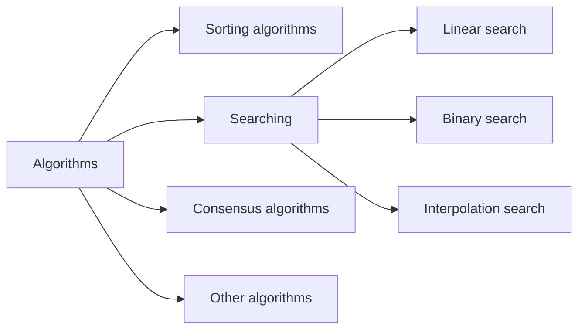
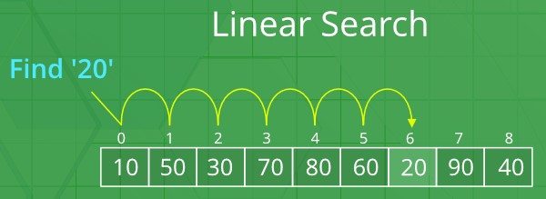
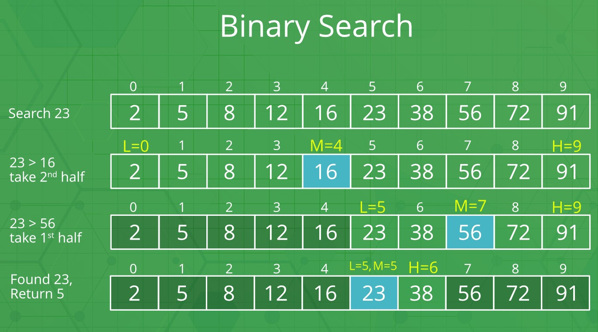
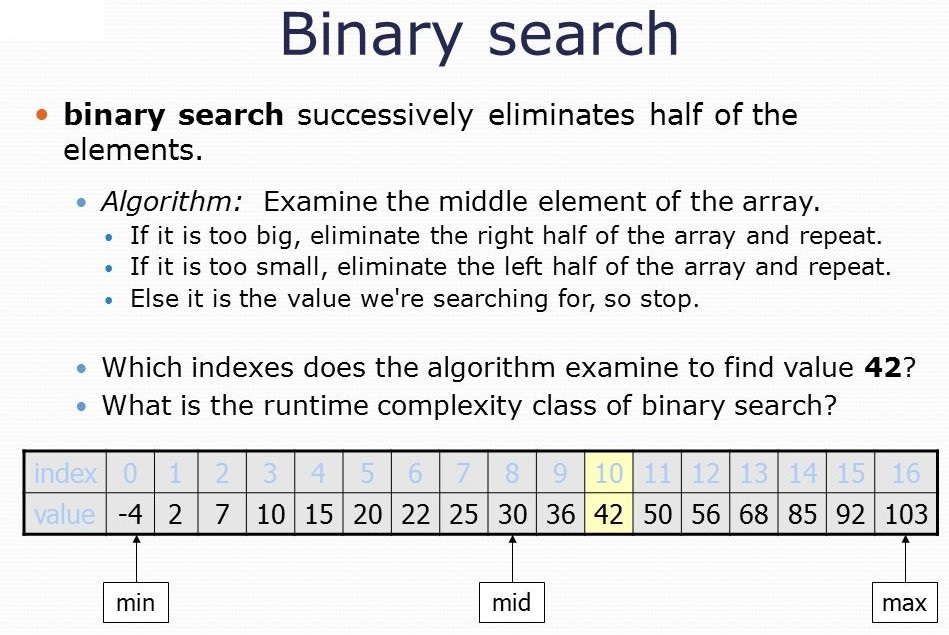
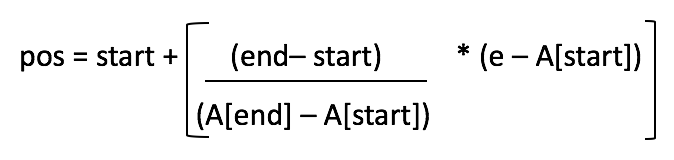
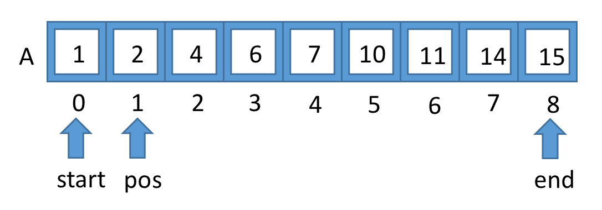
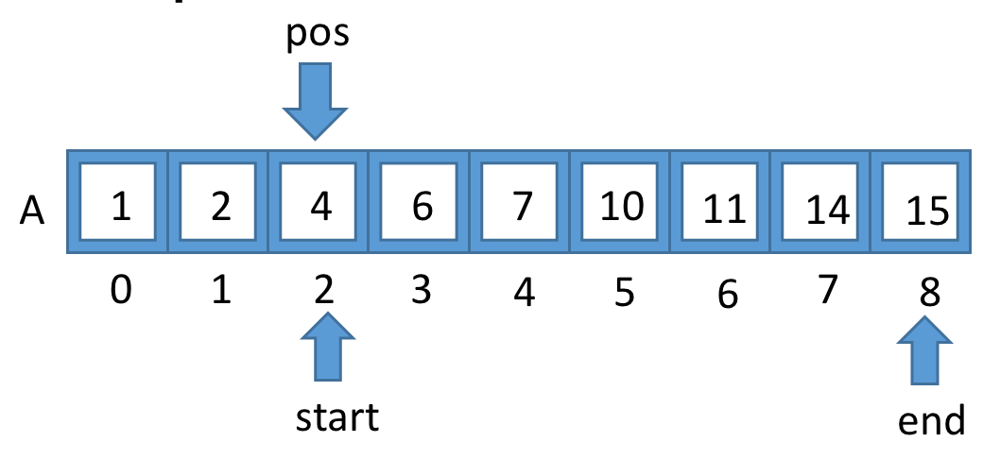
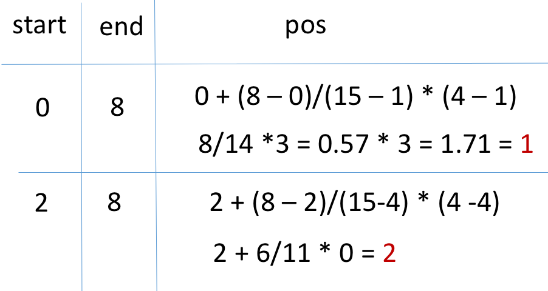

# Searching algorithms

Brief overview of the common **searching** algorithms
Pdf version available: [Searching algorithms](/assets/algorithms-searching.pdf)

- [x] [Linear search](#linear-search)
- [x] [Binary search](#binary-search)
- [x] [Interpolation search](#interpolation-search)

## Table of Contents

- [Searching algorithms](#searching-algorithms)
  - [Table of Contents](#table-of-contents)
  - [Introduction](#introduction)
  - [Linear search](#linear-search)
    - [Runtime and Memory complexity](#runtime-and-memory-complexity)
    - [Pseudo code](#pseudo-code)
    - [References](#references)
  - [Binary search](#binary-search)
    - [Runtime and Memory complexity](#runtime-and-memory-complexity-1)
    - [Pseudo code](#pseudo-code-1)
    - [References](#references-1)
  - [Interpolation search](#interpolation-search)
    - [Runtime and Memory complexity](#runtime-and-memory-complexity-2)
    - [Pseudo code](#pseudo-code-2)
    - [References](#references-2)

## Introduction



## Linear search

- Start from the leftmost element of arr[] and one by one compare x with each element of arr[]
- If x matches with an element, return the index.
- If x doesn’t match with any of elements, return -1.

Linear search is rarely used practically because other search algorithms such as the binary search algorithm and hash tables allow significantly faster searching comparison to Linear search.

Examples:

```cs
// Problem: Given an array arr[] of n elements,
// write a function to search a given element x in arr[].

Input: arr[] = {10, 20, 80, 30, 60, 50, 110, 100, 130, 170}
       x = 110;
Output: 6 // Element x is present at index 6
       x = 175;
Output: -1 // Element x is not present in arr[]
```



### Runtime and Memory complexity

- The time complexity is **O(n)**

### Pseudo code

```cs
// C# code to linearly search x in arr[].
// If x is present then return its location,
// otherwise return -1

using System;

public class GFG
{

    public static int search(int[] arr, int x)
    {
        int n = arr.Length;
        for(int i = 0; i < n; i++)
        {
            if(arr[i] == x) return i;
        }

        return -1;
    }

    public static void Main()
    {
        int[] arr = { 2, 3, 4, 10, 40 };
        int x = 10;

        int result = search(arr, x);
        if(result == -1)
            Console.WriteLine("Element is not present in array");
        else
            Console.WriteLine("Element is present at index " + result);
    }

}
```

### References

- [Linear Search - GeeksforGeeks](https://www.geeksforgeeks.org/linear-search/)
  
---

## Binary search

Binary search is an efficient algorithm for finding an item from a **sorted** list of items. It works by repeatedly **dividing in half** the portion of the list that could contain the item, **until you've narrowed down the possible locations to just one**.

Binary Search: Search a sorted array by repeatedly dividing the search interval in half. Begin with an interval covering the whole array. If the value of the search key is less than the item in the middle of the interval, narrow the interval to the lower half. Otherwise narrow it to the upper half. Repeatedly check until the value is found or the interval is empty.

|  |  |
|---|---|

### Runtime and Memory complexity

- The time complexity is **O(log n)**
- Memory (auxiliary space):
  - Iterative implementation **O(1)**
  - Recursive implementation **O(log n)** recursion call stack space.

### Pseudo code

```cs
// C# implementation of recursive Binary Search
using System;

class GFG {
    // Returns index of x if it is present in
    // arr[l..r], else return -1
    static int binarySearch(int[] arr, int l, int r, int x)
    {
        if (r >= l) {
            int mid = l + (r - l) / 2;

            // If the element is present at the
            // middle itself
            if (arr[mid] == x) return mid;

            // If element is smaller than mid, then
            // it can only be present in left sub array
            if (arr[mid] > x)
                return binarySearch(arr, l, mid - 1, x);

            // Else the element can only be present
            // in right sub array
            return binarySearch(arr, mid + 1, r, x);
        }

        // We reach here when element is not present
        // in array
        return -1;
    }


    // Driver method to test above
    public static void Main()
    {
        int[] arr = { 2, 3, 4, 10, 40 };
        int n = arr.Length;
        int x = 10;

        int result = binarySearch(arr, 0, n - 1, x);

        if (result == -1)
            Console.WriteLine("Element not present");
        else
        Console.WriteLine("Element found at index " + result);
    }

}
```

```cs
// Example: Recursive binary search
function binarySearch(int items[],int key,int from,int to)
 if (to < from):
   // set is empty, so return value showing not found
   return KEY_NOT_FOUND;
 // calculate midpoint to cut set in half
 int middle = midpoint(from, to);
 if (a[middle] > key):
   // key is in lower subset
   return binarySearch(a, key, from, middle - 1);
 else if (a[middle] < key):
   // key is in upper subset
   return binarySearch(a, key, middle + 1, to);
 else:
   // key has been found
   return middle;

// Example: Iterative binary search
int binarySearch(int a[], int key, int from, int to)
 // continue searching while [imin,imax] is not empty
 while (from <= to):
   //calculate the midpoint for roughly equal partition x/
   int middle = midpoint(from, to);
   // determine which subarray to search
   if (a[middle] < key)
     // change from index to search upper subarray
      from = middle + 1;
   else if (a[middle] > key)
     // change to index to search lower subarray
      to = middle - 1
   else
     // key found at index middle
     return middle;
return KEY_NOT_FOUND;

// Example code:
public static int BinaryFind < T > (this T[] array, T value) where T: IComparable < T > {
    int left = 0;
    int right = array.Length;

    while (left < right) {
        int middle = (left + right) / 2;
        int compare = array[middle].CompareTo(value);

        if (compare < 0) {
            Console.WriteLine("{0} < {1}", array[middle], value);
            left = middle + 1;
        } else if (compare > 0) {
            Console.WriteLine("{0} > {1}", array[middle], value);
            right = middle;
        } else {
            return middle;
        }
    }

 return -1;
}

```

### References

- [Binary Search - GeeksforGeeks](https://www.geeksforgeeks.org/binary-search/)
- [Binary search algorithm - Wikipedia](https://en.wikipedia.org/wiki/Binary_search_algorithm)

---

## Interpolation search

Interpolation Search is an improvement over Binary Search for scenarios where the values in a sorted array are uniformly distributed.
Binary Search goes to the middle element to check. On the other hand, **Interpolation Search may go to different locations according to the value of the key being searched.** For example, if the value of the key is close to the last element, Interpolation Search is likely to start search toward the end side.

This search algorithm works on the probing position of the required value. For this algorithm to work properly, the data collection should be in a sorted form and equally distributed.

There are cases where the location of target data may be known in advance. For example, in case of a telephone directory, if we want to search the telephone number of Morphius. Here, linear search and even binary search will seem slow as we can directly jump to memory space where the names start from 'M' are stored.

Example if we are looking for element 4 in the given array.

| **fig. 1**  | **fig. 2**  |
|:-:|:-:|
| **fig. 3**  | **fig. 4**  |

### Runtime and Memory complexity

- The time complexity is **Ο(log (log n))** as compared to **Ο(log n)** of Binary search in favorable situations.

### Pseudo code

```code
Step 1 − Start searching data from middle of the list.
Step 2 − If it is a match, return the index of the item, and exit.
Step 3 − If it is not a match, probe position.
Step 4 − Divide the list using probing formula and find the new midle.
Step 5 − If data is greater than middle, search in higher sub-list.
Step 6 − If data is smaller than middle, search in lower sub-list.
Step 7 − Repeat until match.
```

```code
A → Array list
N → Size of A
X → Target Value

Procedure Interpolation_Search()

   Set Lo  →  0
   Set Mid → -1
   Set Hi  →  N-1

   While X does not match

      if Lo equals to Hi OR A[Lo] equals to A[Hi]
         EXIT: Failure, Target not found
      end if

      Set Mid = Lo + ((Hi - Lo) / (A[Hi] - A[Lo])) * (X - A[Lo])

      if A[Mid] = X
         EXIT: Success, Target found at Mid
      else
         if A[Mid] < X
            Set Lo to Mid+1
         else if A[Mid] > X
            Set Hi to Mid-1
         end if
      end if
   End While

End Procedure
```

### References

- [Data Structure - Interpolation Search - Tutorialspoint](https://www.tutorialspoint.com/data_structures_algorithms/interpolation_search_algorithm.htm)
- [Interpolation Search - GeeksforGeeks](https://www.geeksforgeeks.org/interpolation-search/)
