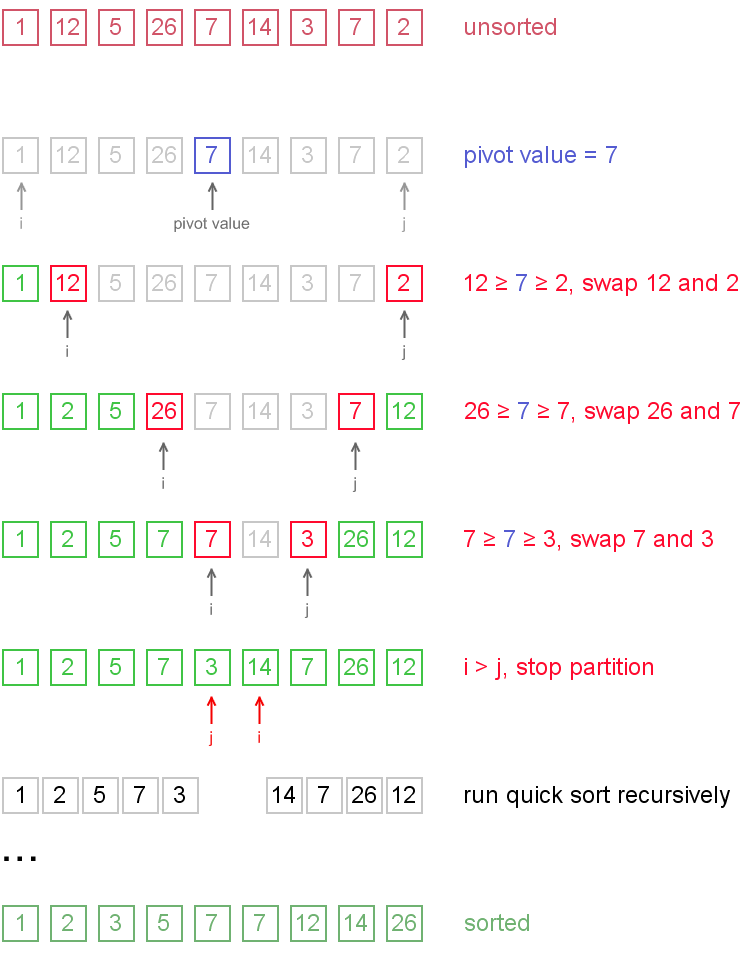
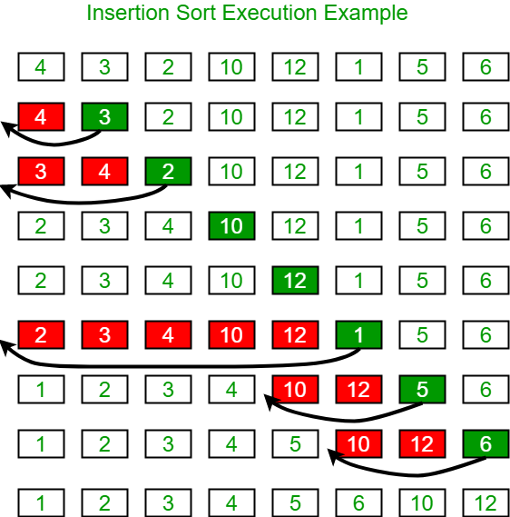

# Common Sorting Algorithms

Brief overview of the common **sorting** algorithms
Pdf version available: [algorithms-sorting.pdf](./assets/algorithms-sorting.pdf)

- [x] [Bubble sort](#bubble-sort)
- [x] [Selection sort](#selection-sort)
- [x] [Merge sort](#merge-sort)
- [x] [Quick sort](#quick-sort)
- [x] [Insertion sort](#insertion-sort)
- [ ] [Bucket sort](#bucket-sort)
- [ ] [Counting sort](#counting-sort)
- [ ] [Heap sort](#heap-sort)
- [ ] [Shell sort](#shell-sort)
- [ ] [Radix sort](#radix-sort)

## Table of Contents

- [Common Sorting Algorithms](#common-sorting-algorithms)
  - [Table of Contents](#table-of-contents)
  - [Introduction](#introduction)
    - [Classification](#classification)
    - [Stability of Sorting](#stability-of-sorting)
    - [Comparison of sorting algorithms](#comparison-of-sorting-algorithms)
  - [Bubble sort](#bubble-sort)
    - [Runtime and Memory complexity](#runtime-and-memory-complexity)
    - [Pseudo code](#pseudo-code)
    - [References](#references)
  - [Selection sort](#selection-sort)
    - [Runtime and Memory complexity](#runtime-and-memory-complexity-1)
    - [Pseudo code](#pseudo-code-1)
    - [References](#references-1)
  - [Merge sort](#merge-sort)
    - [Runtime and Memory complexity](#runtime-and-memory-complexity-2)
    - [Pseudo code](#pseudo-code-2)
    - [References](#references-2)
  - [Quick sort](#quick-sort)
    - [Runtime and Memory complexity](#runtime-and-memory-complexity-3)
    - [Pseudo code](#pseudo-code-3)
    - [References](#references-3)
  - [Insertion sort](#insertion-sort)
    - [Runtime and Memory complexity](#runtime-and-memory-complexity-4)
    - [Pseudo code](#pseudo-code-4)
    - [References](#references-4)
  - [Bucket sort](#bucket-sort)
  - [Counting sort](#counting-sort)
  - [Heap sort](#heap-sort)
  
## Introduction

- Sorting algorithm
  - An algorithm that **puts elements** of a list in a **certain order** (most common lexicographically)
- More formally:
  - The output is **in some (non-decreasing) order**
  - The output is **a permutation** of the input
- Efficient sorting is important for
  - Producing human-readable output
  - Canonicalizing data
  - Optimizing the use of other algorithms
- Sorting presents many important techniques

### Classification

- Sorting algorithms are often classified by
  - Computational **complexity**
    - **worst**, **average** and **best** behavior
  - **Memory** usage
  - Recursive or non-recursive
  - **Stability**
  - Whether or not they are a comparison sort
  - General method
    - insertion, exchange (bubble sort and quicksort), selection (heap sort), merging, serial or parallel…

### Stability of Sorting

- Stable sorting algorithms
  - Maintain the relative order of records with equal values
- If two items compare as equal, then their relative order will be preserved
  - When sorting only part of the data is examined when determining the sort order

```cs
// Unsorted Array
[3, 5, 2, 1, 5', 10]
// Stable sort, will be always in this order
[1, 2, 3, 5, 5', 10]
// Unstable sort, not always 5 and 5' will be the same order
[1, 2, 3, 5, 5', 10]
[1, 2, 3, 5', 5, 10]
```


### Comparison of sorting algorithms

**WIP** There are hundreds of sorting algorithms, some of them are:

| Name      | Best       | Avg           | Worst         | Memory | Stable  |
|:----------|:-----------|:--------------|:--------------|:-------|:--------|
| Bubble    | n          | n<sup>2</sup> | n<sup>2</sup> | 1      | Yes     |
| Insertion | n          | n<sup>2</sup> | n<sup>2</sup> | 1      | Yes     |
| Quick     | n\*log(n)  | n\*log(n)     | n<sup>2</sup> | log(n) | Depends |
| Merge     | n\*log(n)  | n\*log(n)     | n\*log(n)     | n      | Yes     |
| Heap      | n\*log(n)  | n\*log(n)     | n\*log(n)     | n      | No      |
| Bogo      | n          | n\*n!         | n\*n!         | 1      | No      |

[Big O cheat sheets](https://cooervo.github.io/Algorithms-DataStructures-BigONotation/index.html)

---

## Bubble sort

Comparing each pair of adjacent elements and swapped them if they are not in order.

In bubble sort, we start at the beginning of the array and swap the first two elements if the first is greater than the second. Then, we go to the next pair, and so on, continuously making sweeps of the array until it is sorted. In doing so, the smaller items slowly"bubble" up to the beginning of the list.


### Runtime and Memory complexity

- Runtime **O(n<sup>2</sup>)** average and worst case, best case: O(n)
- Memory **O(1)**
- Stable: **Yes**
- Method: **Exchanging**

### Pseudo code

```cs
// Repeatedly stepping through the list
// Comparing each pair of adjacent items
// Swap them if they are in the wrong order
while swapIsDone
  swapIsDone = false
  for i = 0 ... n - 1
    if a[i-1] > a[i]
      swap a[i] a[i-i]
      swapIsDone = true
```

### References

- [Bubble sort - Wikipedia](http://en.wikipedia.org/wiki/Bubble_sort)
- [Bubble Sort Program Using C#](https://www.c-sharpcorner.com/UploadFile/0c1bb2/programm-for-bubble-sort-using-C-Sharp/)
- [Algorithms: Bubble sort | XoaX.net Video Tutorials](http://xoax.net/comp_sci/crs/algorithms/lessons/Lesson1/)
  
---

## Selection sort

Selection the smallest element in the unsorted part, and insert it into the end of sorted part.

Selection sort is the child's algorithm: simple, but **inefficient**.
Find the smallest element using linear scan and move it to the front (swapping it with the front element).
Then, find the second smallest and move it, again doing a linear scan.
Continue doing this until all the elements are in place


### Runtime and Memory complexity

- Runtime **O(n<sup>2</sup>)** average and worst case
- Memory **O(1)** constant, only for the min element
- Stable: **No**
- Method: **Selection**

### Pseudo code

```cs
  for j = 0 ... n-2
      // find the best element in a[j .. n-1]
      best = j;
      for i = j + 1 ... n -1
          if a[i] < a[best]
            best = i;
      if best is not j
        swap a[j], a[best]
```

```cs
static void sort(int[] arr) {
  int n = arr.Length;
  // One by one move boundary of unsorted sub array
  for (int i = 0; i < n - 1; i++) {
    // Find the minimum element in unsorted array
    int min_idx = i;
    for (int j = i + 1; j < n; j++)
    if (arr[j] < arr[min_idx]) min_idx = j;
    // Swap the found minimum element with the first
    // element
    int temp = arr[min_idx];
    arr[min_idx] = arr[i];
    arr[i] = temp;
  }
}
```

### References

- [Selection sort - Wikipedia](https://en.wikipedia.org/wiki/Selection_sort)
- [Selection sort pseudo code (article) | Khan Academy](https://www.khanacademy.org/computing/computer-science/algorithms/sorting-algorithms/a/selection-sort-pseudocode)
- [Algorithms: Lesson 8: Selection Sort | XoaX.net Video Tutorials](http://xoax.net/comp_sci/crs/algorithms/lessons/Lesson8/)

---

## Merge sort

First divides the array into halves. If the number of elements is odd, in the divide process, we will floor it.
Until no more elements can be divided, we combine them in exactly the same manner as they were broken down. When combine two halves, we first compare the element for each list and store the elements in sorted order.

Merge sort divides the array in half, sorts each of those halves, and then merges them back together. Each of those halves has the same sorting algorithm applied to it. Eventually, you are merging just two single element arrays. It is the "merge" part that does all the heavy lifting.

Conceptually, a merge sort works as follows:

- Divide the unsorted list into `n` sublists, each containing `1` element (list of 1 element is sorted)
- Repeatedly merge sublists to produce new sublists until there is only 1 sublist remaining

|  |  |
|---|---|
|  |  |

### Runtime and Memory complexity

- Runtime **O(n*log(n))** average and worst case
- Memory Depends, worst case is **O(n)**
- Stable: **Yes**
- Method: **Merging**
- Highly parallelizable, up to **O(log(n))**
- Using the Three Hungarian's Algorithm

### Pseudo code

```csharp
function merge_sort(list m)
    // if list size is 0 (empty) or 1, consider it sorted
    // (using less than or equal prevents infinite recursion
    // for a zero length m)
  if length(m) <= 1
      return m
    // else list size is > 1, so split the list into two sub lists
  var list left, right
  var integer middle = length(m) / 2
  for each x in m before middle
       add x to left
  for each x in m after or equal middle
       add x to right
    // recursively call merge_sort() to further split each sub list
    // until sub list size is 1
  left = merge_sort(left)
  right = merge_sort(right)
    // merge the sublists returned from prior calls to merge_sort()
    // and return the resulting merged sub list
  return merge(left, right)
```

```cs
function merge(left, right)
    var list result
    while length(left) > 0 or length(right) > 0
        if length(left) > 0 and length(right) > 0
            if first(left) <= first(right)
                append first(left) to result
                left = rest(left)
            else
                append first(right) to result
                right = rest(right)
        else if length(left) > 0
            append first(left) to result
            left = rest(left)
        else if length(right) > 0
            append first(right) to result
            right = rest(right)
    end while
    return result
```

### References

- [Merge sort - Wikipedia](http://en.wikipedia.org/wiki/Merge_sort)
- [Algorithms: Merge Sort | XoaX.net Video Tutorials](http://xoax.net/comp_sci/crs/algorithms/lessons/Lesson3/)
- [Merge Sort C# GitHub gist](https://gist.github.com/pmgeorg/9122984)
- [Merge sort algorithm overview (article) | Khan Academy](https://www.khanacademy.org/computing/computer-science/algorithms/merge-sort/a/overview-of-merge-sort)

---
  
## Quick sort

Quicksort is a divide and conquer algorithm. Quicksort first divides a large array into two smaller sub-arrays: the low elements and the high elements. Quicksort can then recursively sort the sub-arrays.

In quick sort we pick a random element and partition the array, such that all numbers that are less than the partitioning element come before all elements that are greater than it. The partitioning can be performed efficiently through a series of swaps (see below). If we repeatedly partition the array (and its sub-arrays) around an element, the array will eventually become sorted. However, as the partitioned element is not guaranteed to be the median (or anywhere near the median), our sorting could be very slow. This is the reason for the O(n^2) worst case runtime.

The steps are:

1. Pick an element, called a pivot, from the array.
2. Partitioning: reorder the array so that all elements with values less than the pivot come before the pivot, while all elements with values greater than the pivot come after it (equal values can go either way). After this partitioning, the pivot is in its final position. This is called the partition operation.
3. Recursively apply the above steps to the sub-array of elements with smaller values and separately to the sub-array of elements with greater values.

|  |  |
|---|---|
|  |  |

### Runtime and Memory complexity

- Runtime **O(n*log(n))** average, **O(n<sup>2</sup>)** worst case
- Memory **O(log(n))** stack space
- Stable: **Depends**
- Method: **Partitioning**

### Pseudo code

```cs
function quicksort('array')
  if len('array') <= 1:
    return
  select and remove a pivot value from 'array'
  create empty lists 'less' and 'greater'
  for each 'x' in 'array':
    if 'x' <= 'pivot':
      append 'x' to 'less'
    else:
      append 'x' to greater
  return concatenate (quicksort('less'), 'pivot', quicksort('greater'))
```

### References

- [wikipedia - Quicksort](http://en.wikipedia.org/wiki/Quicksort)
- [Algorithms: Quicksort | XoaX.net Video Tutorials](http://xoax.net/comp_sci/crs/algorithms/lessons/Lesson4/)
- [Algorithms: Quicksort (General Algorithm) | XoaX.net Video Tutorials](http://xoax.net/comp_sci/crs/algorithms/lessons/Lesson11/)
- [Understanding Quicksort (with interactive demo) me.dt.in.th](http://me.dt.in.th/page/Quicksort/)

---

## Insertion sort

The insertion sort algorithm is the sort unknowingly used by most card players when sorting the cards in their hands. When holding a hand of cards, players will often scan their cards from left to right, looking for the first card that is out of place.

- Builds the final sorted array one item at a time


|  |  |
|---|---|
|  |  |

### Runtime and Memory complexity

- Runtime **O(n<sup>2</sup>)** worst and average, **O(n)** best case
- Memory **O(1)**
- Stable: **Yes**
- Method: **Insertion**
  
### Pseudo code

```cs
for i = 1 ... n - 1
  valueToInsert = a[i]
  holePos = i
  while holePos > 0 and valueToInsert < A[holePos - 1]
    a[holePos] = A[holePos - 1] // shift the larger value up
    holePos = holePos - 1       // move the hole position down
  A[holePos] = valueToInsert
```

### References

- [Insertion sort - Wikipedia](http://en.wikipedia.org/wiki/Insertion_sort)
- [Performing insertion sort in C# - Code Review Stack Exchange](https://codereview.stackexchange.com/questions/59968/performing-insertion-sort-in-c)
- [SparkNotes: Insertion Sort: Insertion Sort](http://www.sparknotes.com/cs/sorting/insert/summary/)

---

## Bucket sort

**WIP:**

- Partitioning an array into a number of buckets
  - Each bucket is then sorted individually
- Not a comparison sort
- Average case: `n + k`
  - `k` = the number of buckets
- Worst case: `n2 * k`
- Stable: Yes
- Memory: `n * k`
- [Bucket sort - Wikipedia](http://en.wikipedia.org/wiki/Bucket_sort)

<!--  -->

---

## Counting sort

**WIP:**

- Algorithm for sorting a collection of objects according to keys that are small integers
  - Or big integers and a `map`
- Not a comparison sort
- Average case: `n + r`
- Worst case: `n + r`
  - `r` is the range of numbers to be sorted
- Stable: Yes
- Memory: `n + r`
- [Counting sort - Wikipedia](http://en.wikipedia.org/wiki/Counting_sort)
<!--  -->

---

## Heap sort

**WIP:**

- Specialized tree-based data structure that satisfies the heap property:
  - Parent nodes are always greater (less) than or equal to the children
    - No implied ordering between siblings or cousins

<!-- 
- https://en.wikipedia.org/wiki/Heap_data_structure
 -->

- Can be divided into two parts
  - In the first step, a heap is built out of the data
  - A sorted array is created by repeatedly removing the top element from the heap
- Best, average and worst case: `n*log(n)`
- Memory: Constant - `O(1)`
- Stable: No
- Method: Selection
- [Heapsort - Wikipedia](http://en.wikipedia.org/wiki/Heapsort)
