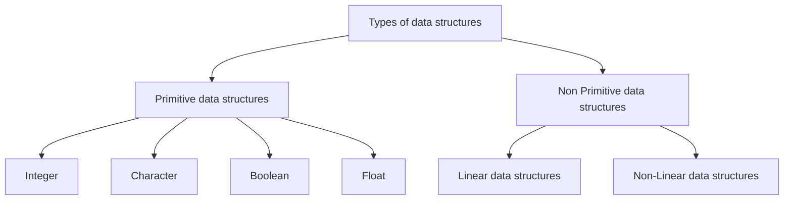
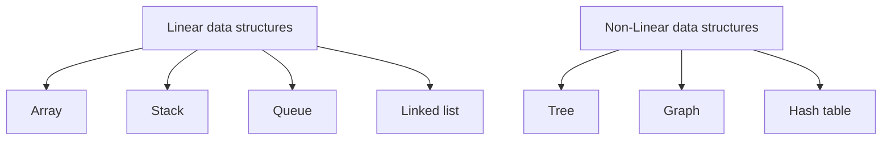

# Data structures
  
Common data structures

!> Work in process!

?> Coming soon...

## Content

- [Data structures](#data-structures)
  - [Content](#content)
  - [Data structures hierarchy](#data-structures-hierarchy)
    - [Non primitive data structures](#non-primitive-data-structures)
    - [Heap](#heap)
    - [Stacks](#stacks)
      - [Stack](#stack)
      - [Queue](#queue)
      - [Hash tables](#hash-tables)
      - [Graphs](#graphs)
      - [Trees](#trees)
      - [Binary Search](#binary-search)
      - [BFS](#bfs)
      - [DFS](#dfs)
      - [Dijkstra](#dijkstra)

## Data structures hierarchy



### Non primitive data structures



### Heap

Data structure that manage free block of memory (OS do it). Dynamicaly memory.
<!-- Структура от данни, която управлява свободните блокове памет (ос го прави)
Наричана още динамична памет (памет на OS) -->

### Stacks

Linear structure.
<!-- Обработката на информацията става само от едната страна наречена връх -->
LIFO - last in, first out

#### Stack

- ```Stack<T>```
- LIFO (last in fist out)
- push, pop
- static stack (array based), fixed capacity
- linked stack (dynamic)
  - Two fields: value, next
  - Like linked list

#### Queue

- ```Queue<T>```
- FIFO (first in first out)
- staticaly (array based, fixed size)
- dynamicaly (using pointers). Linked queue

#### Hash tables

#### Graphs

#### Trees

#### Binary Search

#### BFS

#### DFS

#### Dijkstra

resources

[data-structures-reference](https://www.interviewcake.com/data-structures-reference)
