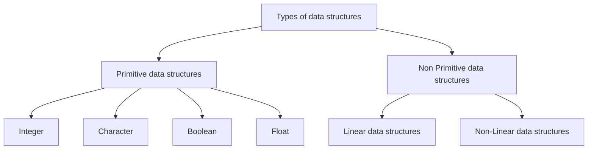
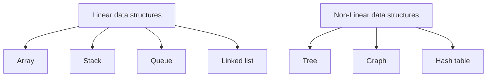
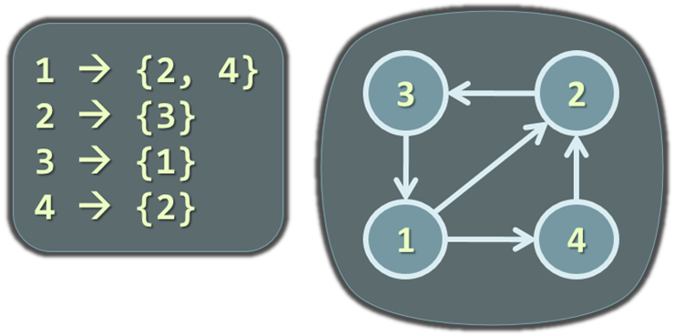
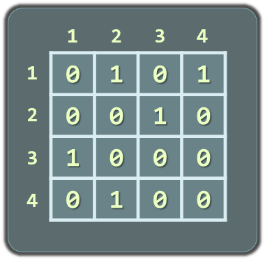
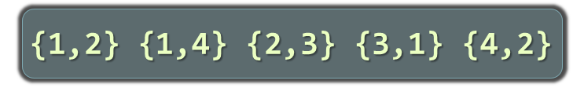
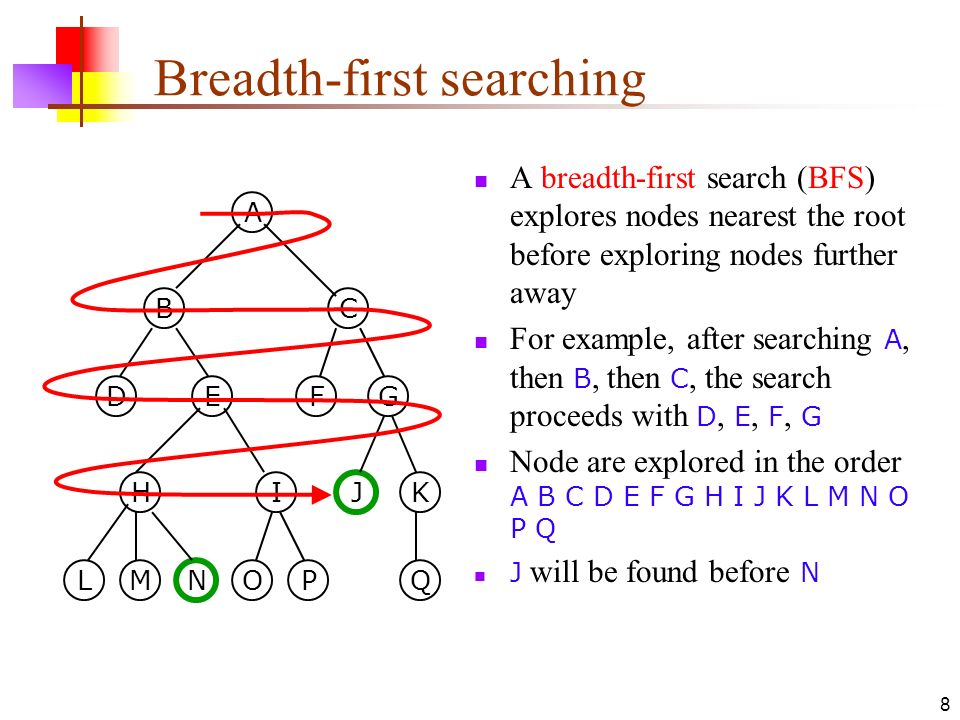
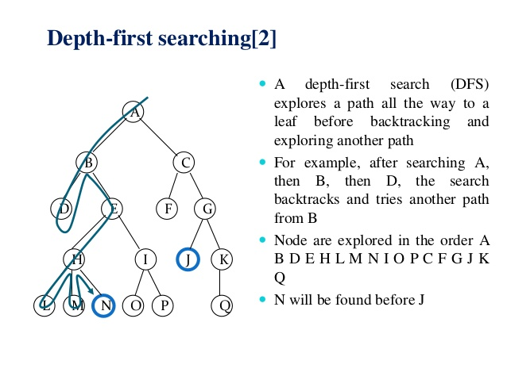
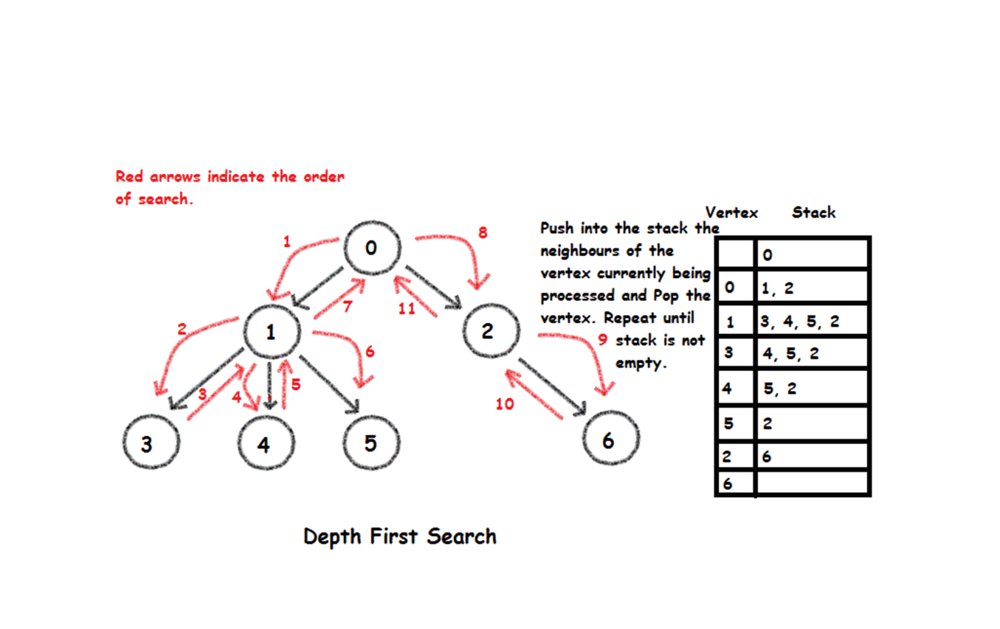

# Data structures
  
Common data structures

!> Work in process!

?> Coming soon...

## Content

- [Data structures](#data-structures)
  - [Content](#content)
  - [Data structures hierarchy](#data-structures-hierarchy)
    - [Non primitive data structures](#non-primitive-data-structures)
    - [Heap](#heap)
    - [Stacks](#stacks)
      - [Stack](#stack)
      - [Queue](#queue)
      - [Hash tables](#hash-tables)
      - [Graphs](#graphs)
      - [Trees](#trees)
      - [Binary Search](#binary-search)
      - [BFS and DFS](#bfs-and-dfs)
        - [BFS](#bfs)
        - [DFS](#dfs)
      - [Dijkstra](#dijkstra)

## Data structures hierarchy



### Non primitive data structures



### Heap

Data structure that manage free block of memory (OS do it). Dynamicaly memory.
<!-- Структура от данни, която управлява свободните блокове памет (ос го прави)
Наричана още динамична памет (памет на OS) -->

### Stacks

Linear structure.
<!-- Обработката на информацията става само от едната страна наречена връх -->
LIFO - last in, first out

#### Stack

- ```Stack<T>```
- LIFO (last in fist out)
- push, pop
- static stack (array based), fixed capacity
- linked stack (dynamic)
  - Two fields: value, next
  - Like linked list

#### Queue

- ```Queue<T>```
- FIFO (first in first out)
- staticaly (array based, fixed size)
- dynamicaly (using pointers). Linked queue

#### Hash tables

[Data Structure and Algorithms - Hash Table](https://www.tutorialspoint.com/data_structures_algorithms/hash_data_structure.htm)

[Hash table](https://en.wikipedia.org/wiki/Hash_table)

Hash Tables and Hash Functions <br>
[](https://www.youtube.com/watch?v=KyUTuwz_b7Q "Hash Tables and Hash Functions")

Hash Tables <br>
[](https://www.youtube.com/watch?v=h2d9b_nEzoA "Hash Tables")

**Collision** refers to a situation where a function maps two distinct inputs to the same output. <br>
A collision is the situation when **different keys have the same hash value** ``h(k1) = h(k2) for k1 ≠ k2``

Solving Collision:
 - Linear Probing
   - If key match the same index, store the value to next free slot
   - Notes
     - Hash table will get large, 
	   - clustering - when more and more collisions,
     - abstract data type (ADT)
 - Separate Chaining
   - Hash table become array of linked lists

Summary

- Used to index large amounts of data
- Address of each key calculated using the key itself
- Collisions resolved with open or closed addressing
- Hashing is widely used in database indexing, compilers, caching, password authentication, and more
- Insertion, deletion and retrieval occur in constant time

#### Graphs

[Graph & Graph Models](https://www.tutorialspoint.com/discrete_mathematics/graph_and_graph_models.htm)

[Data Structure - Graph Data Structure](https://www.tutorialspoint.com/data_structures_algorithms/graph_data_structure.htm)

**Weighted** and **unweighted** graphs

Weight (cost) is associated with each edge

Data structures: Introduction to graphs <br>
[](https://www.youtube.com/watch?v=gXgEDyodOJU "Data structures: Introduction to graphs")

Graphs and Their Applications, Graphs have many real-world applications

- Modeling a computer network like Internet
  - Routes are simple paths in the network
- Modeling a city map
  - Streets are edges, crossings are vertices
- Social networks
  - People are nodes and their connections are edges
- State machines
  - States are nodes, transitions are edges

Representing Graphs

- Adjacency list
  - Each node holds a list of its neighbors
- Adjacency matrix
	- Each cell keeps whether and how two nodes are connected
- Set of edges

|     |     |     |
|:---:|:---:|:---:|
|  |  |  |

Simple C# Representation

```csharp
public class Graph
{
  List<int>[] childNodes;
  public Graph(List<int>[] nodes)
  {
    this.childNodes = nodes;
  }
}

Graph g = new Graph(new List<int>[] {
  new List<int> {3, 6}, // successors of vertice 0
  new List<int> {2, 3, 4, 5, 6},// successors of vertice 1
  new List<int> {1, 4, 5}, // successors of vertice 2
  new List<int> {0, 1, 5}, // successors of vertice 3
  new List<int> {1, 2, 6}, // successors of vertice 4
  new List<int> {1, 2, 3}, // successors of vertice 5
  new List<int> {0, 1, 4}  // successors of vertice 6
});
```

#### Trees

#### Binary Search

#### BFS and DFS

Depth-First Search (DFS) and Breadth-First Search (BFS) can traverse graphs <br>
Each vertex should be visited at most once

BFS is going to use more memory depending on the branching factor... however, BFS is a complete algorithm... meaning if you are using it to search for something in the lowest depth possible, BFS will give you the optimal solution. BFS space complexity is O(b^d)... the branching factor raised to the depth (can be A LOT of memory).

DFS on the other hand, is much better about space however it may find a suboptimal solution. Meaning, if you are just searching for a path from one vertex to another, you may find the suboptimal solution (and stop there) before you find the real shortest path. DFS space complexity is O(|V|)... meaning that the most memory it can take up is the longest possible path.
They have the same time complexity.
In terms of implementation, BFS is usually implemented with Queue, while DFS uses a Stack.

[Graphs data structure: DFS vs BFS?](https://stackoverflow.com/questions/2626198/graphs-data-structure-dfs-vs-bfs)

Algorithms: Graph Search, DFS and BFS <br>
[](https://www.youtube.com/watch?v=zaBhtODEL0w "Algorithms: Graph Search, DFS and BFS")


##### BFS  

Breadth-first search (BFS), **uses Queue** <br>
Breadth-First Search first visits the neighbor nodes, later their neighbors, etc.

| BFS |
|:---:|
|  |

Pseudocode example

```
BFS(node)
{
  queue ← node
  visited[node] = true
  while queue not empty
    v ← queue
    print v
    for each child c of v
      if not visited[c]
        queue ← c
        visited[c] = true
}
```

##### DFS

DFS, **uses stack** <br>
Depth-First Search first visits all descendants of given node recursively, finally visits the node itself.

| DFS |     |
|:---:|:---:|
|  |  |

Pseudocode example

```
DFS(node)
{
  stack ← node
  visited[node] = true
  while stack not empty
    v ← stack
    print v
    for each child c of v
      if not visited[c]
        stack ← c
        visited[c] = true
}
```

#### Dijkstra

resources

[data-structures-reference](https://www.interviewcake.com/data-structures-reference)
