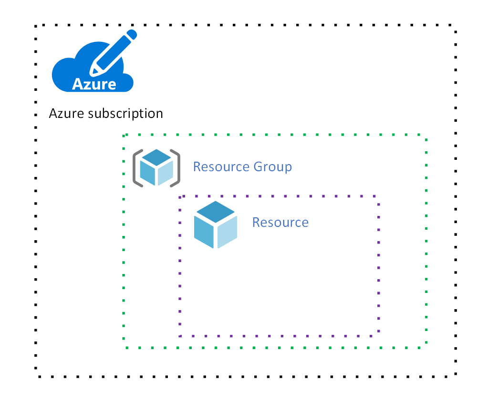
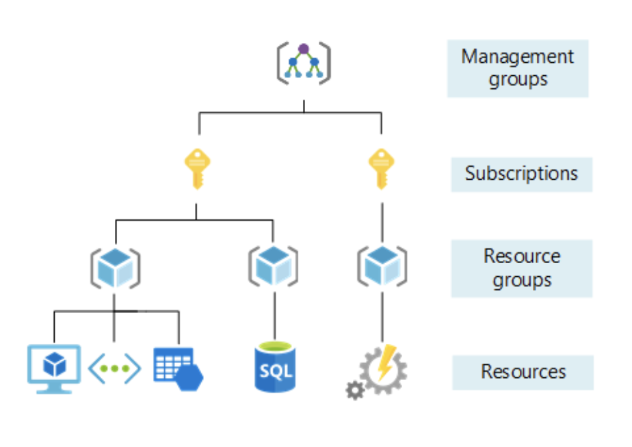

# Infrastructure as code, Azure ARM templates

*Modified 2021-03-29*

Notes about infrastructure as Code using Azure ARM templates.

- [Infrastructure as code, Azure ARM templates](#infrastructure-as-code-azure-arm-templates)
  - [Key concepts](#key-concepts)
  - [Install the Azure CLI](#install-the-azure-cli)
  - [The Basics](#the-basics)
    - [Create a resource group](#create-a-resource-group)
    - [Create ARM template](#create-arm-template)
    - [Sample ARM templates](#sample-arm-templates)
    - [Deploy](#deploy)
  - [References](#references)

## Key concepts

**Azure Resources Groups**

>Azure Resources Groups are logical collections of virtual machines, storage accounts, virtual networks, web apps, databases, and/or database servers. Typically, users will group related resources for an application, divided into groups for production and non-production

**Azure resource**

>In Azure, the term resource refers to an entity managed by Azure. For example, virtual machines, virtual networks, and storage accounts are all referred to as Azure resources.

Overview of the relationship between:

| Resource groupe and resource relationship | Example of resource groups with resources |
|:-----------------------------------------:|:-----------------------------------------:|
|                |                |

**ARM template**

> Azure Resource Manager templates are JavaScript Object Notation (JSON) files that define the infrastructure and configuration for your project.

## Install the Azure CLI

There few different CLI's that could be installed, such as ``Azure``, ``AzureRm`` and  ``Az``.  
The ``Az`` is the latest and cross platform, so once you are familiar with could be use anywhere, anyway rest will be deprecated.
Installation guidelines 👉 [Install the Azure CLI](https://docs.microsoft.com/en-us/cli/azure/install-azure-cli).

## The Basics

```PowerShell
az help
az login
az account list-locations -o table
```

``-o table`` is used to format the output as table, more at - [az commands references](https://docs.microsoft.com/en-us/cli/azure/reference-index?view=azure-cli-latest)

### Create a resource group

Some good practices:
- Use different **resource group for the environments**
- Define **naming conventions** such as ``rg-<service short name>-<environment>``
 
For example,

| RG Name         | Environment |
|:----------------|:------------|
| rg-contoso-dev  | Development |
| rg-contoso-qa   | QA          |
| rg-contoso-prod | Production  |


Creating a resource groupe with name ``rg-exploring`` and location ``Western Europe``.

```PowerShell
az group create -n rg-exploring -l westeurope
```

### Create ARM template 

Good practices:
- **Naming conventions** are must
  Check out for inspiration - [Define your naming convention](https://docs.microsoft.com/en-us/azure/cloud-adoption-framework/ready/azure-best-practices/resource-naming)
- **Do not** cheat using **one resource for more than one environment**  
  Why? Imagine we are using a ``blob storage`` with many containers having a ``dev`` and ``prod`` environments.  
  There are workarounds to save from the total cost using only one storage account.  
  But this can cause a lot of troubles, such as so called "noisy neighbor".  
  What if a bug in dev cause continuously uploading and hit the capacity of the storage. Which means we are going to be billed a lot or maybe production downtime. 
- **Parametrize** what make sense
  
The best way for me was to start exploring what already made by the rest of world.  
A good starting point for exploring is [Azure Quickstart Templates](https://azure.microsoft.com/en-us/resources/templates/).  
Different approach is to manually create resources and then export them as template, but do not make my mistake creating a bunch of resources, because you will end with 1000 lines of JSON and will be get totally confused.  
Check the links in [References](#references) section, there are some damn good tutorials about creating an ARM templates.

### Sample ARM templates

You may look at this sample templates

[az-arm-netapi-webapp-st-mssql.json](https://gist.github.com/atanasyanew/14e40a6700d3132d7c2e652dcf8a9a3c)
- Storage account and Blob
- MS SQL
- App service plan
- .NET Core API
- Web app

[az-arm-netapi-webapp-st-pssql.json](https://gist.github.com/atanasyanew/e6ef5d8c1053feb779df23272480d51f)
- Storage account and Blob
- PostgreSQL
- App service plan
- .NET Core API
- Web app

<!-- Web apps
App Service includes full support for hosting web apps by using ASP.NET, ASP.NET Core, Java, Ruby, Node.js, PHP, or Python. You can choose either Windows or Linux as the host operating system.

API apps
Much like hosting a website, you can build REST-based web APIs by using your choice of language and framework. You get full Swagger support and the ability to package and publish your API in Azure Marketplace. The produced apps can be consumed from any HTTP- or HTTPS-based client. -->


### Deploy

Validate 

```PowerShell
az deployment group validate --resource-group rg-exploring --template-file azuredeploy.json
az deployment group validate --resource-group rg-exploring --template-file azuredeploy.json --parameters parameters.json
```

Deploy using CLI

```PowerShell
az deployment group create --resource-group rg-exploring --template-file azuredeploy.json
az deployment group create --resource-group rg-exploring --template-file azuredeploy.json --parameters parameters.json
```

Note that for validation and deployment there are for both two commands, the second use external file ``parameters.json`` to provide the parameters for the ARM template.

## References

- [Tutorial: Create and deploy your first ARM template](https://docs.microsoft.com/en-us/azure/azure-resource-manager/templates/template-tutorial-create-first-template?tabs=azure-powershell)
  Microsoft's documentation, basics.
- [Build Azure Resource Manager templates](https://docs.microsoft.com/en-us/learn/modules/build-azure-vm-templates/)
  A good hands on experience using cli, requires Azure account.
- [Azure Resource Manager (ARM) Full Course Tutorial | Creating infrastructure in Azure using Code](https://www.youtube.com/playlist?list=PLGjZwEtPN7j8_kgw92LHBrry2gnVc3NXQ)
  Awesome YouTube video lessons for getting started with the ARM templates.

---

<!-- - [Deploy an Angular App From Visual Studio Code to Azure](https://dzone.com/articles/deploy-an-angular-app-from-visual-studio-code-to-a-1)
- [Getting started with Azure Blob Storage in .NET Core | Azure Tutorial](https://www.youtube.com/watch?v=9ZpMpf9dNDA)
- [Azure — Configure Application settings and Connection strings in Azure App Services](https://medium.com/awesome-azure/configure-app-settings-in-azure-app-services-1d50842d167c) -->