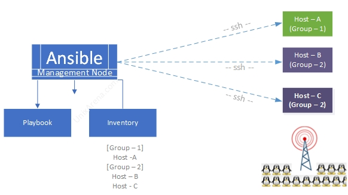

# Ansible 101

*Modified 2022-03-18*

Ansible is an open-source software provisioning, configuration management, and application-deployment tool enabling infrastructure as code.
Its also agentless.

- [Ansible 101](#ansible-101)
  - [How does it works](#how-does-it-works)
  - [Environment setup](#environment-setup)
  - [Concepts](#concepts)
    - [Ansible Core](#ansible-core)
    - [Ad hoc commands](#ad-hoc-commands)
    - [Playbooks](#playbooks)
    - [Inventory](#inventory)
    - [Roles](#roles)
    - [Host Variables](#host-variables)
    - [Handlers](#handlers)
    - [Templates](#templates)
  - [Setup remote hosts credentials](#setup-remote-hosts-credentials)
  - [Example](#example)
  - [References](#references)

## How does it works

>Ansible connects over ssh or WinRM (windows) to a remote system to execute a task. Python 2.4+ is a requirement on the remote systems where Ansible will execute its tasks.

|  |
|:------------------------------------------:|
| Fig.01 - Ansible overview                  |


## Environment setup

Setup the required environment in order to run Ansible, environment for the machine that will execute tasks aka playbooks to the remotes.

1. Installation steps for installing ansible on WSL
   <!-- 
   ```bash
   sudo apt update
   sudo apt install software-properties-common
   sudo add-apt-repository --yes --update ppa:ansible/ansible
   sudo apt install ansible
   ``` 
   -->
   ```bash
   sudo apt install ansible
   ansible --version
   ```

1. Fix file permission warnings
   
   ```bash
   sudo nano /etc/wsl.conf
   ```

   and copy the following content

   ```ini
   [automount]
   enabled = true
   mountFsTab = false
   root = /mnt/
   options = "metadata,umask=22,fmask=11"

   [network]
   generateHosts = true
   generateResolvConf = true
   ```
  
2. Optional, in order to skip step 2, [read more](https://github.com/ansible/ansible/issues/42388)

   ```bash
   cd projectRoot # Where the ansible.cfg is located
   export ANSIBLE_CONFIG=./ansible.cfg
   ```

## Concepts

### Ansible Core

>Command-line tool/Interface

### Ad hoc commands

>Ansible Core allows ad-hoc commands to be run, or for playbooks to be executed

>Ad hoc commands are great for tasks that repeat rarely, tasks you could execute a quick one-liner in Ansible without writing a playbook. 

Examples
```bash
# Ad hoc command syntax
ansible [pattern] -m [module] -a "[module options]"

# Ad hoc command that pings localhost
ansible localhost -m ping
ansible all -i 'octopi.local,' -m ping -u pi --ask-pass

# Ad hoc shell command on a remote system
ansible octopi.local -m shell -a 'echo $TERM' --ask-pass

# Rebooting servers
ansible octopi.local -a "/sbin/reboot"

# Managing files
ansible octopi.local -m ansible.builtin.copy -a "src=/etc/hosts dest=/tmp/hosts"

# Managing packages
ansible octopi.local -m ansible.builtin.apt -a "name=htop state=latest" --ask-pass

# Managing services
# Ensure a service is started on all web servers
ansible webservers -m ansible.builtin.service -a "name=httpd state=started"

# Gathering facts, variables about a system, can be used for conditional execution
ansible octopi.local -m ansible.builtin.setup --ask-pass
```

### Playbooks

>Playbooks are highly customizable scripts that are used to execute a series of tasks and commands.

>Ansible Playbooks offer a repeatable, re-usable, simple configuration management and multi-machine deployment system,

>If you need to execute a task with Ansible more than once, write a playbook and put it under source control. 
>Then you can use the playbook to push out new configuration or confirm the configuration of remote systems. 
>The playbooks in the [ansible-examples repository](https://github.com/ansible/ansible-examples) illustrate many useful techniques.

Playbooks are expressed in YAML format, example

```yml
- hosts: octopis

  tasks:

    - name: OctoPi apt get update and upgrade # Name/description of the task
      become: true # Become super user
      register: debug_update # Register the result to a variable
      apt: # Module name
        update_cache: yes # Run the equivalent of apt-get update
        upgrade: yes # If yes or safe, performs an aptitude safe-upgrade.

    - name: OctoPi install 3rd party plugins
      pip:
        name: # The packages to install, either name or url
          - https://github.com/Kragrathea/OctoPrint-PrettyGCode/archive/master.zip # Adds a 3D GCode visualizer tab in Octoprint.
          - https://github.com/bradcfisher/OctoPrint-ExcludeRegionPlugin/archive/master.zip # Adds the ability to prevent printing within rectangular or circular regions of the currently active gcode file.
          - https://github.com/Salandora/OctoPrint-FileManager/archive/master.zip # A simple file manager
        state: latest # The state of packages

    - name: OctoPi systemctl restart service
      become: true
      systemd:
        name: octoprint # The service name
        state: restarted

    - debug: msg="{{ debug_update.stdout }}" # Debug registered variables/outputs
    - debug:  var=debug_update.stdout_lines # Using stdout_lines, for multiline output
    - debug: msg="{{ debug_update.stderr }}"
```

### Inventory

>A list of managed nodes. An inventory file is also sometimes called a 'hostfile'. 
>Your inventory can specify information like IP address for each managed node. 
>An inventory can also organize managed nodes, creating and nesting groups for easier scaling.

For example ``hosts.ini``
```ini
mail.example.com

[webservers]
foo.example.com
bar.example.com

[dbservers]
one.example.com
two.example.com
three.example.com

[octopis]
octopi.local

[octopis:vars] # Variables for octopi group
ansible_user=pi
```

### Roles

>Roles let you automatically load related vars, files, tasks, handlers, and other Ansible artifacts based on a known file structure. After you group your content in roles, you can easily reuse them and share them with other users.

Like a playbook, but simpler.
Does not include hosts and have fewer tasks.
Also known as task book.
Divining tasks into a roles.
File should be called ``main.yml`` and placed into ``root/roles/roleName/tasks/main.yml`` 

### Host Variables

``host_vars`` folder that contains files with variables for each host, instead of defining them in the main inventory host file.
The name of the file should be either the IP address, host name or dns name of the server.
The givens in inventory file names should match those files, for example ``./host_vars/octopi.local.yml``

### Handlers

Like an event, task to be execute based on condition.
Defined based on this file structure (required by ansible) ``./roles/roleName/handlers/main.yml``.
Name section should be simplified in order to use/reference it later on.
Can be threaded as normal tasks.

How to use them in a playbook - ``notify: taskNameDefinedInHandler``

### Templates

!> WIP!
jinja2 format .j2

## Setup remote hosts credentials

Set key base authentication

1. Generate an ssh key on machine you are using ansible, (using wsl ubuntu)
   ```bash
   # Generate a key, you may skip the passphrase, 
   # otherwise you should always run ansible with --ask-pass
   ssh-keygen -t ed25519 -C "ansible default key"

   # Verify that key is created (optional)
   cat ~/.ssh/id_ed25519.pub
   ```
2. Copy the key to all remote machines, for example
   ```bash
   # Copy the ssh key to the host
   ssh-copy-id -i ~/.ssh/id_ed25519.pub pi@octopi.local
   # Or Alternative methods 
   cat ~/.ssh/id_ed25519.pub | ssh pi@octopi.local 'cat >> ~/.ssh/authorized_keys'
   ```
   <!-- 
   In case it fails, a few changes in ``sshd_config`` are required
   ```bash
   sudo nano /etc/ssh/sshd_config
   ```
   Add the following
   ```bash
   WIP
   ```
   and then restart:
   ```bash
   sudo systemctl restart sshd
   ``` 
   -->
   You may read more - [SSH Keys | Adding an SSH key to a Raspberry Pi](https://www.youtube.com/watch?v=w6OsICbnJbA) and [How to add SSH public key to server](https://www.simplified.guide/ssh/copy-public-key)

## Example

Creating an ansible project, the example is for automating an Octoprint instance
- Update and upgrade OS packages
- Install plugins, using the octopi's pip (not the ansible one)
- Restarting octoprint systemctl service

Assuming the following project structure:

```bash
| .
│   ansible.cfg
├───inventory
│       hosts.ini
└───playbooks
        apt-upgrade.yml
        octopi.yml
```

Comments are written for each file, you may also download the sample project from [github.com/atanasyanew/ansible](https://github.com/atanasyanew/ansible)

Note that the comments are only in this article, **you are not allowed to use inline comments** into files.

``ansible.cfg``
```ini
# Ansible Configuration Settings
# https://docs.ansible.com/ansible/latest/reference_appendices/config.html#ansible-configuration-settings-locations

[defaults]
inventory = ./inventory/hosts.ini # This points to the file that lists your hosts
```

``inventory/hosts.ini``
```bash
# Inventory file lists hosts that can be acted upon
# hosts sorted into groups to apply variables and tasks in bulk
# hosts can be in multiple groups
# there's a whole child group thing that we won't get into but you can read about here:
# https://docs.ansible.com/ansible/latest/user_guide/intro_inventory.html

[serversGrpSample] # Defining a group of hosts
srv1.local
srv2.local

[rpi]
rpi1.local
rpi2.local 
rpi3.local

[octopis]
octopi.local

[octopis:vars] # Variables for the group
ansible_user=pi # The user that will be used for ssh connection
```

``playbooks/octopi.yml``
```yaml
- name: Provision Octopi's instances # Name/description of the playbook
  hosts: octopis

  tasks:

    - name: OctoPi apt get update and upgrade # Name/description of the task
      become: true # Become super user
      register: debug_update # Register the result to a variable
      apt: # Module name
        update_cache: yes # Run the equivalent of apt-get update
        upgrade: yes # If yes or safe, performs an aptitude safe-upgrade.

    - name: OctoPi install 3rd party plugins
      pip:
        name: # The packages to install, either name or url
          - https://github.com/Kragrathea/OctoPrint-PrettyGCode/archive/master.zip # Adds a 3D GCode visualizer tab in Octoprint.
          - https://github.com/bradcfisher/OctoPrint-ExcludeRegionPlugin/archive/master.zip # Adds the ability to prevent printing within rectangular or circular regions of the currently active gcode file.
          - https://github.com/Salandora/OctoPrint-FileManager/archive/master.zip # A simple file manager
          - https://github.com/j7126/OctoPrint-Dashboard/archive/master.zip # Adds a dashboard tab that displays the most relevant info regarding the state of the printer and any on-going print job.
          - https://github.com/OllisGit/OctoPrint-DisplayLayerProgress/releases/latest/download/master.zip # Displays stats on Browser TabTitle, NavBar and Printer Display
          - https://github.com/AlexVerrico/octoprint-stats/archive/master.zip # This plugin is designed to show statistics of your printer and estimate power usage in kWh.
          - https://github.com/jneilliii/OctoPrint-TabOrder/archive/master.zip # Simple plugin to allow the ordering of tabs within OctoPrint.
          - https://github.com/FormerLurker/ArcWelderPlugin/archive/master.zip # To make curved prints smoother
          - https://github.com/Andy-ch/OctoPrint-HeaterTimeout/archive/master.zip # Automatically shut off heaters if no print has been started.
          
          # - https://github.com/FormerLurker/Octolapse/archive/master.zip # Create a stabilized timelapse of your 3D prints.
          # - https://github.com/The-EG/OctoPrint-CameraSettings/archive/main.zip # Interactive camera settings via v4l2-ctl
          # - https://plugins.octoprint.org/plugins/telegram/ # A plugin to send and react on messages before, during and after a print via Telegram Messenger.
          # - https://github.com/BillyBlaze/OctoPrint-TouchUI/archive/master.zip # A touch friendly interface for Mobile and TFT touch modules
          # - https://github.com/birkbjo/OctoPrint-Themeify/archive/master.zip # Beautiful themes for octoprint
          # - https://github.com/OctoPrint/OctoPrint-FirmwareUpdater/archive/master.zip # Remote firmware updates give you added convenience and reduced hassle.
        executable: ~/oprint/bin/pip # The explicit executable or pathname for the pip executable, if different from the Ansible Python interpreter
        state: latest # The state of packages

    - name: OctoPi systemctl restart service
      become: true
      systemd:
        name: octoprint # The service name
        state: restarted

    - debug: msg="{{ debug_update.stdout }}" # Debug registered variables/outputs
    - debug:  var=debug_update.stdout_lines # Using stdout_lines, for multiline output
    - debug: msg="{{ debug_update.stderr }}"
```

Execute the playbook

```bash
# When having ssh passphrase-less key
ansible-playbook ./playbooks/octopi.yml -K

# When the ssh key has a passphrase
ansible-playbook ./playbooks/octopi.yml -k -K

# Or just ask for help
ansible-playbook -h
```

Some flags and their descriptions

- ``-K`` shorten for ``--ask-become-pass`` used when the task requires root access, check the defined ``become: true`` in the playbook
- ``-k`` shorten for ``--ask-pass`` in order to prompt for the ssh passphrase
- ``--become`` in order to execute as root permissions

A few more examples to explore 

```bash
# Get free space for octopis inventory grp, ssh using user pi, and ask for a password
ansible -i ./inventory/hosts.ini octopis -a "free -h" -u pi -k

# Ping octopis host grp, using ssh user pi and ask for passphrase
ansible -i ./inventory/hosts.ini octopis -m ping --user pi --ask-pass

# List a hosts in the group
ansible -i ./inventory/hosts.ini octopis --list-hosts
# Or just (if defined as is in ansible.cfg)
ansible octopis --list-hosts

# Install htop via apt module
ansible octopis -m apt -a name=htop -u pi -k --become -K

# Same as sudo apt get update
ansible octopis -m apt -a update_cache=true -u pi -k --become -K
```

## References

- [Ansible 101 - Ansible for beginners](https://www.redhat.com/en/blog/ansible-101-ansible-beginners)<br>
  Red Hat blog
- [User Guide](https://docs.ansible.com/ansible/latest/user_guide/index.html)<br>
  Ansible official user guide
- [Ansible Playbook to deploy user with SSH Key](https://bidhankhatri.com.np/automation/ansible-playbook-to-deploy-user-with-ssh-key/)<br>
  Create a new user with sudo privilege and deploy it with their SSH Public Key to all the targeted hosts through ansible-playbook
- [Getting started with Ansible](https://www.youtube.com/playlist?list=PLT98CRl2KxKEUHie1m24-wkyHpEsa4Y70)<br>
  YouTube series, LearnLinuxTV
- [you need to learn Ansible RIGHT NOW!! (Linux Automation)](https://www.youtube.com/watch?v=5hycyr-8EKs)<br>
  YouTube, NetworkChuck
- [Ansible for the Windows Admin by Jeremy Murrah](https://www.youtube.com/watch?v=ZI20Y10OKd0)<br>
  YouTube, PowerShell.org
- [Manage Windows like Linux with Ansible](https://www.youtube.com/watch?v=FEdXUv02Dbg)<br>
  YouTube, Red Hat Summit

