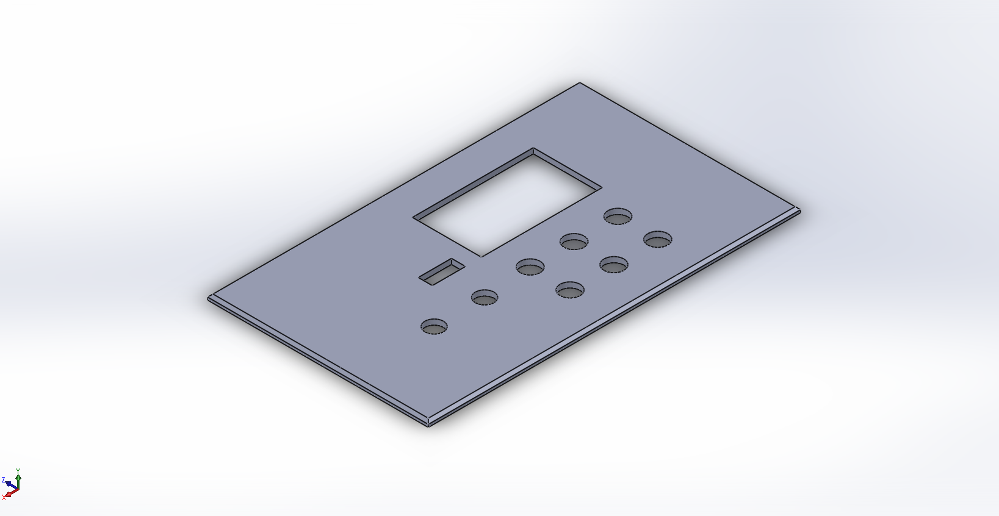
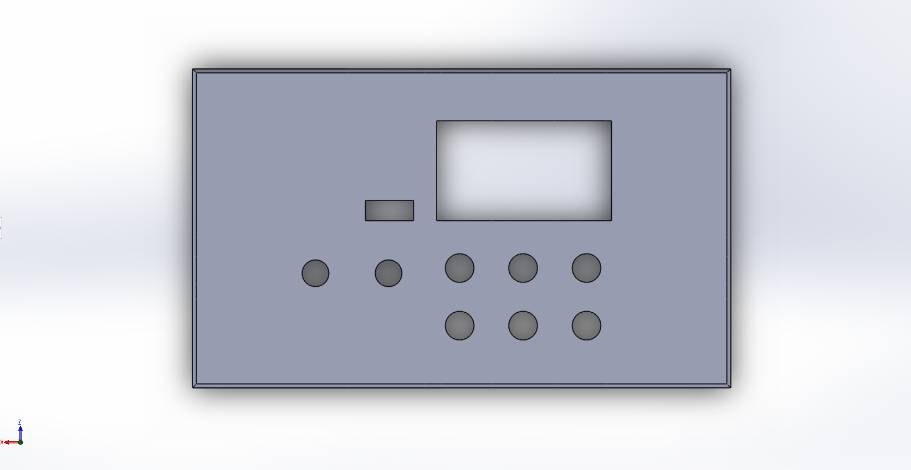
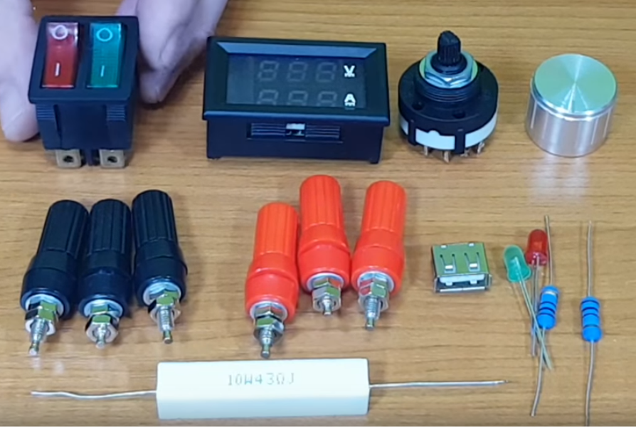
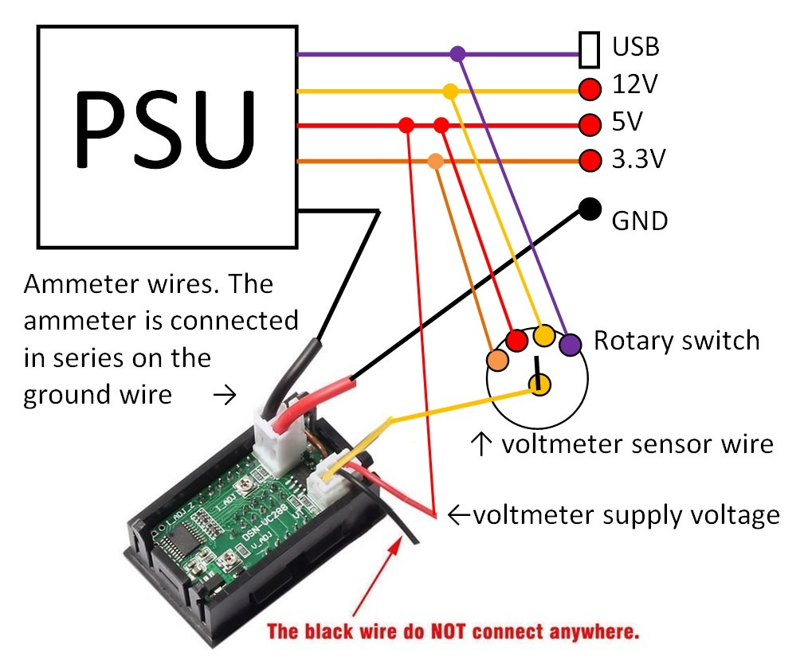

# Lab bench power supply

<!-- date: Jul 20, 2018 -->

- [Lab bench power supply](#lab-bench-power-supply)
  - [Description](#description)
  - [Show case](#show-case)
  - [References](#references)
    - [Parts](#parts)
    - [Wiring](#wiring)
    - [Video tutorial](#video-tutorial)

## Description

Lab bench power supply from PSU

Files:

- [front-panel-model.SLDPRT](./assets/front-panel-model.SLDPRT)
- [front-panel-model.STL](./assets/front-panel-model.STL)

## Show case

## References

### Parts

### Wiring

### Video tutorial

