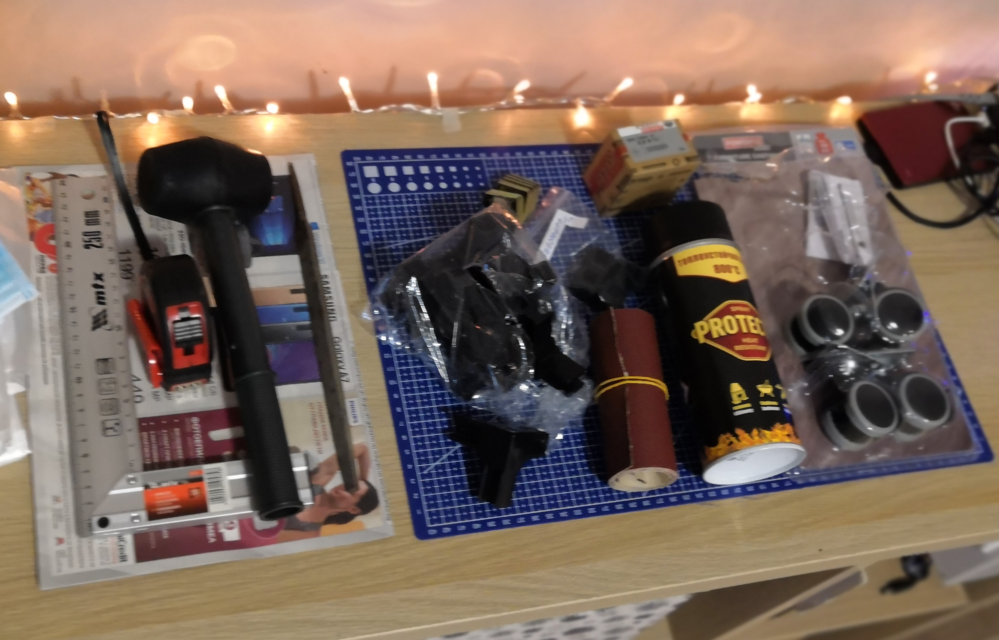
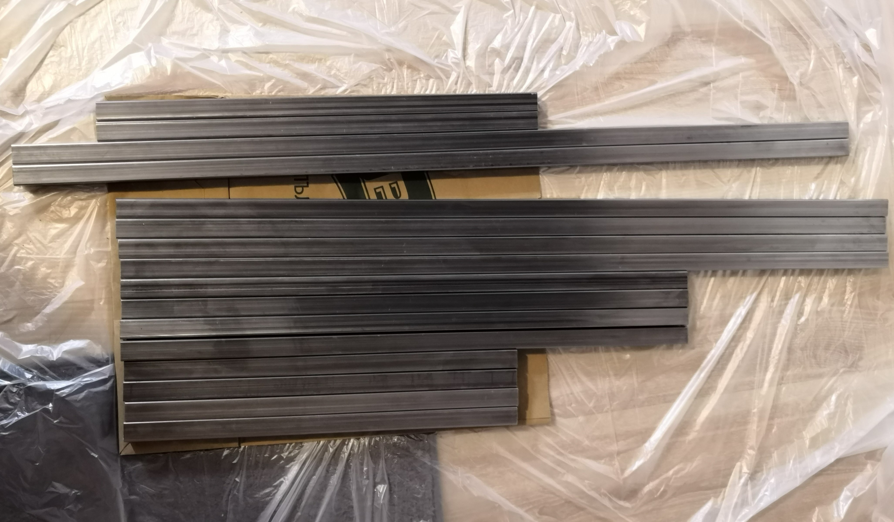
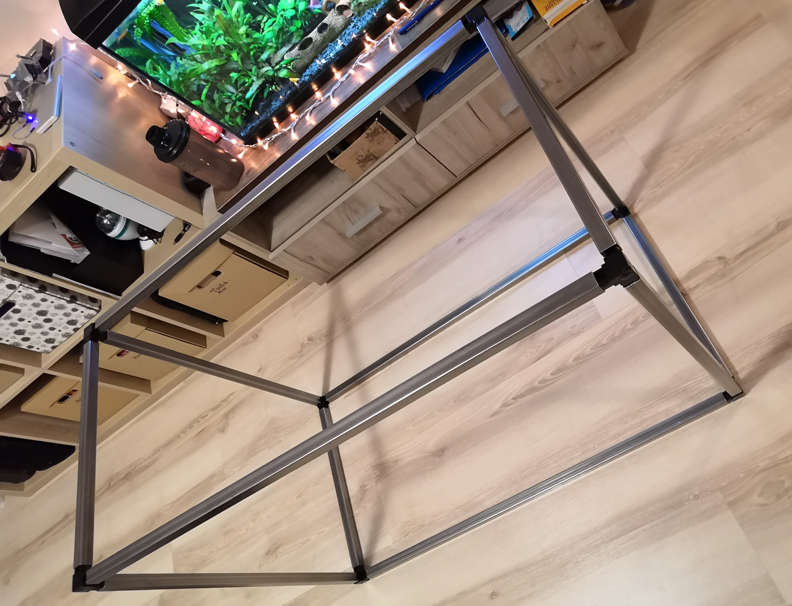
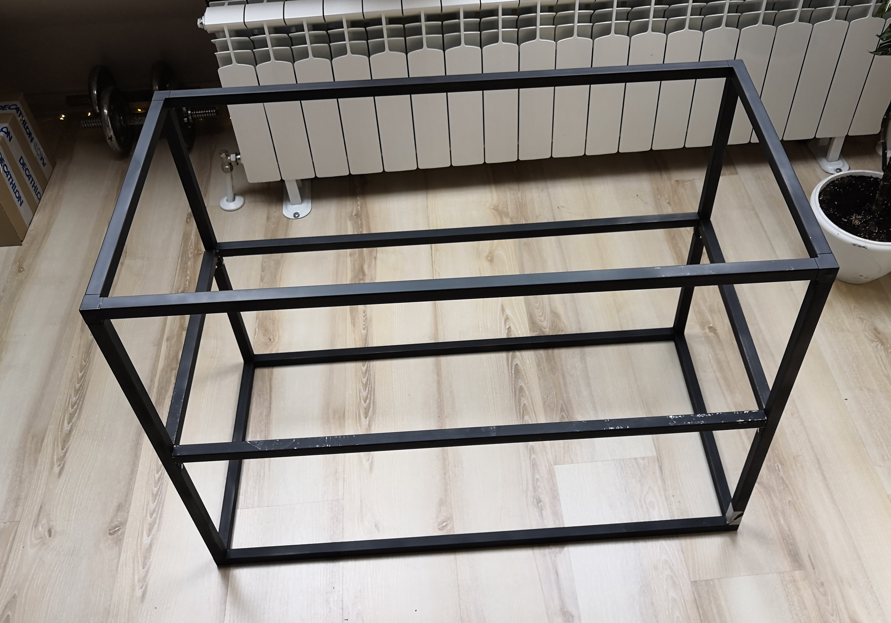
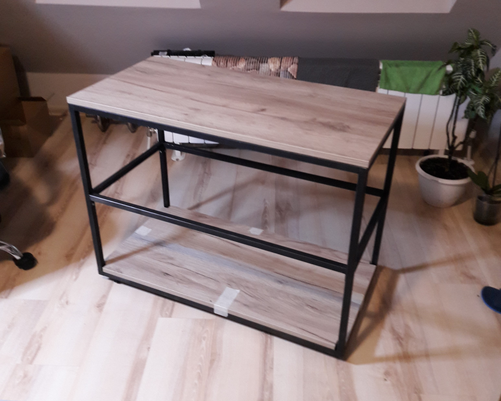

# Portable workbench

<!-- Date: 2019.05.02  -->
- [Portable workbench](#portable-workbench)
  - [Description](#description)
  - [Show case](#show-case)
  - [Parts](#parts)
  - [Assembly](#assembly)
  - [Resources](#resources)

## Description

Portable workbench

## Show case

|  |  |
|:------------------------------------:|:------------------------------------:|

## Parts

| Name | BGN | QTY | Total price |
|:-|:-:|---|---|
| [Square pipe connector](https://www.mdm-bg.eu/brand/product/bid/1/mcid/57/pcid/58/pid/250/)  (For pipe  20 х 20 х 1.2 mm)| 4 | 8 | 32 |
| [Square pipe](http://www.metal-m.bg/productdetails.aspx?id=2)  (20x20x1.2 mm, cutting included) |  |  ~12m | 20 |
| Mounting angle| 0.60 | 10 | 36 |
| Shelf's (45x90x1.8) | 22 | 3 | 66 |
| Screws (3.5 x 13, package of 100) | 3 | 1 | 3 |
| Paint spray | 10 | 1 | 10 |
| Tires (Lidl powerfix furniture castors) | 10 | 1 | 10 |
|  |  |  | 180 |

|  |  |
|:------------------------------------:|:------------------------------------:|

## Assembly

- Pipes should be cut as follow (Total length used - ~1100 cm)
  - 4x60 cm
  - 4x85 cm
  - 4x40 cm
  - 2x45 cm (shelf's support stand)
  - 2x90 cm (shelf's support stand)
- Pipes preparation (Cleaning and sanding)
- Assembly the construction
- Painting the whole construction
- Adding shelf's
- Adding tires

|  |  |
|:------------------------------------------:|:------------------------------------------:|
|  |  |

## Resources

- [How to Make a Folding Mobile Workbench](https://www.youtube.com/watch?v=p-XQduw9tFk)
- [Easy Portable Workbench](https://rogueengineer.com/easy-diy-portable-workbench-plans/)
- [Easy Build Workbench - buildsomething.com](buildsomething.com)
- [How to make an Ironbound DIY Bookcase out of angle irons and 2x10s](https://www.youtube.com/watch?v=f2FNg-2TMh0)
- [3 Tier Metal & Wood Book Shelf | Modern Builds | DIY](https://www.youtube.com/watch?v=Yd7M_VX7o3k)
- [DIY Folding Mobile Workbench - YouTube](https://www.youtube.com/watch?v=jUNZVaGAE3E)
