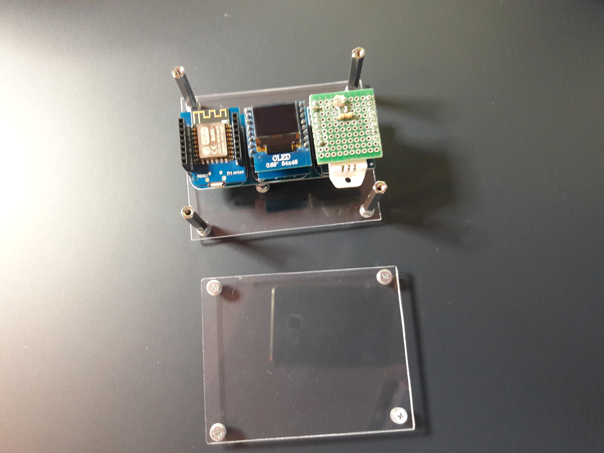

# Weather stations

<!-- Date: Jun 18, 2019 -->

!> Deprecated

- [Weather stations](#weather-stations)
  - [Description](#description)
  - [Show cases](#show-cases)
  - [References](#references)

## Description

Home repository from my weather stations
The repository contains two versions of the weather stations, with small differences between them.

- Indoor station, source code: [/src/indoor-station](/src/indoor-station)

Both stations using MQTT to communicate with RPI.
The RPI host a Node-Red instance that take care for the rest like data storing, visualizing etc..

## Show cases

|  |  |
|:-----------------------------------------------------------------:|:-----------------------------------------------------------------:|
|  |  |
|  |  |

## References

[Solar Powered Weather Station](https://bitluni.net/solar-powered-weather-station)
