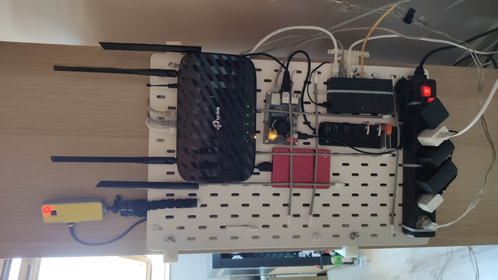
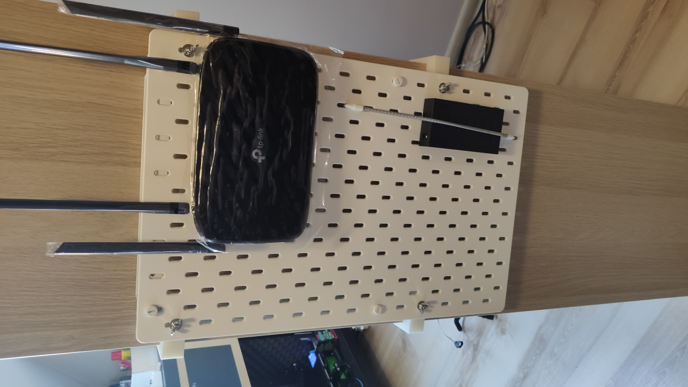

# Home server panel

*Modified 2020-07-31*

- [Home server panel](#home-server-panel)
  - [Description](#description)
  - [Show case](#show-case)
  - [TODOs](#todos)

## Description

Home server panel

For the panel I'm using IKEA Skadis board, mounted on Kallax via [thing:4580900](https://www.thingiverse.com/thing:4580900)

## Show case

Version 3

|  |  |
|:--------------------------------------:|:--------------------------------------:|

Version 2

|  |  |
|:--------------------------------------:|:--------------------------------------:|

Version 1, the first

|  |  |
|:--------------------------------------:|:--------------------------------------:|

## TODOs

- More details to be written.
- Add the new version of the panel
