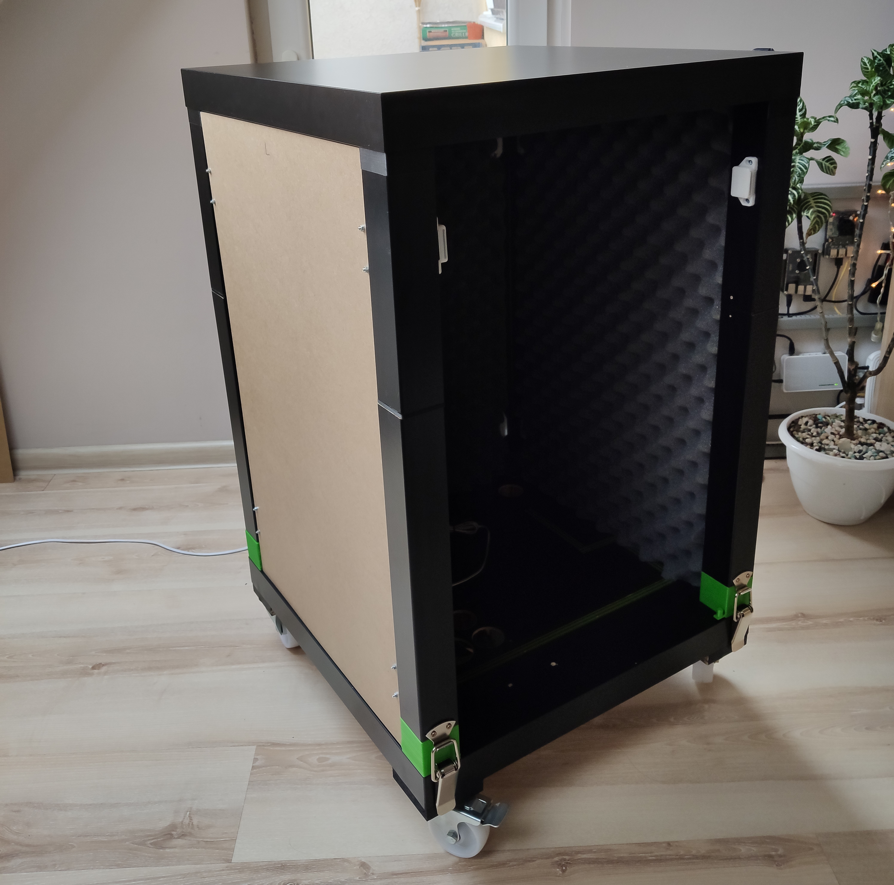
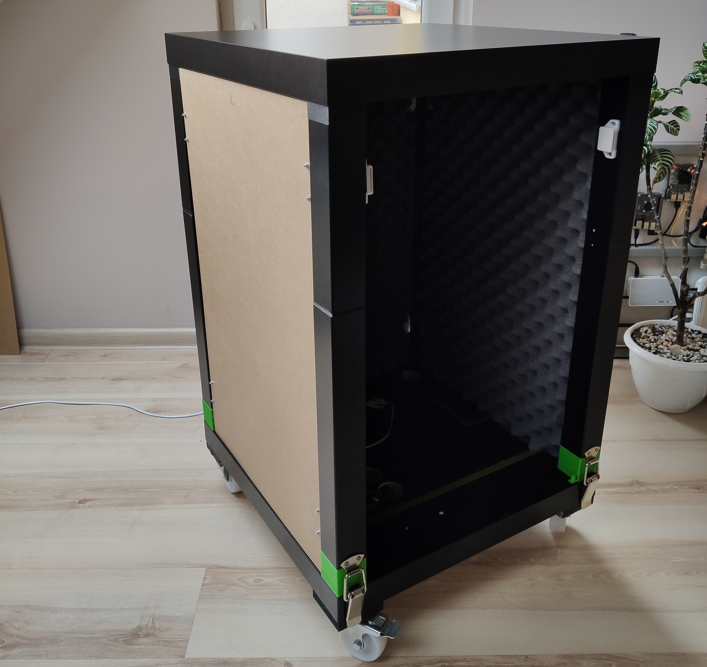
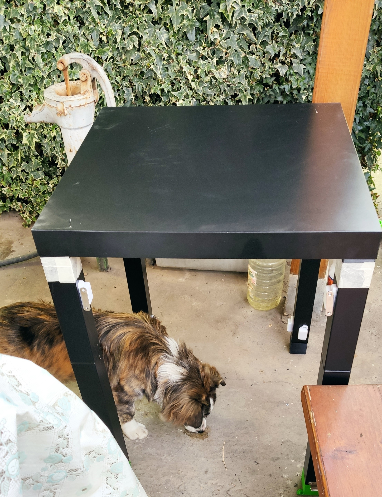
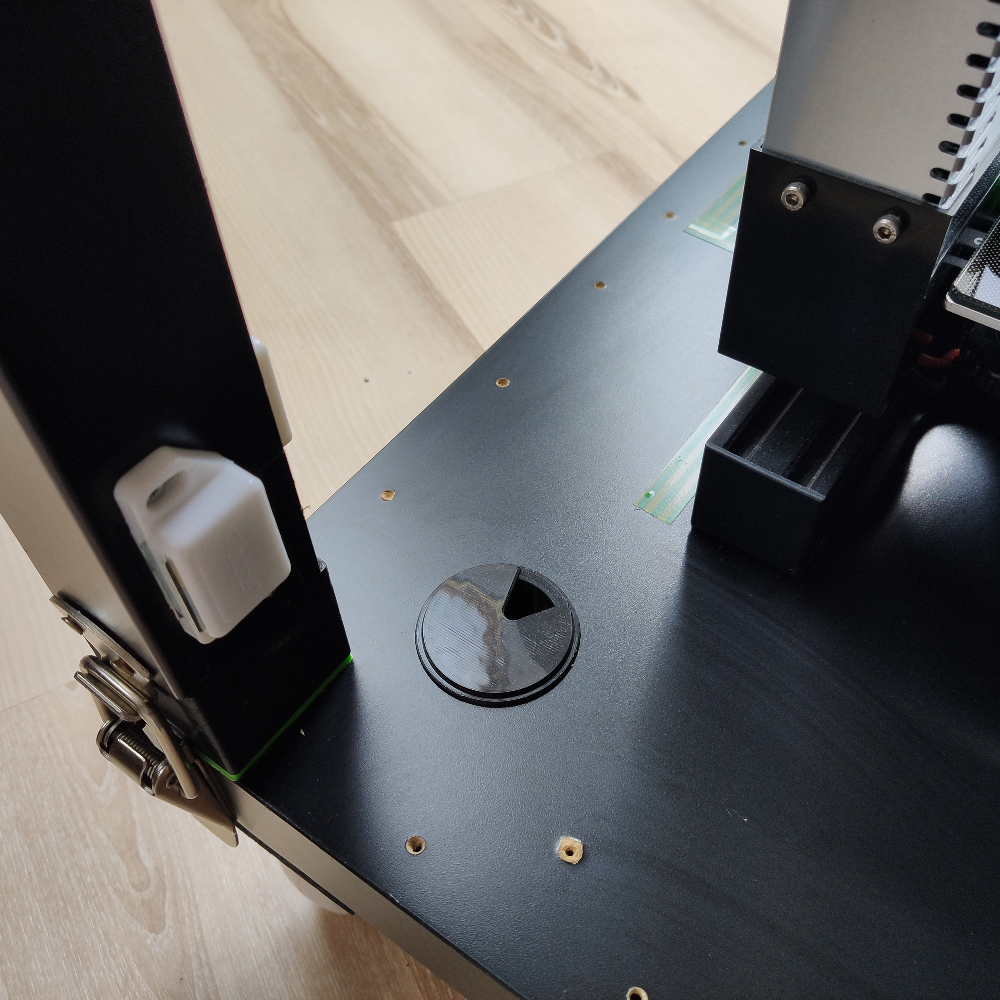
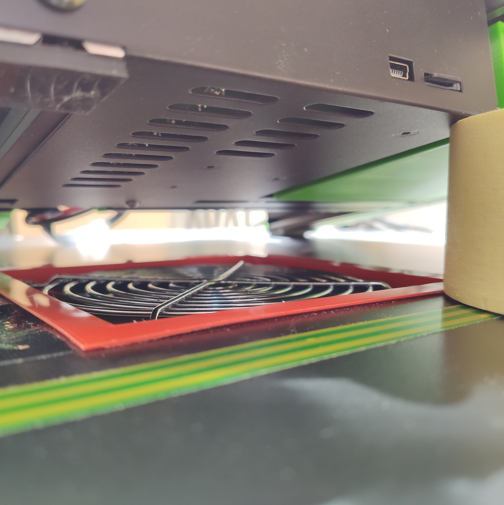

# Creality Ender 3 enclosure

Modified: 2020.05.02

- [Creality Ender 3 enclosure](#creality-ender-3-enclosure)
  - [Description](#description)
  - [Parts](#parts)
  - [Parts, 3D printed](#parts-3d-printed)
  - [Show case](#show-case)
  - [TODOs](#todos)

## Description

Notes for creating my 3D printer enclosure

## Parts

| n | Name | QTY | Total price | Description |
|:-:|------|:---:|------------:|-------------|
| 1   | Ikea lack table                | 2     | 7 EUR      |                              |
| 2   | 3mm mdf                        |       | 5 EUR      | 3 pieces (44.4cm x 70.4cm)   |
| 3   | Acoustic Foam                  |       | 10 EUR     | approximately less than 2m^2 |
| 4   | Furniture door magnet          | 18    | 6 EUR      |                              |
| 5   | POWERFIX Furniture Castors Set | 1     | 5 EUR      | 4 wheels in a set            |
| 6   | Toggle Latch Catch Hasp Clamp  | 4     | 5 EUR      |                              |
| 7   | Power outlet extender          | 1     | 4 EUR      |                              |
| 8   | Plexiglass                     | 1     | 5 EUR      |                              |
| 9   | Screws, etc..                  |       | 2 EUR      |                              |
| 9   | Used filament?                 |       |            |                              |
|     |                                |       | **50 EUR** |                              |

## Parts, 3D printed

| n | File name | QTY | link to file | Description |
|:-:|------|:---:|------------:|-------------|
| 1 | ``LACK_foot_Joiner.STL``               | 4 | [thing:2578774](https://www.thingiverse.com/thing:2578774/files) |                             |
| 2 | ``UPPER_LEG_EXTENDER_v3-0.stl``        | 4 | [thing:2578774](https://www.thingiverse.com/thing:2578774/files) |                             |
| 3 | ``LOWER_LEG_EXTENDER_v0-0.stl``        | 4 | [thing:2578774](https://www.thingiverse.com/thing:2578774/files) |                             |
| 4 | ``LEG_HOLDER_-_ALL_FOUR_51x51x23.stl`` | 4 | [thing:2578774](https://www.thingiverse.com/thing:2578774/files) |                             |
| 5 | ``socket_bracket_v1.stl``              | 2 | [thing:4088168](https://www.thingiverse.com/thing:4088168)       | Outlet holder               |
| 6 | ``Cable_bracket.stl``                  | 2 | [thing:1563959](https://www.thingiverse.com/thing:1563959)       | Cable hold down Bracket     |
| 7 | Outlet plug holder (for side mount)    | 1 |                                                                  |                             |
| 8 | ``120mm-fan-hepa-filter-like.stl``     | 1 | [thing:4331348](https://www.thingiverse.com/thing:4331348)       | Bottom, electronics cooling |
| 9 | Ikea Lack Grommet                      | 1 | [thing:2225786](https://www.thingiverse.com/thing:2225786/)      | Assembly of two parts       |

## Show case

Summary view

|  |  |  |  |
|:------------------------------------------------------------:|:------------------------------------------------------------:|:------------------------------------------------------------:|:------------------------------------------------------------:|
|  |  |  |  |
|  |  |  |  |

<!-- 

-->

Bottom, below view

|  |  |  |
|:------------------------------------------------------------:|:------------------------------------------------------------:|:-------------------------------------------------------------:|

Bottom, above view

|  |  |  |  |  |  |
|:----------------------------------------:|:-----------------------------------------|:----------------------------------------:|:----------------------------------------:|:----------------------------------------:|:-----------------------------------------|

## TODOs

- Should design case for the Raspberry Pi OctoPrint and auxiliary circuit (relays etc...)
- Light up the enclosure with LED strip (controllable with the OctoPrint)
- Consider moving PSU outside (bottom of the enclosure) or update flow of the air (PSU)
  - [Ender 3 / Ender 3 Pro - Underside PSU Mount](https://www.thingiverse.com/thing:3349588)
- Additional safety features (Smoke and fire alarm)
