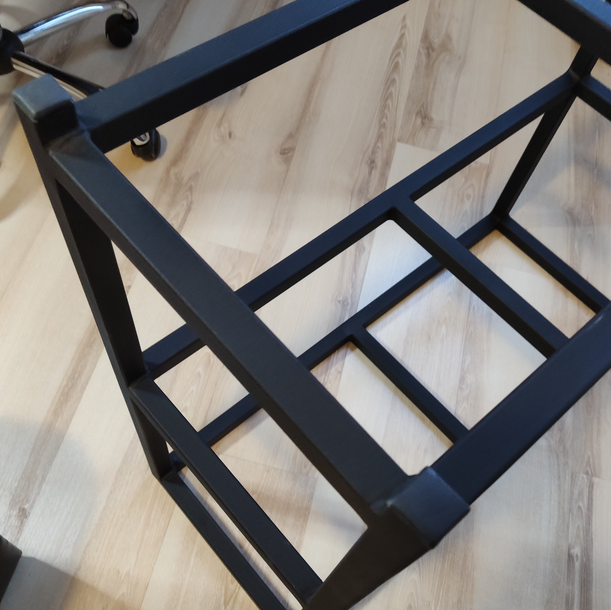
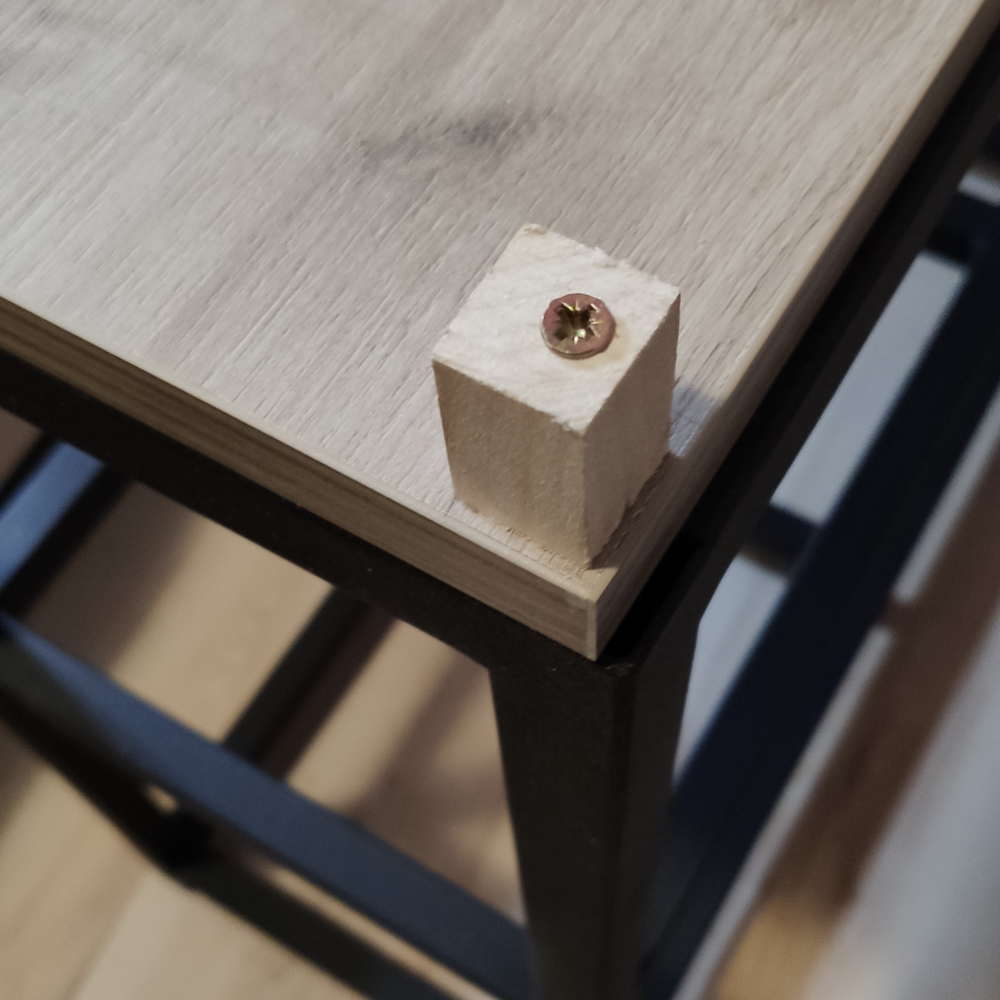

# Fish tank stand

## Description

Notes about creating my fish tank stand.

Overall dimensions

|          | L (cm) | H (cm) | W (cm) |
|:--------:|:------:|:------:|:------:|
| Aquarium | 60 | 50 | 31.5 |
| Stand    | 80 | 70 | 32   |

## Parts and assembly

The fish tank stand construction is build from ``square pipe's (25x25x2mm)``, using the drawings below.

|  |  |
|:-------------------------------------------------:|:-------------------------------------------------:|

| Name               | BGN | QTY | Total price | Description |
|:-------------------|:---:|-----|-------------|-------------|
| Metal construction | 100 | 1   | 100 BGN     | outsourced the whole construction, including paint |
| Table top          |     | 1   | 12 BGN      | 18 mdf (800x320)  |
| Shelf's            |     | 2   | 6 BGN       | 3mm mdf (800x320) |
| Misc               |     | -   | 4 BGN       | screws, furniture pads, etc.. |

Not mention in the parts list, but some wood squares used for button of the legs and to attach the table top to the construction.

## Showcase

|  |  |  |
|:----------------------------------------:|:----------------------------------------:|:----------------------------------------:|
|  |  |  |
