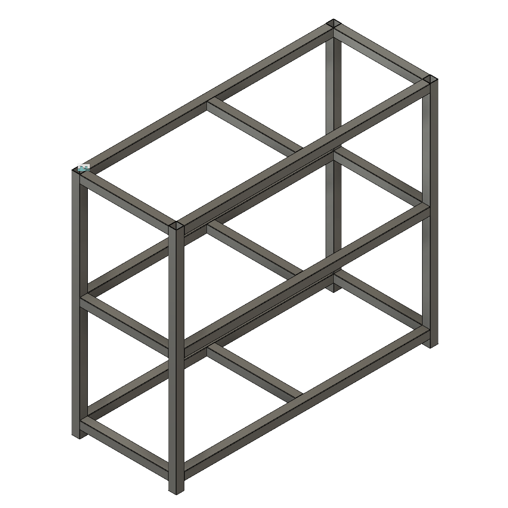
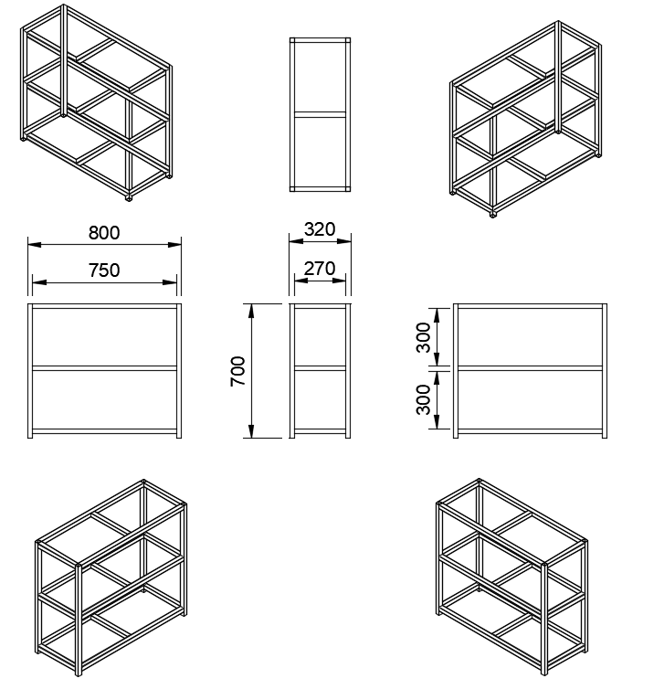

# Fish tank stand

## Description

Notes about creating my fish tank stand.

Overall dimensions

|          | L (cm) | H (cm) | W (cm) |
|:--------:|:------:|:------:|:------:|
| Aquarium | 60 | 50 | 31.5 |
| Stand    | 80 | 70 | 32   |

## Parts and assembly

The fish tank stand construction is build from ``square pipe's (25x25x2mm)``, using the drawings below.

|  |  |
|:------------------------------------:|:------------------------------------:|

| Name | BGN | QTY | Total price | Description |
|:-|:-:|---|---|---|
| Metal construction | 100 | 1 | 100 | outsourced the whole construction, including paint |
| Table top          |     | 1 |     | 18 mdf (800x320)  |
| Shelf's            |     | 2 |     | 3mm mdf (800x320) |

Not mention in the parts list, but some wood squares used for button of the legs and to attach the table top to the construction.

## Showcase
