# DiyHue LED light strip

Modified 2020-09-14

- [DiyHue LED light strip](#diyhue-led-light-strip)
  - [Description](#description)
  - [Parts](#parts)
  - [Installation](#installation)
  - [Show case](#show-case)
  - [References](#references)

## Description

Build of [diyHue](https://diyhue.org/) led strip using ``ESP8266 WeMos D1 Mini`` and ``WS2812B``
The led strip is controlled by the ``ESP``.
An instance of [diyHue](https://diyhue.org/getting-started/) hosted on the local server using docker, check more about the home server - [Home server using RPI](https://wiki.ayanev.eu/#/raspberry-pi/2020-02-rpi-home-server/)
There are many ways for controlling the led strip are provided, including the application from Philips - [Hue Essentials](https://www.hueessentials.com/).

## Parts

| n | Name | QTY | Total price | Description |
|:-:|------|:---:|------------:|-------------|
| 1   | Power supply 5V                | 1     | 5 EUR      | wattage depends on led strip |
| 2   | Led strip WS2812B              | 1     | 12 EUR     | Bought 4m 60 IP67, [WS2812B Led Strip](https://www.aliexpress.com/item/32682015405.html?spm=a2g0s.12269583.0.0.5c1bd07714INbs)  |
| 3   | ESP8266 NodeMCU / D1 mini      | 1     | 2 EUR      | [ESP8266 NodeMCU](https://www.aliexpress.com/item/32820380705.html?spm=a2g0s.9042311.0.0.27424c4dPIK0XS), I am using D1 mini |
| 4   | Connectors wires etc..         |       | 2 EUR      |                              |
|     |                                |       | **20 EUR** |                              |

## Installation

1. **Hue emulator**

   First of all run an instance of the ``diyHue emulator``, I am using Docker, more details [Home server using RPI](https://wiki.ayanev.eu/#/raspberry-pi/2020-02-rpi-home-server/).

2. **Setup mobile app**

   Download the [Hue Essentials](https://www.hueessentials.com/) mobile application and connect to the hub, choose manual connect and provide the server IP address as well the port ``8070``.

3. **Flashing the firmware**

   According to [diyHue’s documentation](https://diyhue.readthedocs.io/en/latest/lights/diylights.html#flashing-firmware)
  
   >In the new version is mandatory add SPIFFS storage to the ESP module. Try to choose the maximum possible size. For NodeMcu/Wemos D1 mini that have 4Mb of flash select 4M with **3M SPIFFS**. You will know if the SPIFFS storage is properly set by looking at wifi manager broadcast SSID, if is in format ESPxxxxx then you must try different SPiFFS option. Future upgrades can be performed manually by exporting the compiled binary file from Arduino and upload it using any browser by accessing /update http location of the light.

   and

   >The data pin of the LED’s must be connected to **RX** pin of the ESP8266 board. Make sure to disconnect this when uploading or it could fail.

   Download the software from [github.com/diyhue/Lights](https://github.com/diyhue/Lights)

   ```git
   git clone https://github.com/diyhue/diyHue.git
   ```

   Find and open ``Generic_WS2812_Strip.ino`` with Arduino IDE
   No need code changes

   Board config for ``D1 mini``

   | 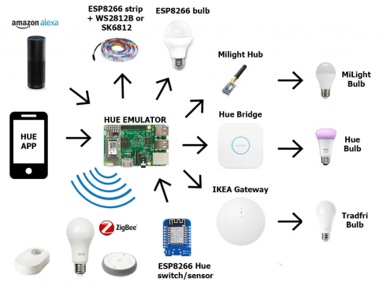 | 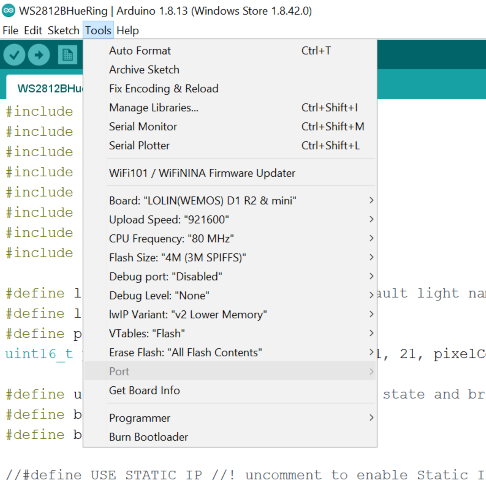 |
   |:---------------------------------------------:|:--------------------------------------------------:|

   If the board does not appear in the list go to ``File/Preferences/Additional boards manager`` and past the link ``http://arduino.esp8266.com/stable/package_esp8266com_index.json``, then ``Tools\Board\Board manager`` search for ``esp8266`` and install the library, note that you may have issues with the latest version, so am I, tested with ``version 2.4.2``

   After the flash is done, the device opens a hotspot, connect and should automatically navigate you to WIFI credential manager or go to ``192.168.4.1``. When the credentials are set, find the IP of the device and access it from the browser, in order to config the led strip.

   >Recommend using at least 3 lights, one light at every 20 - 50 LED’s so you can enjoy Hue scenes and Hue Entertainment.

4. **Wire and assembly**
  
   According to product details
    - Input Voltage: **5VDC**  
    - Power
      | LEDs/m    | Watt/m     |
      |:---------:|:----------:|
      | 30LEDs/m  | 9Watt/m    |
      | 60LEDs/m  | 18Watt/m   |
      | 74LEDs/m  | 22.2Watt/m |
      | 96LEDs/m  | 28.8Watt/m |
      | 144Leds/m | 43.2Watt/m |

   I'm using 2 meters LED strip with 60LEDs/m, witch is about 40W power supply 5VDC at 8A.

   Wiring of the hardware presented in the next diagram.
   Note that the led strip and the MCU should have one common ground, according to documentation the control pin is ``RX``.

   | 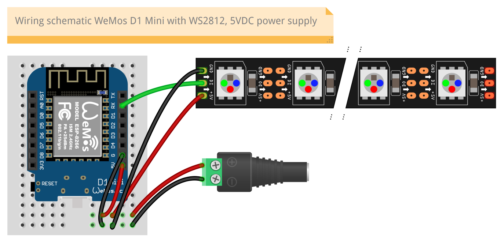  | 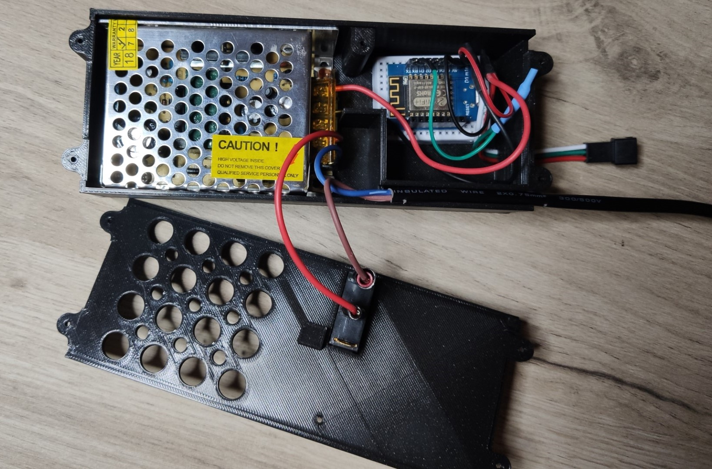  |
   |:----------------------------------------------:|:----------------------------------------------:|

   Everything is placed in a 3D printed case to protect the components and better end looking.
   Case models that can be used with some post print modifications [thing:2408514](https://www.thingiverse.com/thing:2408514) or [thing:2623182](https://www.thingiverse.com/thing:2623182).

## Show case

The **LED strip**

| 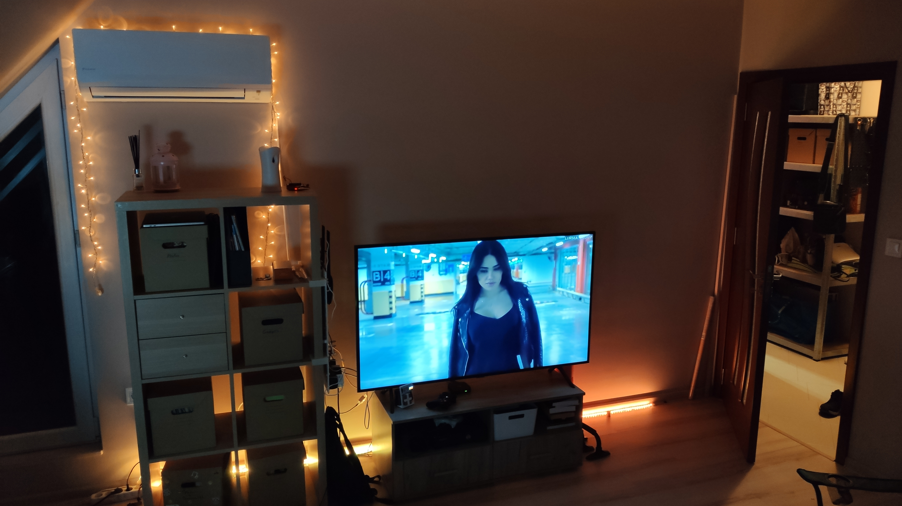 | 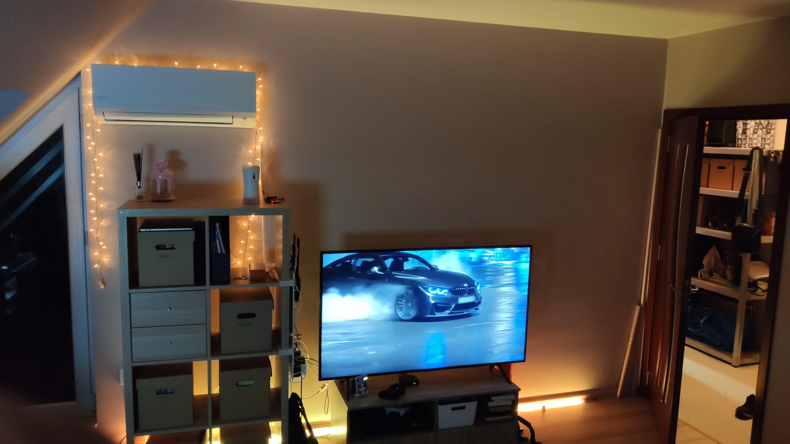 | 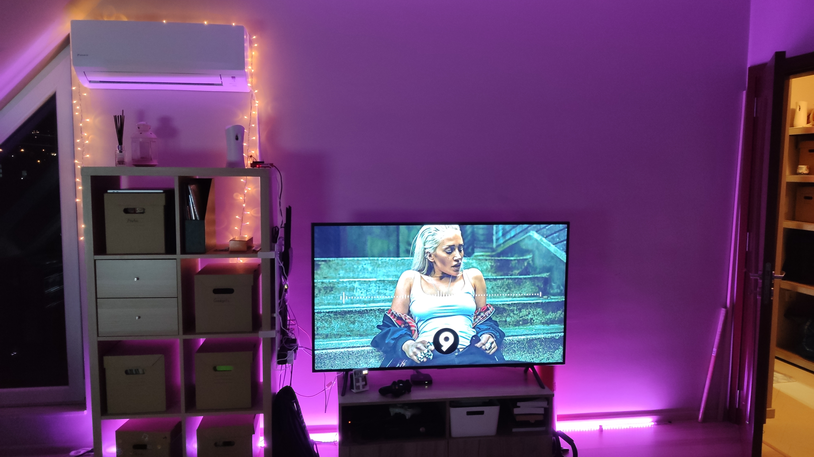 | 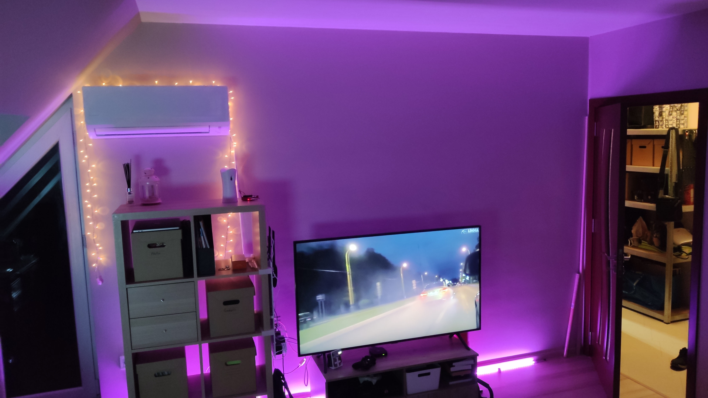 |
|:---------------------------------------------:|:---------------------------------------------:|:---------------------------------------------:|:---------------------------------------------:|

UI **Emulator**, **Device UI** and **Hue** mobile app

| 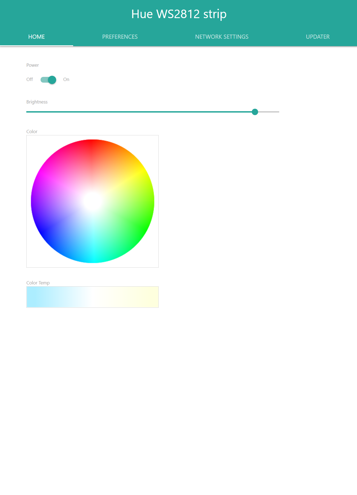 | 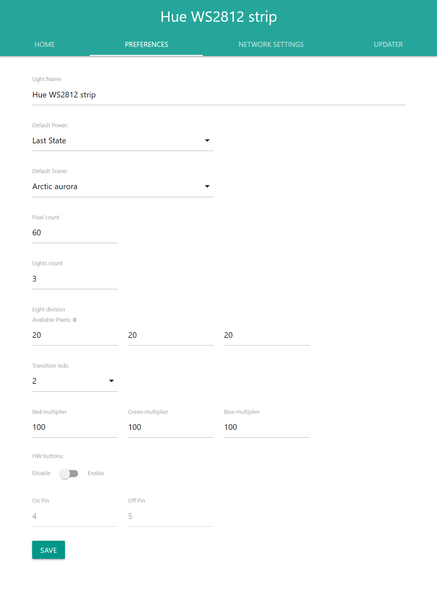 | 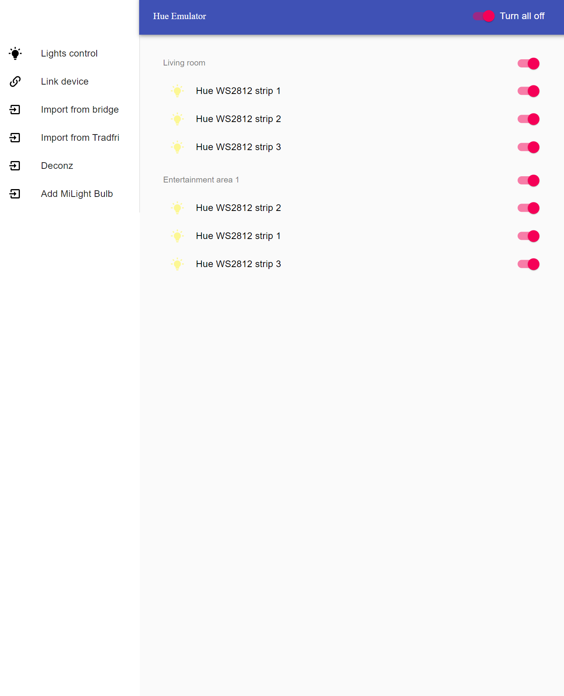 | 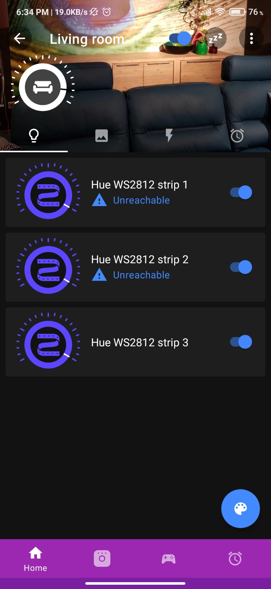 | 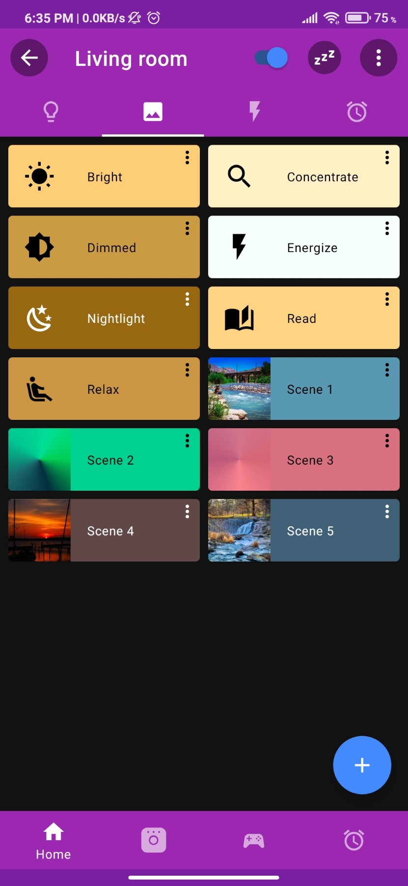 |
|:----------------------------------------:|:----------------------------------------:|:----------------------------------------:|:------------------------------------------:|:----------------------------------------:|

## References

- [diyhue.org](https://diyhue.org/)
- [diyhue.readthedocs.io](https://diyhue.readthedocs.io/en/latest/lights/diylights.html)
- [diyHue build, YouTube](https://www.youtube.com/watch?v=l77AuFNfD-s)
