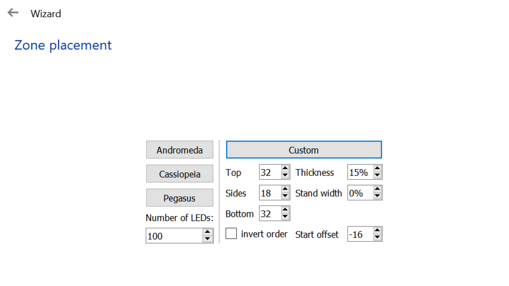

# Monitor ambient light

Modified 2020-10-03

- [Monitor ambient light](#monitor-ambient-light)
  - [Description](#description)
  - [Parts](#parts)
  - [Installation](#installation)
  - [Show case](#show-case)
  - [References](#references)

## Description

Build of desktop ambient light for my monitor (AOC U2777B) using ``Arduino nano``, ``WS2812 LED strip`` and [Prismatik](https://github.com/psieg/Lightpack).

## Parts

| n | Name | QTY | Total price | Description |
|:-:|------|:---:|------------:|-------------|
| 1   | Power supply 5V                | 1     | 5 EUR     | wattage depends on led strip |
| 2   | Led strip WS2812B              | 1     | 0 EUR     | had some left, for my monitor used less than 2, [WS2812B Led Strip](https://www.aliexpress.com/item/32682015405.html?spm=a2g0s.12269583.0.0.5c1bd07714INbs)  |
| 3   | Arduino Nano                   | 1     | 1 EUR     | [Arduino Nano](https://www.aliexpress.com/item/32551909986.html?spm=a2g0s.9042311.0.0.27424c4d3wew8n) |
| 4   | Connectors wires etc..         |       | 2 EUR     | [DC-DC LM2596](https://www.aliexpress.com/item/32653212622.html?spm=a2g0s.9042311.0.0.65174c4d64tA6f) (Optional, if using other power supply), <br> [LED Strip Connector](https://www.aliexpress.com/item/32805106492.html?spm=a2g0s.9042311.0.0.65174c4d64tA6f), <br> [Corner Connector](https://www.aliexpress.com/item/32705217295.html?spm=a2g0s.9042311.0.0.5ec14c4dulmC07)                             |
|     |                                |       | **7 EUR** | |

## Installation

1. **Wire and assembly**
  
   According to product details
    - Input Voltage: **5VDC**  
    - Power
      | LEDs/m    | Watt/m     |
      |:---------:|:----------:|
      | 30LEDs/m  | 9Watt/m    |
      | 60LEDs/m  | 18Watt/m   |
      | 74LEDs/m  | 22.2Watt/m |
      | 96LEDs/m  | 28.8Watt/m |
      | 144Leds/m | 43.2Watt/m |

   I'm using less than 2 meters of LED strip with 60LEDs/m, which is about 30W power supply, strip voltage 5VDC.

   Back side LEDs config for the monitor

   - top/bottom ``32``
   - sides ``18``
   - total of ``100``

   Wiring of the hardware presented in the next diagram.

   Note that the LED strip and the MCU should have one common ground.

   |  |  |  |  |
   |:-------------------------------------------------------:|:-------------------------------------------------------:|:-------------------------------------------------------:|:-------------------------------------------------------:|

   3D printed enclosure used, [thing:2511187](https://www.thingiverse.com/thing:2511187) or [thing:3162083](https://www.thingiverse.com/thing:3162083).

2. Arduino firmware

   Download the source code from [Adalight WS2812](https://github.com/Wifsimster/adalight_ws2812).

   The sketch requires [Adalight-FastLED](https://github.com/dmadison/Adalight-FastLED) library, arduino libraries typically located in ``/Users/<username>/Documents/Arduino/``.

   Variables to be changed, ``Adalight_WS2812.ino``.

   ```cpp
   #define NUM_LEDS 100
   #define DATA_PIN 6
   #define serialRate 115200
   ```

   Board configuration

   - Board ``Arduino Nano``
   - Processor ``ATmega32BP (Old Bootloader)``

3. Desktop software

   Desktop software used [Lightpack project with Prismatik flavour](https://github.com/psieg/Lightpack).

   After the installation run the configuration wizard, choose the ``COM port``, ``serialRate`` and config the LEDs.

   Example of my configuration

   |  |  |
   |:----------------------------------------------------------:|:----------------------------------------------------------:|

## Show case

|  |  |  |  |
|:--------------------------------------------:|:--------------------------------------------:|:--------------------------------------------:|:--------------------------------------------:|

## References

- [Adalight-FastLED](https://github.com/dmadison/Adalight-FastLED)
- [Lightpack](https://github.com/psieg/Lightpack)
- [YouTube, DIY Arduino Ambilight RGB WS2812b Full Build & How-To](https://www.youtube.com/watch?v=juC-3imLoTQ)
- [YouTube, DIY $50 Ambient Lighting for PC | Full Guide | Addressable RGB](https://www.youtube.com/watch?v=wBMm1tInv4Q)
- [YouTube, Ultimate £20 monitor upgrade (DIY Dynamic Backlighting)](https://www.youtube.com/watch?v=e9sswAYv2tA)
