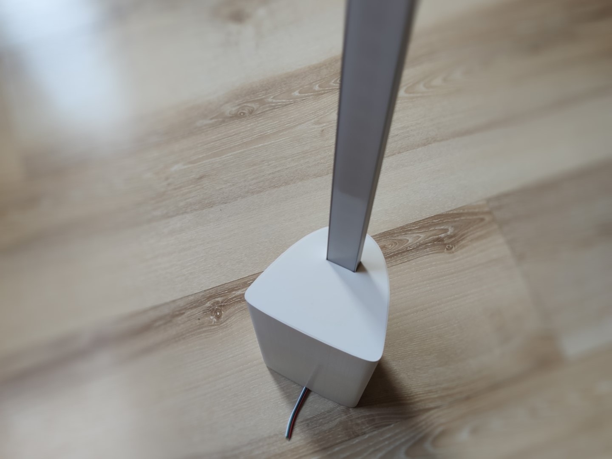

# Home lights

*Modified 2021-04-26*

Light up the home, DIY notes.

The LED strips I'm using for all the lights - ``WS2812B``, drived by ``WeMos D1 Mini`` boards.

An instance of ``diyHue`` running on local ``RPI server``, from user point of view using ``Hue essentials`` app.

The wiring and software setup is pretty generic, described at - [DiyHue LED light strip](https://wiki.ayanev.eu/#/do-it-yourself/2020-09-diyhue-led-strip/).

Video with the lights in action coming soon..

<!-- 
``WS2812B`` power consumption specifications

| LEDs/m        |  	Watt/m       |
|:-------------:|:--------------:|
| ``30LEDs/m``  |	``9Watt/m``    |
| ``60LEDs/m``  |	``18Watt/m``   |
| ``74LEDs/m``  |	``22.2Watt/m`` |
| ``96LEDs/m``  |	``28.8Watt/m`` |
| ``144Leds/m`` |	``43.2Watt/m`` | 
-->

## ToC

- [Home lights](#home-lights)
  - [ToC](#toc)
  - [Lights installed](#lights-installed)
  - [Light guidelines](#light-guidelines)
    - [diyHue Lightstrip](#diyhue-lightstrip)
    - [DIYHue Play light bar](#diyhue-play-light-bar)
    - [DIYHue Signe Lamp](#diyhue-signe-lamp)
  - [Acknowledgments](#acknowledgments)

## Lights installed

The table describes the lights used and their locations across the rooms.

| n   | Name                  | Room        | Area        | Position               | Notes                           |
|:---:|:----------------------|:------------|:------------|:-----------------------|:--------------------------------|
| 1   | diyHue Lightstrip     | Living room | TV area     | Floor backlight        | ``2m`` of length                |
| 2   | diyHue Lightstrip     | Kitchen     |             | Above the countertop   | ``2m`` of length                |
| -   |                       |             |             |                        |                                 |
| 3   | diyHue Signe Lamp     | Living room | TV area     | Right corner tv height | The big one, ``150cm`` height   |
| 4   | diyHue Signe Lamp     | Living room | TV area     | Left corner            | The small one, ``100cm`` height |
| 5   | diyHue Signe Lamp     | Living room | Sofa area   | Right corner           | The small one, ``100cm`` height |
| 6   | diyHue Signe Lamp     | Living room |             | Room upper left corner | The small one, ``100cm`` height |
| -   |                       |             |             |                        |                                 |
| 7   | diyHue Play light bar | Living room | TV area     | Behind on tv mounted   |                                 |
| 8   | diyHue Play light bar | Living room | TV area     | Behind on tv mounted   |                                 |
| 9   | diyHue Play light bar | Living room | TV area     | Behind on tv mounted   |                                 |
| 10  | diyHue Play light bar | Living room | Office area | Behind monitor mounted |                                 |
| 11  | diyHue Play light bar | Living room | Office area | Behind monitor mounted |                                 |
| 12  | diyHue Play light bar | Living room | Office area | Behind monitor mounted |                                 |

## Light guidelines

Basic information of how to made the different type of lights.

### diyHue Lightstrip

- Behind the TV, floor height backlight strip
- Above the kitchen countertop LED strip

Bill of materials for all the light strips.

| n   | Name | QTY | Total price | Description |
|:---:|:-----|:---:|------------:|-------------|
|     | ``Common``                       |   |      |                            |
| 1   | Power supply 5Vdc                | 2 |      | 36W PSU at 5V, or similar  |
| 2   | Led strip WS2812B                | - | 12 € | Total of 4m, 60LEDs/m      |
| 3   | WeMos D1 Mini ESP8266            | 2 | 4 €  |                            |
| 4   | Connectors wires, screws, etc..  |   |      |                            |
|     | ``TV floor backlight``           |   |      |                            |
| 5   | Electronics enclosure            |   |      | ``3D Printed``, for TV ground backlight, [thing:2623182](https://www.thingiverse.com/thing:2623182) |
|     | ``Kitchen countertop``           |   |      |                            |
| 6   | Aluminum profile with diffuser   | 1 | 3 €  | For the kitchen LED strip, [2m D-IL](https://praktiker.bg/bg/LED-lenti-i-aksesoari/ALUMINIEV-PROFIL-ZA-LED-LENTA-ZA-VGRAZhDANE-MAT-2M-D-IL/p/115566) |
| 7   | Mounting brackets                | 4 |      | ``3D Printed``, [thing:4837026](https://www.thingiverse.com/thing:4837026) |
| 8   | Electronics enclosure 180x120x50 | 1 |      | ``3D Printed``, using another, because of having different PSU [thing:4839494](https://www.thingiverse.com/thing:4839494) |

### DIYHue Play light bar

This is most inexpensive to make, because use serval LEDs powered via USB.

You may be interested about [Setting up Hue Sync app (PC) with diyhue](https://diyhue.discourse.group/t/setting-up-hue-sync-app-pc-with-diyhue/240). 
Awesome features there, specially if watching movie or playing a game, works with old version of the official app (1.4.0.7), but powerful enough.

- Power consumption, ``5Vdc`` at ``0.5A``
- Dimensions, ``L=200mm``, ``W=35mm``, ``H=27mm``

**Bill of materials** for one unit of ``Play light bar``.

| n   | Name | QTY | Total price | Description |
|:---:|:-----|:---:|------------:|-------------|
| 1   | Led strip WS2812B                | - |      | 20 LEDs used for unit, 60LEDs/m strip |
| 2   | WeMos D1 Mini ESP8266            | 1 | 2 €  |                                       |
| 3   | Micro USB cable                  | 1 | 1 €  |                                       |
| 4   | Connectors wires, screws, etc..  |   |      |                                       |
| 5   | Hue Play light bar 3D model      | 1 |      | ``3D Printed``, [thing:3543341](https://www.thingiverse.com/thing:3543341) |

**Showcase**

|  |  |  |  |
|:--------------------------------------------------------------------|:--------------------------------------------------------------------|:--------------------------------------------------------------------|:-------------------------------------------------------------------:|
|  |  |  |  |

### DIYHue Signe Lamp

There are two versions of Signe

- DIYHue Signe floor lamp
  - Dimensions, ``L=150cm`` (with ``130cm`` of visible light area), ``W=10.5cm``, ``H=9cm``
  - Total LEDs ``78 (60 + 18)``, ``60LEDs/m`` strip

- DIYHue Signe table lamp (not actually table lamp, but short version of the floor lamp)
  - Dimensions, ``L=100cm`` (with ``85mm`` of visible light area), ``W=6.5cm``, ``H=8cm``
  - Total LEDs ``50``, ``60LEDs/m`` strip

**Bill of materials** per lamp

| n   | Name | QTY | Total price | Description |
|:---:|:-----|:---:|------------:|-------------|
|     | ``DIYHue Signe floor lamp``      |   |      |                            |
| 1   | Led strip WS2812B                | - |      | 130cm, 60LEDs/m strip      |
| 2   | WeMos D1 Mini ESP8266            | 1 | 2 €  |                            |
| 3   | Power supply 5Vdc                | 1 |      | 25W                        |
| 4   | Aluminum profile with diffuser   | 1 | 7 €  | ``23.5x9.8`` [2m V-TAC](https://praktiker.bg/bg/LED-lenti-i-aksesoari/ALUMINIEV-PROFIL-ZA-LED-LENTA-2M-23-5X9-8MM-MAT-V-TAC/p/121580) |
| 5   | Hue Sygne 3D model               | 1 |      | ``3D Printed``, [thing:4765596](https://www.thingiverse.com/thing:4765596) |
|     | ``DIYHue Signe table lamp``      |   |      |                            |
| 6   | Led strip WS2812B                | - |      | 85cm, 60LEDs/m strip       |
| 7   | WeMos D1 Mini ESP8266            | 1 | 2 €  |                            |
| 8   | Power supply 5Vdc                | 1 |      | 15W                        |
| 9   | Aluminum profile with diffuser   | 1 | 2 €  | ``V shaped`` [1M D-IL](https://praktiker.bg/bg/LED-lenti-i-aksesoari/ALUMINIEV-PROFIL-ZA-LED-LENTA-%C3%A0GLOV-OB%C3%A0L-KAPAK-MAT-1M-D-IL/p/120507) |
| 10  | Hue Sygne 3D model               | 1 |      | ``3D Printed``, [thing:4820143](https://www.thingiverse.com/thing:4820143) |

**Showcase**

DIYHue Signe floor lamp

|  |  |  |  |
|:------------------------------------------------------------------|:------------------------------------------------------------------|:------------------------------------------------------------------|:-----------------------------------------------------------------:|
|  |  |  |  |
|  |  |  |  |

DIYHue Signe floor lamp mini

|  |  |  |  |
|:------------------------------------------------------------------------|:------------------------------------------------------------------------|:------------------------------------------------------------------------|:-----------------------------------------------------------------------:|
|  |  |  |  |
|  |  |  |  |
|  |  |  |                                                                         |
|  |  |

## Acknowledgments

I want to express my gratitude to the guys developing [diyHue](https://diyhue.org/), [Hue Essential](https://www.hueessentials.com/) app, as well as all the designers of those awesome 3D models, that have been used.

A lot of work and time spent behind the scenes, this won't be possible without the community, thank you all!
