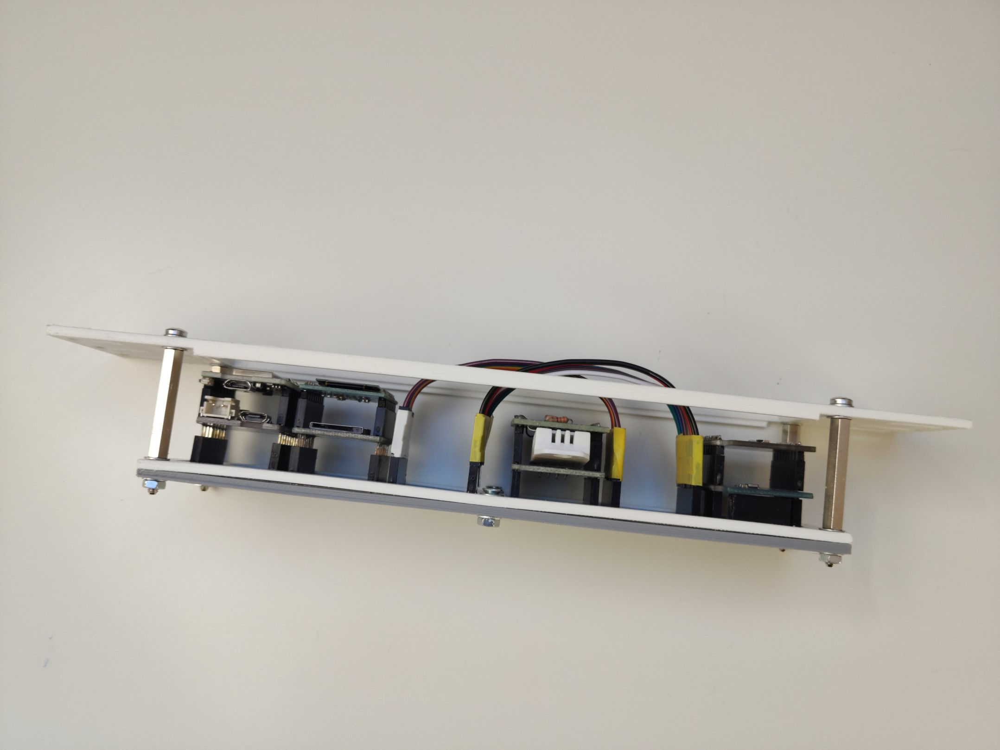

## ESP8266 D1 mini triple base pcb server mount

*Modified 2022-02-27*

Mounting an ``ESP8266 D1 Mini`` dev board with 2x triple base shields into the server rack. 
Changes are related only for the server rack mounting modifications, if interested you may read more about the device at - [ESP8266 D1 mini shields](/do-it-yourself/2022-01-esphome/esphome-nodes?id=esp8266-d1-mini-shields)

|  |  |  |  |
|:-----------------------------------------------------------------------------------------------------------------:|:-----------------------------------------------------------------------------------------------------------------:|:-----------------------------------------------------------------------------------------------------------------:|:-----------------------------------------------------------------------------------------------------------------:|
|  |  |  |  |
