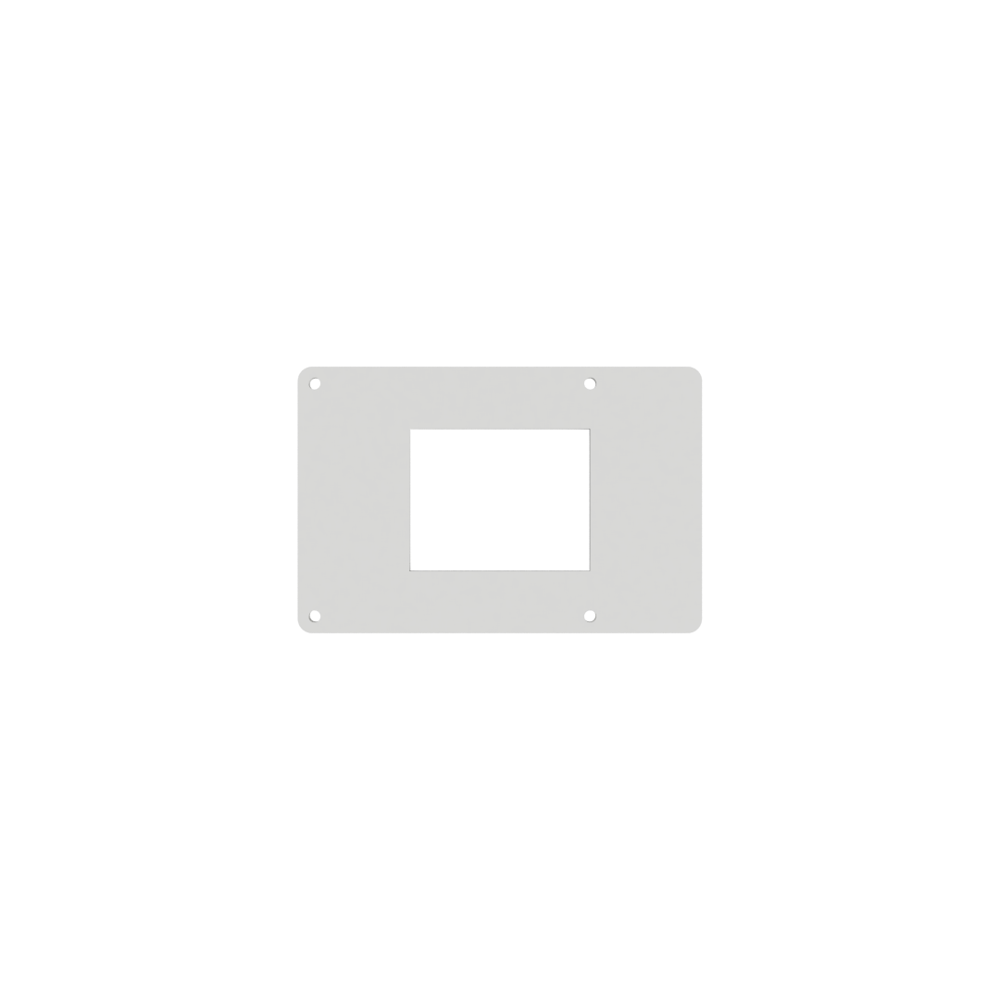
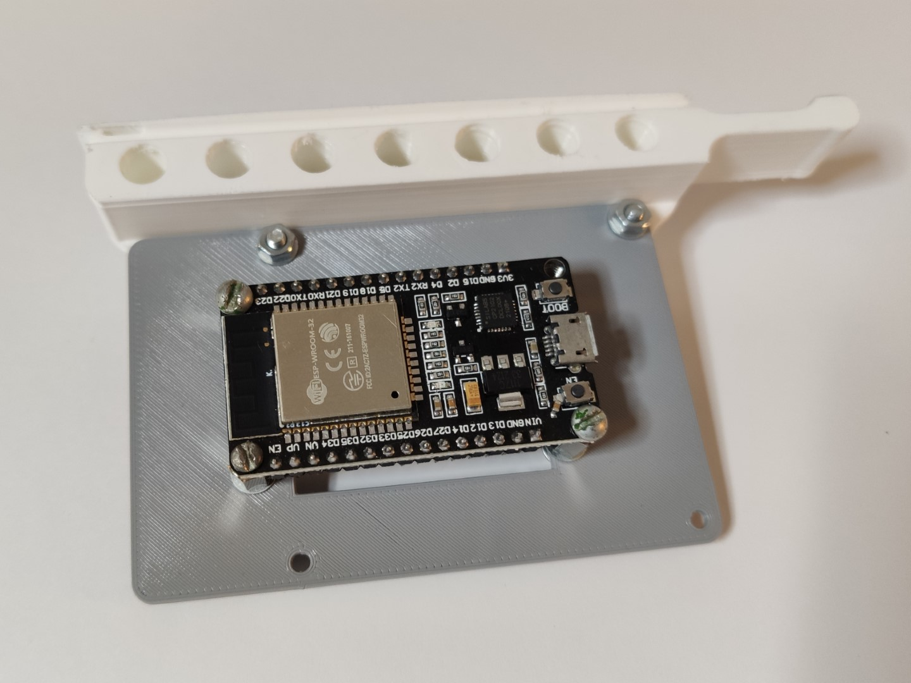
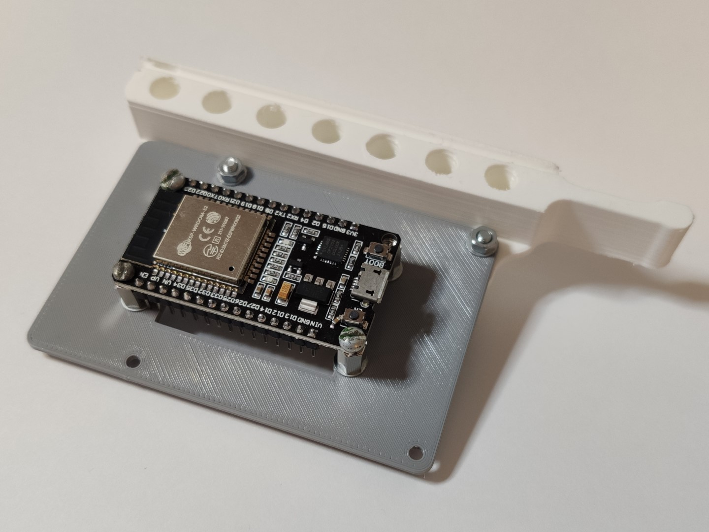

## ESP32 server mount

*Modified 2022-02-24*

<!-- 
Social, thingiverse:

ESP32 to RPI footprint
Mounting an ``ESP32`` dev board into the server rack, using the space left for the Raspberry Pis panel.
Since many different esp32 footprints, decided to leave the design without holes for the board, in order to achieve more generic design.
Using the design with the [thing:4756812](https://www.thingiverse.com/thing:4756812) to mount in my server rack,
If interested you may read more at [DIY Home server rack](https://wiki.ayanev.eu/#/do-it-yourself/2021-08-server-rack-10inch/)
-->

Mounting an ``ESP32`` dev board into the server rack, using the space left for the Raspberry Pis panel. 
Since many different ESP32 footprints, decided to leave the design without holes for the board, in order to achieve more generic design. 
Changes are related only for the server rack mounting modifications, if interested you may read more about the device purpose at - [Bluetooth gateway for Xiaomi Temperature and Humidity sensors](https://wiki.ayanev.eu/#/do-it-yourself/2022-01-esphome/esphome-nodes?id=xiaomi-temperature-and-humidity)

|  |  |  |  |
|:-----------------------------------------------------------------------------------:|:-----------------------------------------------------------------------------------:|:-----------------------------------------------------------------------------------:|:-----------------------------------------------------------------------------------:|

