# DIY Home server rack

Notes about creating my 10" home server rack.

- [DIY Home server rack](#diy-home-server-rack)
  - [BOM](#bom)
    - [Purchased](#purchased)
    - [Printed](#printed)
  - [Show case](#show-case)
  - [References](#references)

## BOM

### Purchased

| Name | QTY | Price € | Notes |
|:-----|:---:|--------:|:------|
| Lanberg RACK CABINET 10"            | 1  | 45   | [WF10-2309-10B](https://lanberg.pl/en/produkt/WF10-2309-10B) |
| Lanberg Surge protector             | 1  | 15   | [PDU-03E-0200-BK](https://lanberg.pl/en/produkt/PDU-03E-0200-BK) | 
| Lanberg keystone CAT.6              | 8  | 1.2  | [KSU6-3000](https://lanberg.pl/en/produkt/KSU6-3000) |
| Triton Patch panel                  | 1  | 8    | [RAB-PP-X03-C1](https://industry-electronics.com/triton/rab-pp-x03-c1-10-wall-housing-accessory-modular-patch-panel-keystone-lieske_969487.htm) |
| Lanberg patchcord CAT.6 0.25m blue  | 10 | 1    | [PCF6-10CC-0025-B](https://lanberg.pl/en/produkt/PCF6-10CC-0025-B) |
| Lanberg patchcord CAT.6 0.5m blue   | 2  | 1.10 | [PCF6-10CC-0025-B](https://lanberg.pl/en/produkt/PCF6-10CC-0050-G) |
| Lanberg mounting screws set, 20 pcs | 1  | 3.50 | [AK-1303-S](https://lanberg.pl/en/produkt/AK-1303-S)               |

### Printed 

| File | QTY | Notes |
|:-----|:---:|:------|
| ``LAN_Clip.stl``                   | 6  | [thing:4667320](https://www.thingiverse.com/thing:4667320) |
| ``srv-rack-lanberg-leg``           | 4  | Enclosure leg |
| ``srv-rack-tplink-ls1008g.stl``    | 1  | Holder for [tp-link LS1008G](https://www.tp-link.com/us/home-networking/8-port-switch/ls1008g/) |
| ``srv-rack-rpi-stack-bracket.stl`` | 2  | Remixed from [thing:4756812](https://www.thingiverse.com/thing:4756812), mirror used |
| ``Body_x14.stl``                   | 7  | RPI stack [thing:4756812](https://www.thingiverse.com/thing:4756812) |
| ``Tray_with_support_x14.stl``      | 4  | RPI stack |
| ``Pin_x26.stl``                    | 12 | RPI stack |
| ``Nameplate.stl``                  | 3  | RPI stack |

Most of the raspberry pi stack models are from [thing:4756812](https://www.thingiverse.com/thing:4756812). 
The printer I'm using is well calibrated, but not perfect. 
Followed the provided print instruction, but still parts does not fit as I wanted, a lot of sanding work was done.

## Show case

The assembly process

| 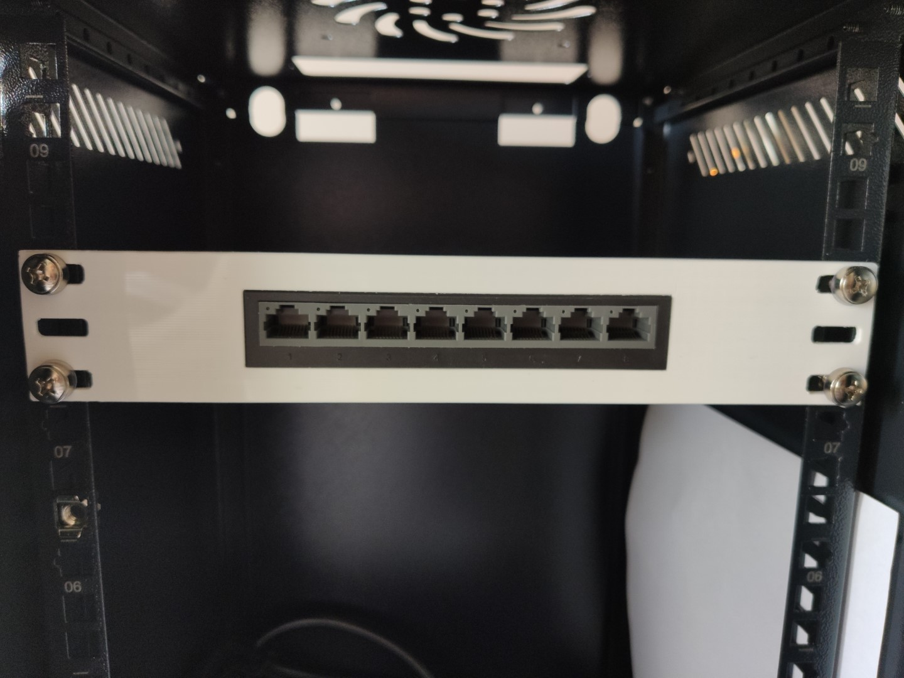 | 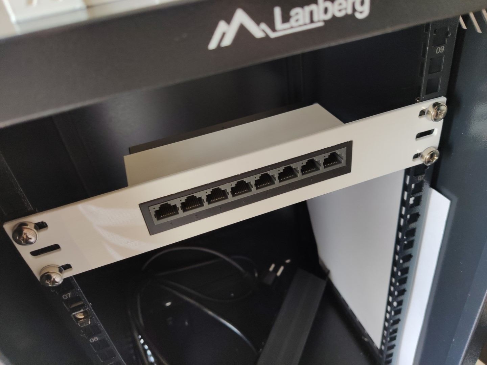 | 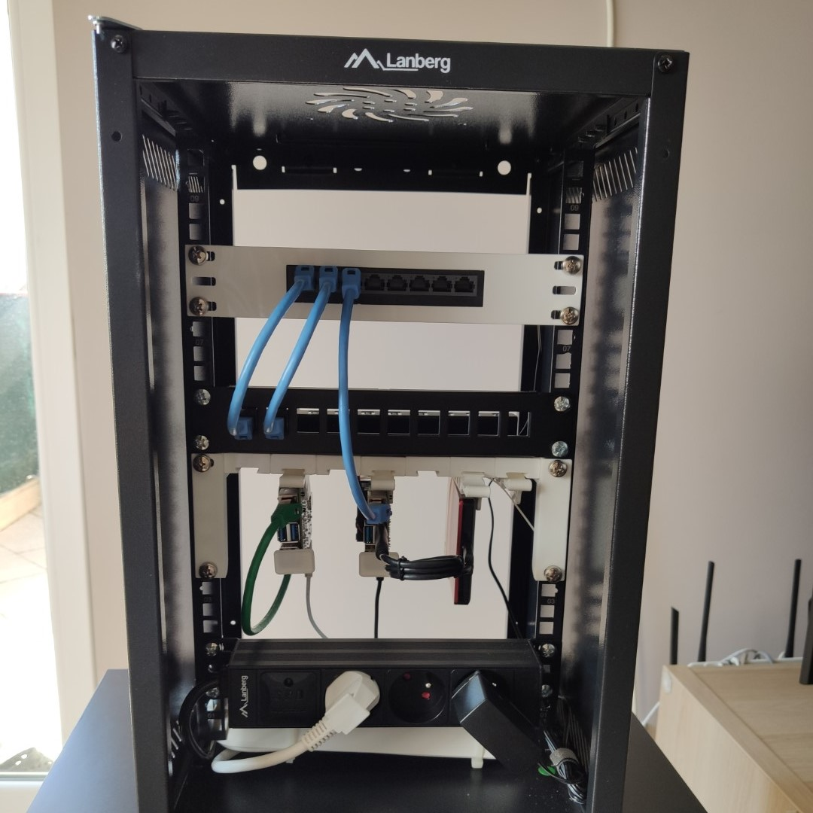 | 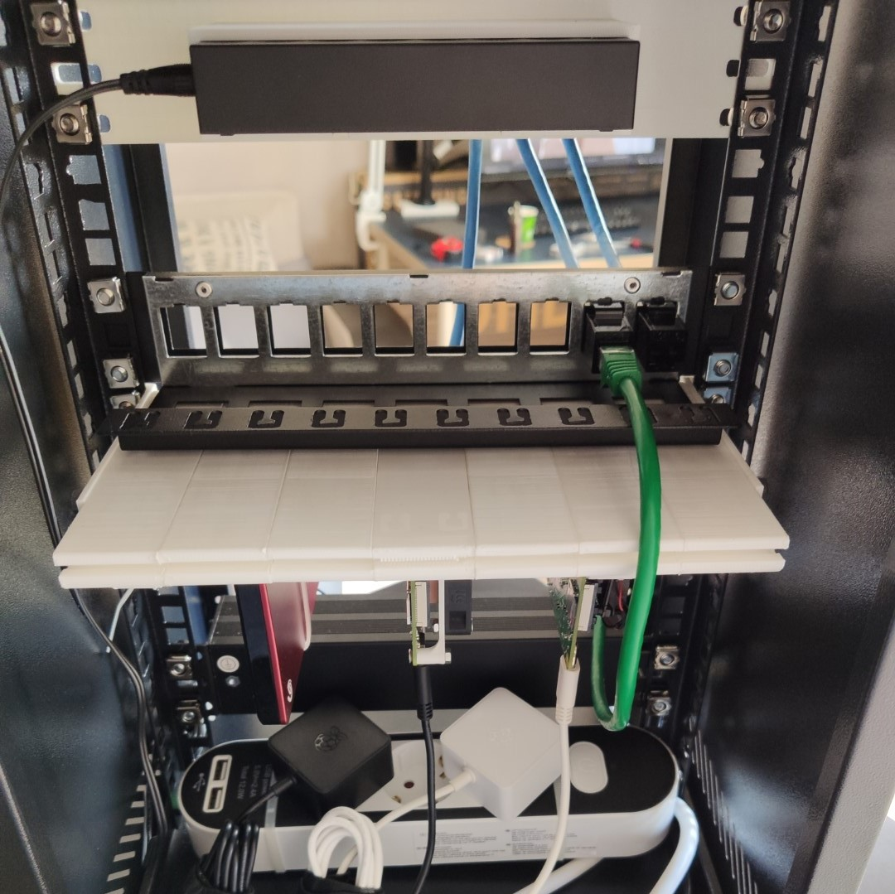 |
|:-----------------------------------------:|:-----------------------------------------:|:-----------------------------------------:|:-----------------------------------------:|

Perspective point of view

| 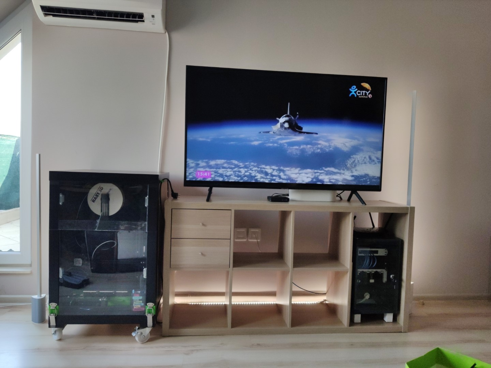 | 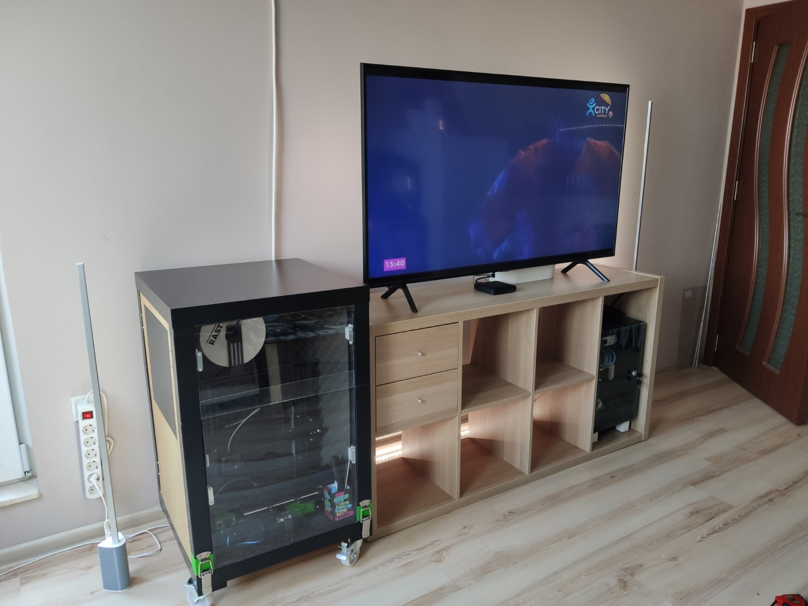 | 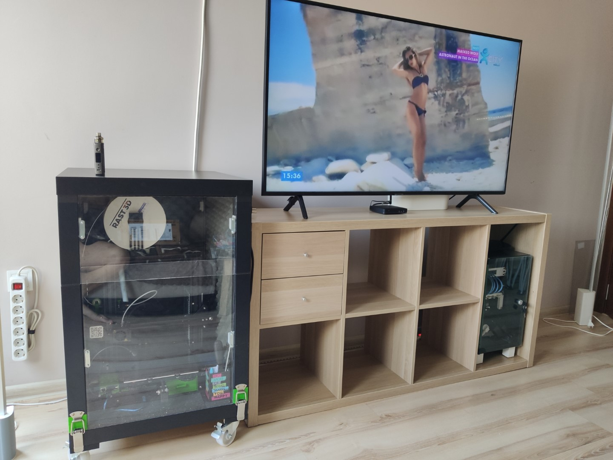 |
|:-------------------------------------------------:|:-------------------------------------------------:|:-------------------------------------------------:|

The final result

| 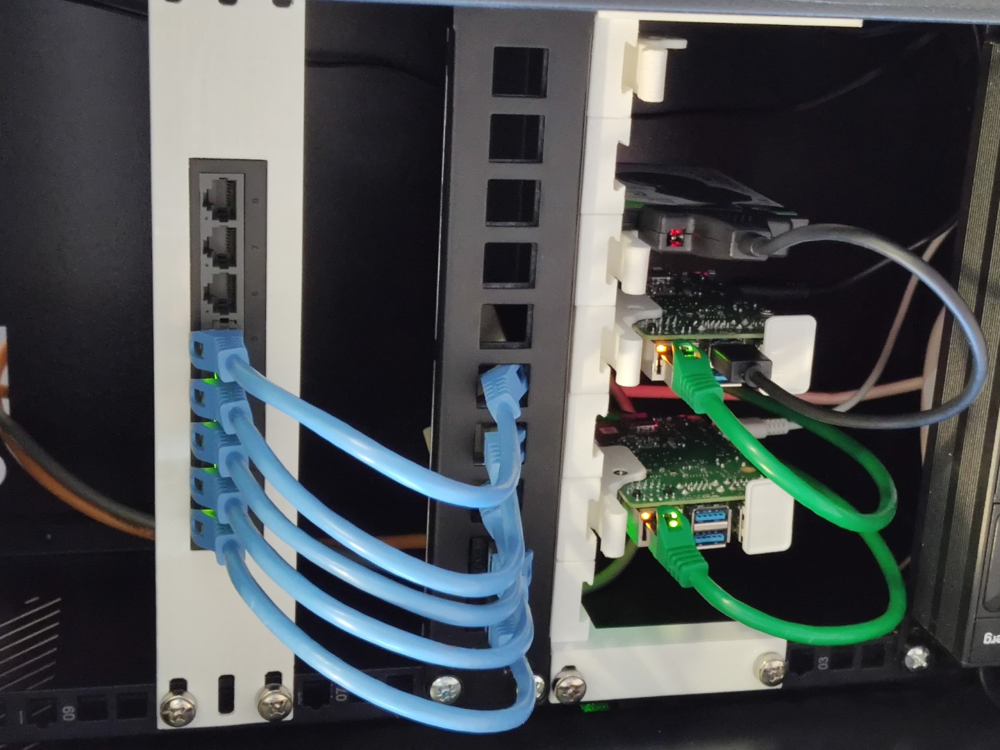 | 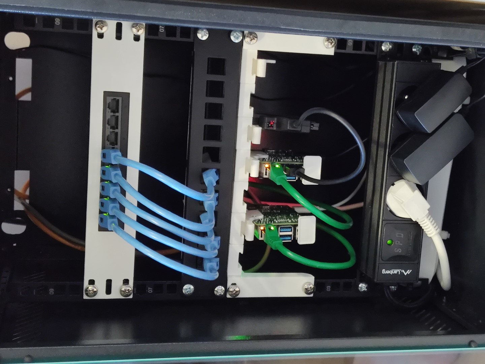 | 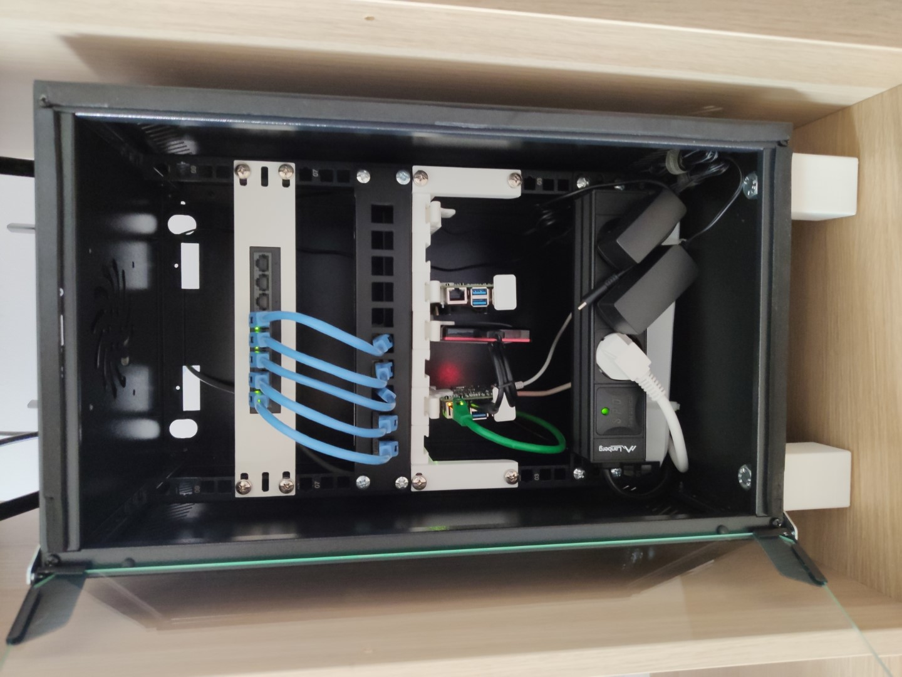 |
|:-------------------------------------------------:|:-------------------------------------------------:|:-------------------------------------------------:|
| 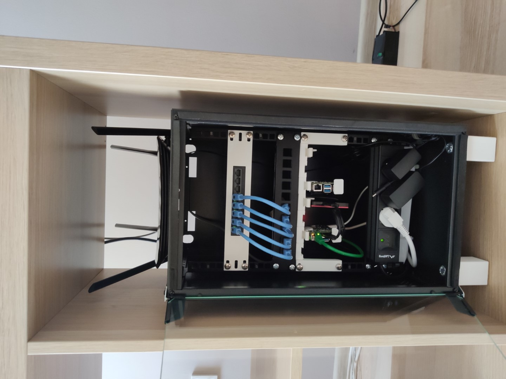 | 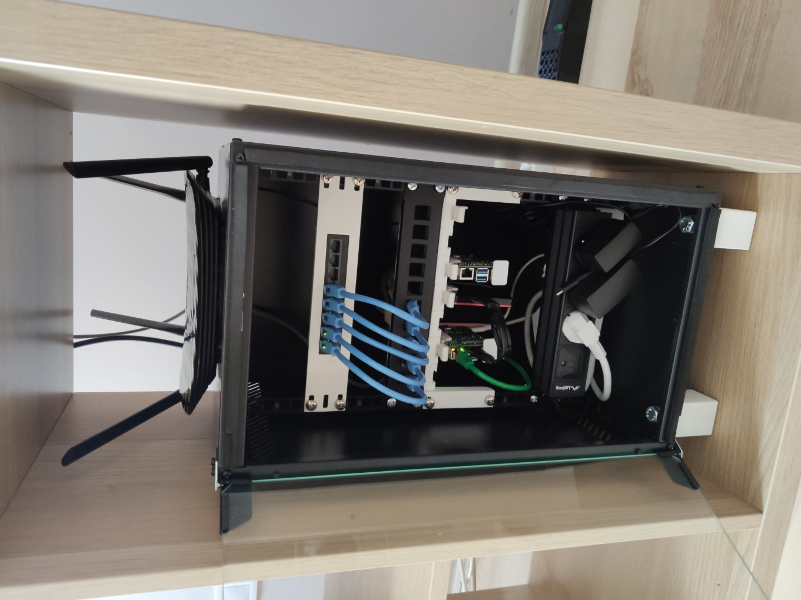 | 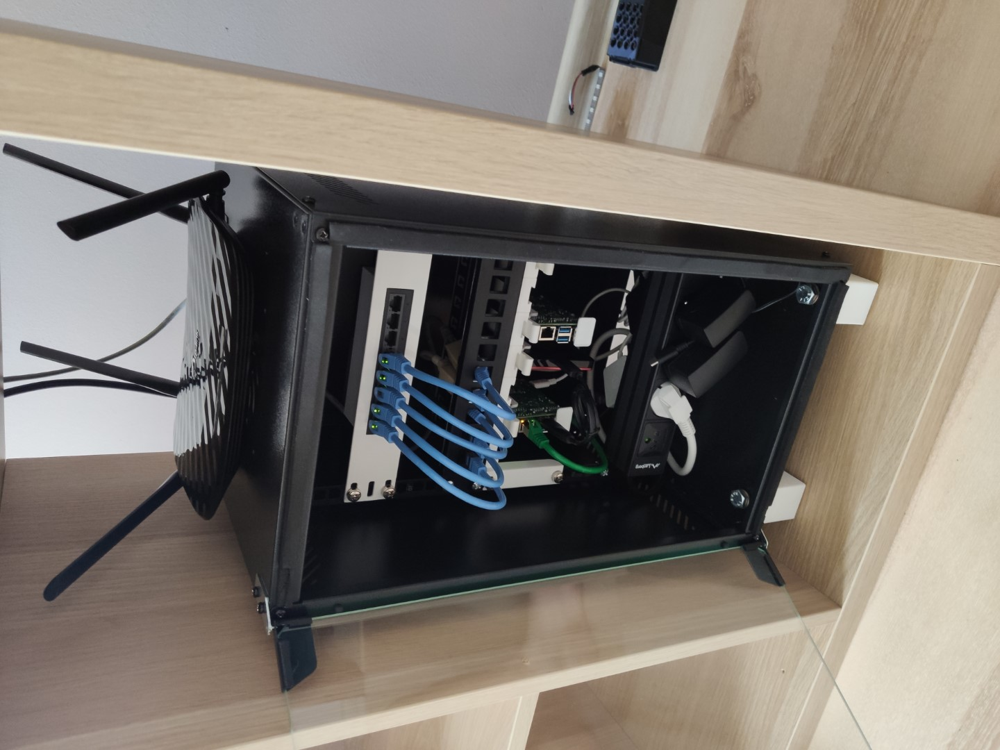 |

## References

Additional resources helped me build the 10" server rack

- [Raspberry Pi Home server](https://wiki.ayanev.eu/#/raspberry-pi/2020-02-rpi-home-server/)
- [Raspberry Pi NAS server with OpenMediaVault and Plex](https://wiki.ayanev.eu/#/raspberry-pi/2021-08-rpi-nas-media-server/)
- [What Ethernet Cable to Use? Cat5? Cat6? Cat7?](https://www.youtube.com/watch?v=ha3zVvwzMvY&t=23s)
- [DIY Home Network Done Right and WRONG!](https://www.youtube.com/watch?v=LzND7Y8PgaA)
- [Half-Width 10 Inch Server Rack Project for Raspberry Pi](https://www.youtube.com/watch?v=4Ri76EbpKVo)
- [Power Distribution Unit (PDU) for 10 Inch Server Rack Project](https://www.youtube.com/watch?v=cALwxH5vJuo)
- [UPTIME Raspberry Pi Platform pi14ssd (v1.2)](https://uplab.pro/2020/12/raspberry-pi-server-mark-iii/)
