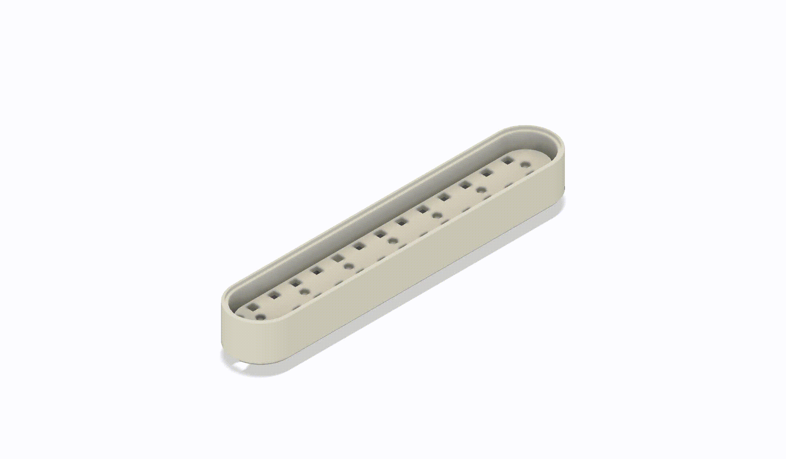
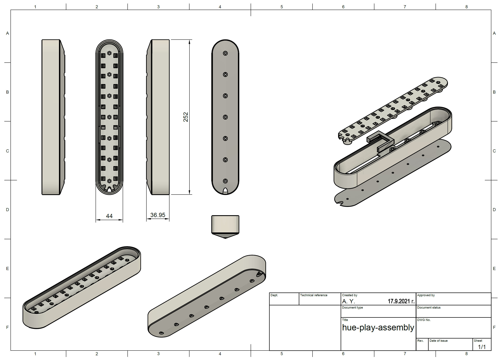
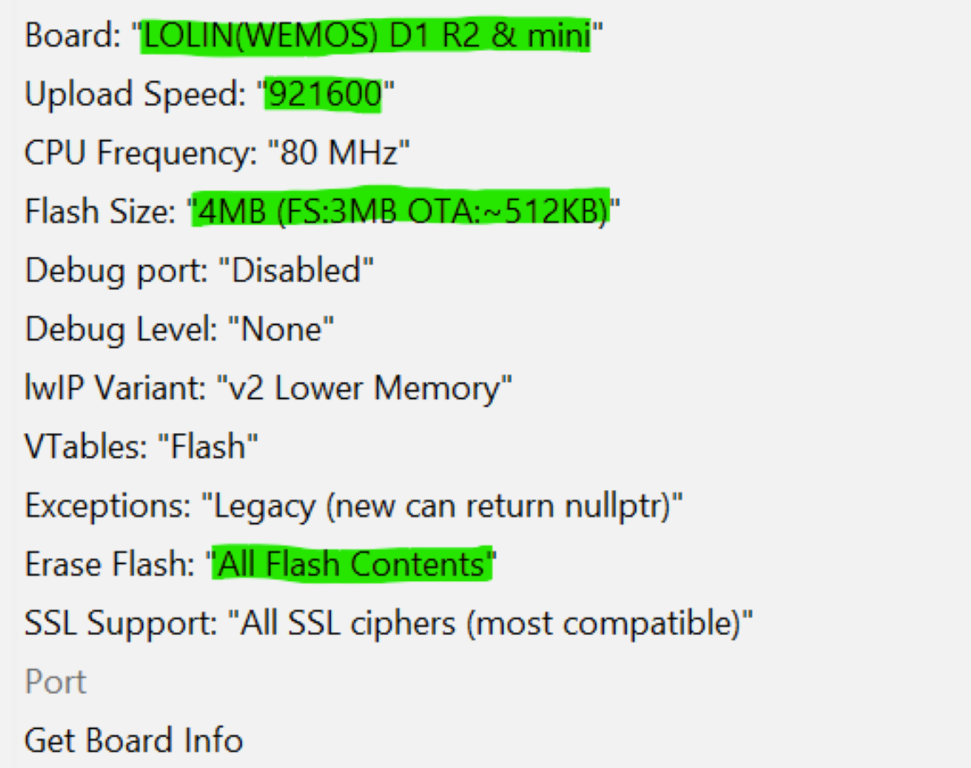
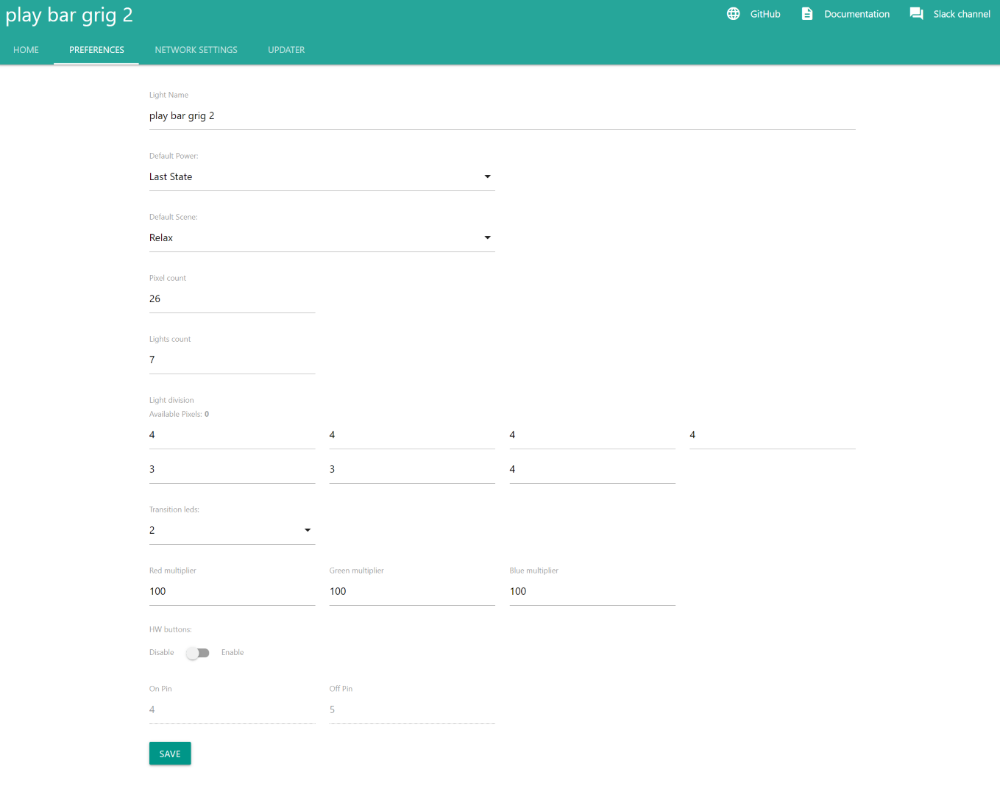

# DIY Hue play bar

*Modified 2021-09-21*

Notes about creating Hue like play bar.

- [DIY Hue play bar](#diy-hue-play-bar)
  - [BOM](#bom)
  - [Assembly](#assembly)
  - [Software](#software)
    - [DiyHue emulator](#diyhue-emulator)
    - [Apps](#apps)
    - [Lights firmware](#lights-firmware)
  - [Show case](#show-case)


## BOM

| Name | QTY | Price € | Notes |
|:-----|:---:|--------:|:------|
| ``hue-play-body.stl``       | 1   |     | 3D printed, [thing:4970685](https://www.thingiverse.com/thing:4970685) |
| ``hue-play-leds-frame.stl`` | 1   |     | 3D printed |
| ``hue-play-back-plate.stl`` | 1   |     | 3D printed |
| ``d1-mini-case.stl``        | 1   |     | 3D printed |
| Led strip WS2812B           | 0.5 | 1.5 | About 0.5m, 26 LEDs in total, <br> - 60LEDs/m strip <br> - 18Watt/m consumption | 
| ESP8266 NodeMCU / D1 mini   | 1   | 1.5 | Designed case fit for MCU WeMos D1 Mini |
| MicroUSB to USB A cable     | 1   | 2   | Purchased 1m cable with polyester yarn sheathing |
|                             |     |     | |
| Screws, nuts, wires, etc..  | 1   | 0.5 | |
| - Screw DIN 965, M3X25mm    | 5   |     | |
| - Screw DIN 965, M3X10mm    | 5   |     | |
| - Nuts DIN 934, M3          | 9   |     | |

## Assembly

|  |  | 
|:---------------------------------------------------------------:|:-------------------------------------------------------------:|

## Software

### DiyHue emulator

Using a [DiyHue](https://diyhue.org/) emulator within docker container.

### Apps

Controlling the lights with - [Hue Essential app](https://www.hueessentials.com/).

Hue Sync app for desktop - [Setting up Hue Sync app (PC) with diyhue](https://diyhue.discourse.group/t/setting-up-hue-sync-app-pc-with-diyhue/240).

### Lights firmware

The source code used for the MCU's play bar - [Gradient_Strip_WS2812.ino](https://github.com/diyhue/Lights/blob/master/Arduino/Gradient_Strip_WS2812/Gradient_Strip_WS2812.ino).

You may also edit the sketch, changing the name of the light
```ino
char lightName[LIGHT_NAME_MAX_LENGTH] = "play bar";
```

A good detailed reading about how to setup and configure a diyHue light - [Make your own gradient lightstrip with diyHue](https://community.hueessentials.com/t/make-your-own-gradient-lightstrip-with-diyhue/1568).

In few words, flash the firmware (check the screenshot below for the board configuration), 
after the flashing is completed, the light should open a "hotshot" with the corresponding name from the modified sketch (``play bar``),
connect to the "hotspot" and configure the WiFi network. 
The device will reboot and obtain an IP in the local network.
Find and access the IP address of the light, you will find a WEB UI serving at port 80.
Use the screenshot below as base to configure the new play bar light.
Add the light to the bridge via Hue Essential app.

| Arduino IDE, configuration under the tools ribbon menu                    | WEB UI of the light, configuration settings used |
|:-------------------------------------------------------------------------:|:------------------------------------------------:|
|  |  |

## Show case

|  |  |  |  |
|:-------------------------------------:|:-------------------------------------:|:-------------------------------------:|:-------------------------------------:|
|  |  |  |  |
