# DIY Hue signe lamp

*Created 2021-11-25*

3D printable Hue Gradient Signe lamp.

- [DIY Hue signe lamp](#diy-hue-signe-lamp)
  - [Changelog](#changelog)
  - [BOM](#bom)
  - [Assembly](#assembly)
    - [Software](#software)
  - [Show case](#show-case)
    - [Table lamp](#table-lamp)
    - [Floor lamp](#floor-lamp)

## Changelog

## BOM

| Name | QTY | Price € | Notes |
|:-----|:---:|--------:|:------|
| From the store                    |     |     |    |
| LED profile                       | 1   | 3   | [Triangle LED profile 2M D-IL](https://praktiker.bg/en/LED-lenti-i-aksesoari/ALUMINIEV-PROFIL-ZA-LED-LENTA-%C3%A0GLOV%2C-OB%C3%A0L-KAPAK-MAT-2M-D-IL/p/115560)   *You may create one table and floor lamp from a single 2m aluminum profile |
| Led strip WS2812B                 |     |     | Any compatible with [diyhue lights](https://github.com/diyhue/Lights) (60LEDs/m strip, 18Watt/m consumption) | 
| ESP8266 NodeMCU / D1 mini         | 1   | 1.5 |    |
| MicroUSB to USB A cable           | 1   | 1   | Purchased 1m cable with polyester yarn sheathing |
| Screws, M3X25mm                   | 4   |     | Any M3 screws |
| 5V PSU                            |     |     | Optional, floor lamp  |
|                                   |     |     |    |
| 3D Printable                      |     |     |    |
| ``hue-signe-base-frame-test.stl`` | 1   |     | Used before you begin to check if the led profile fits |
| ``hue-signe-top-plate``           | 1   |     | For both floor and table versions of the lamp |
| ``hue-signe-table-bottom.stl``    | 1   |     | Table lamp, base stand |
| ``hue-signe-table-cover.stl``     | 1   |     | Floor lamp, cover/shield |
| ``hue-signe-floor-bottom.stl``    | 1   |     | Floor lamp, base stand |
| ``hue-signe-floor-cover.stl``     | 1   |     | Floor lamp, cover/shield |

## Assembly

| 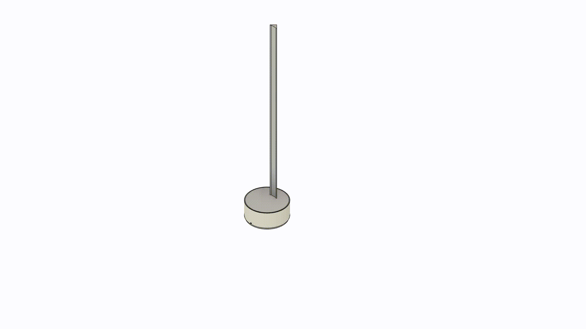 | 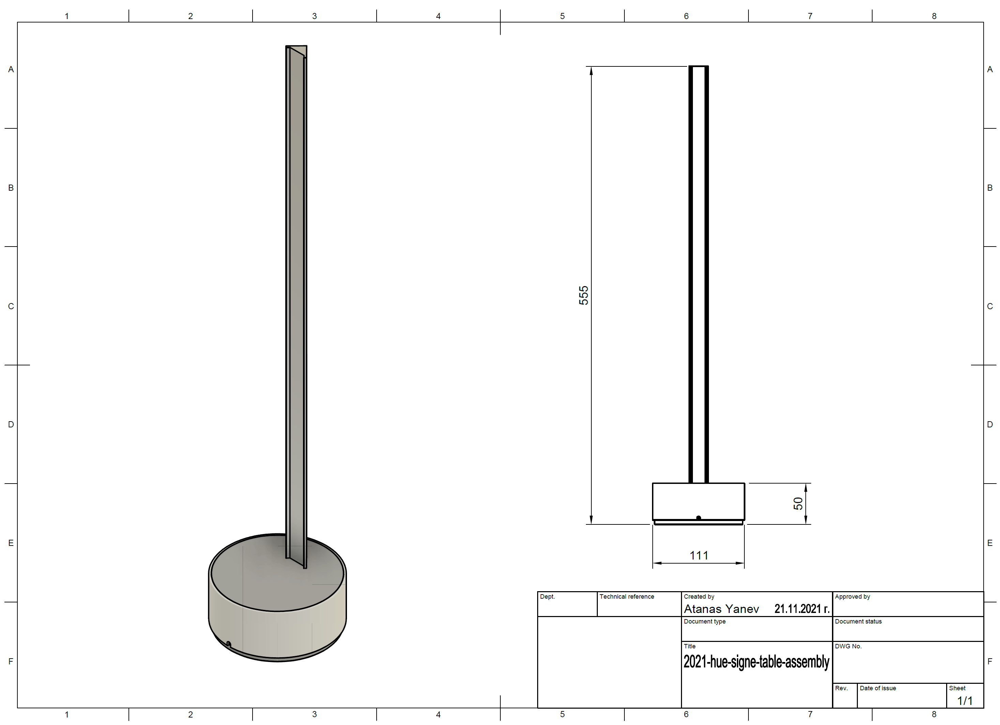 | 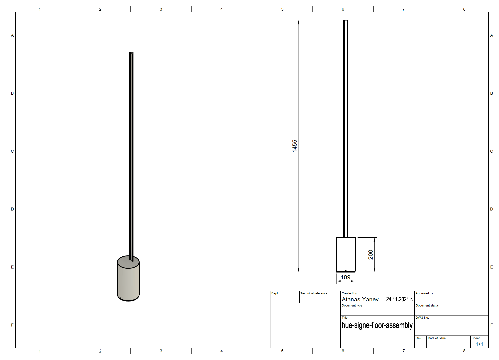 |
|:-----------------------------------------------------------------------------:|:---------------------------------------------------------------------------:|:---------------------------------------------------------------------------:|

### Software

Using a [DiyHue](https://diyhue.org/) emulator within docker container.

Controlling the lights with - [Hue Essential app](https://www.hueessentials.com/).

Hue Sync app for desktop - [Setting up Hue Sync app (PC) with diyhue](https://diyhue.discourse.group/t/setting-up-hue-sync-app-pc-with-diyhue/240).

You may check some of the rest documentations within the wiki for more detailed information about how to flash the MCU board.

## Show case

### Table lamp

| 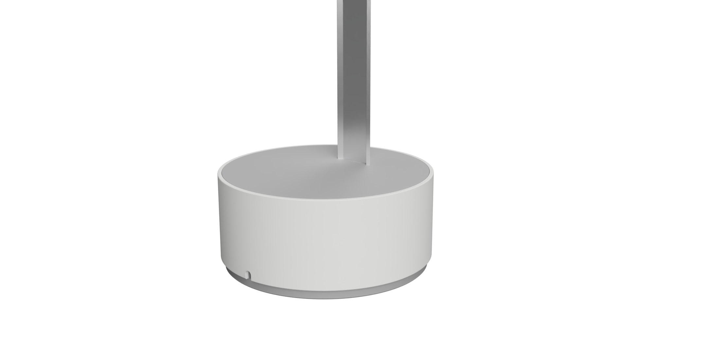 | 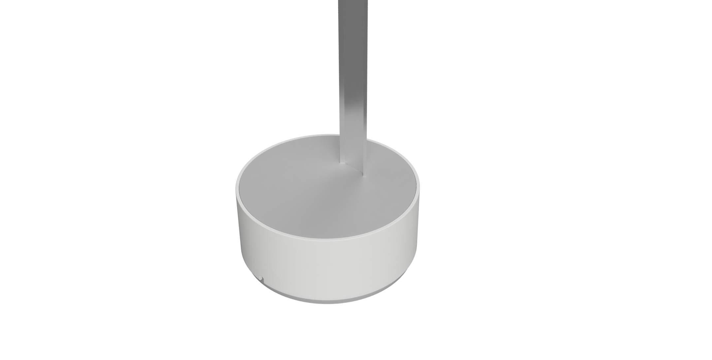 |
|:-------------------------------------------------------------------------------------------------:|:-------------------------------------------------------------------------------------------------:|
| 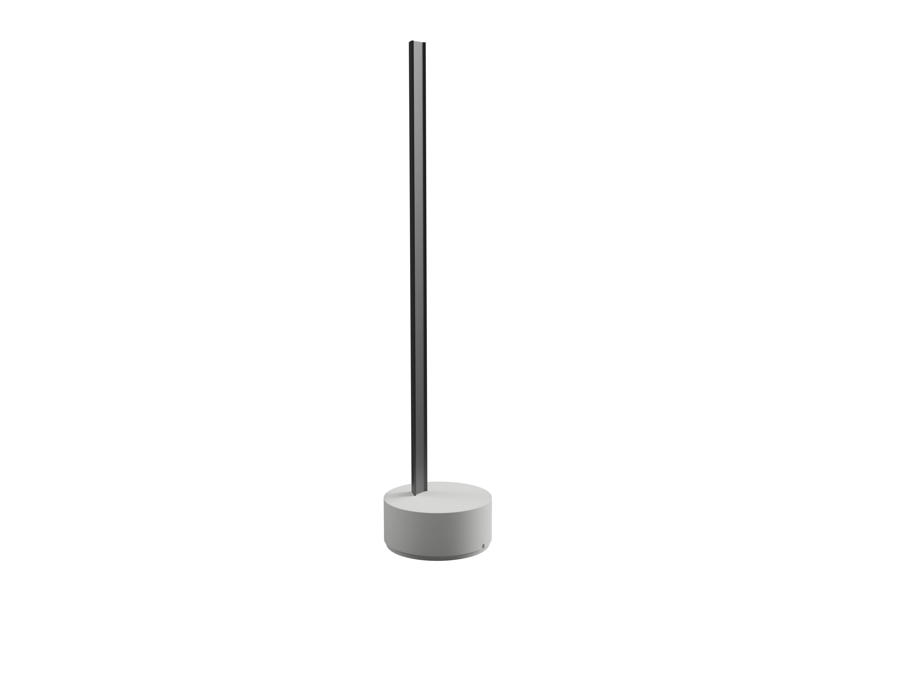   | 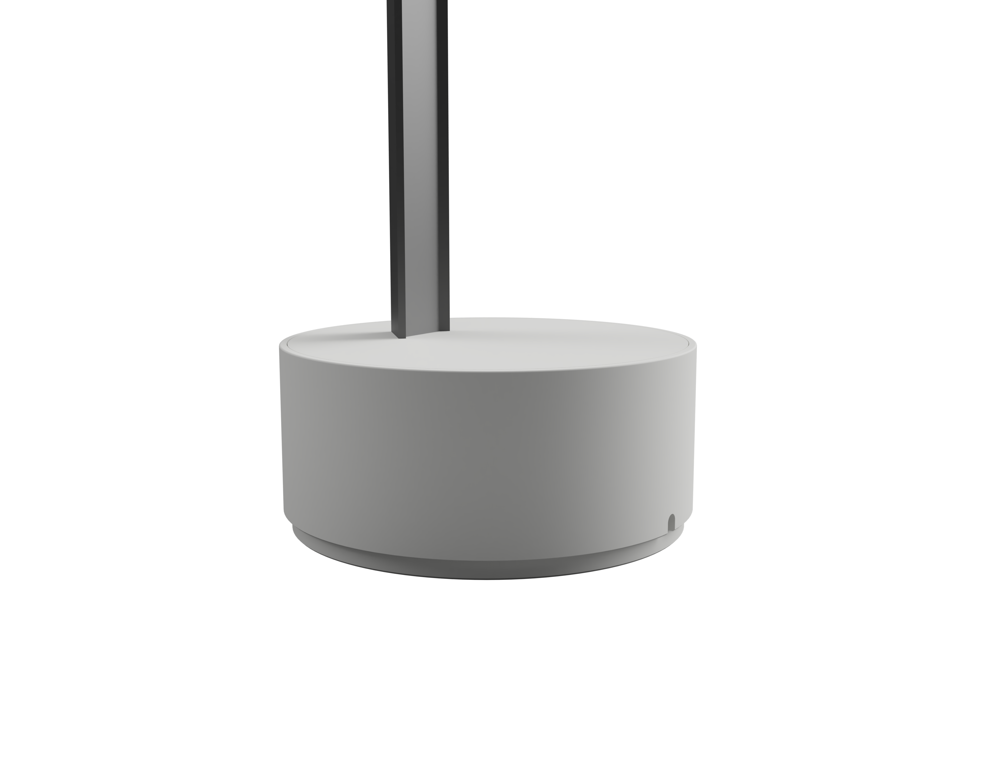 |

### Floor lamp

| 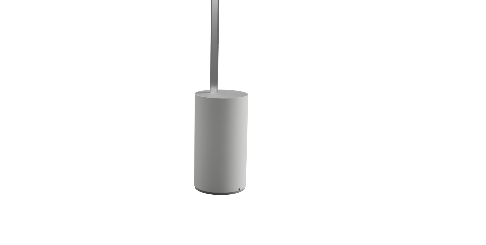 | 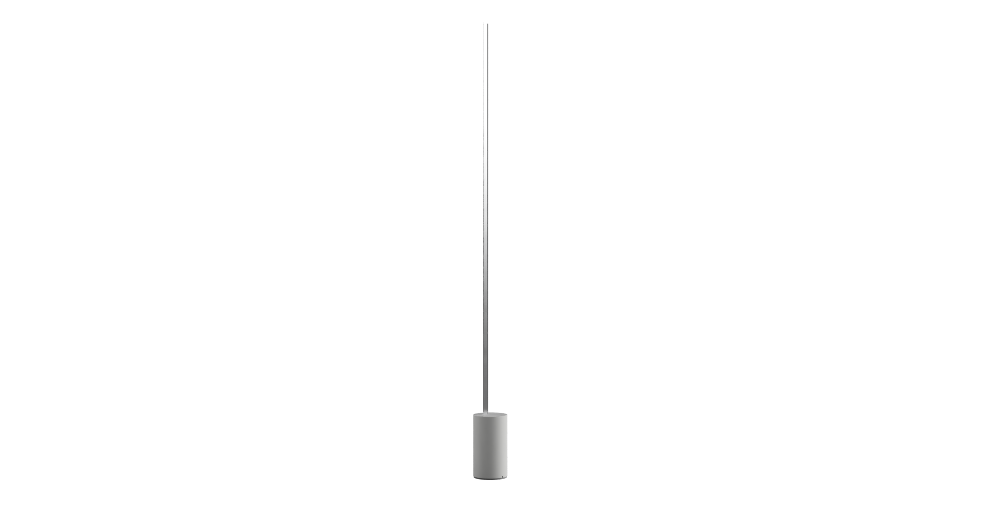 |
|:-------------------------------------------------------------------------------------------------:|:-----------------------------------------------------------------------------------------------:|
| 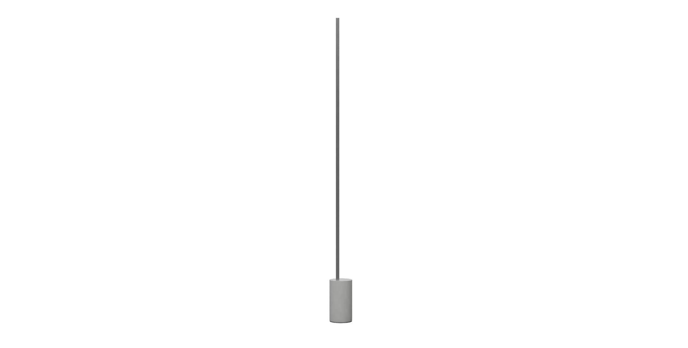   | 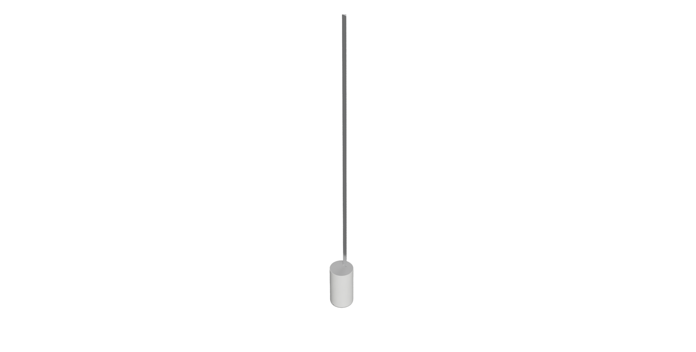 |
