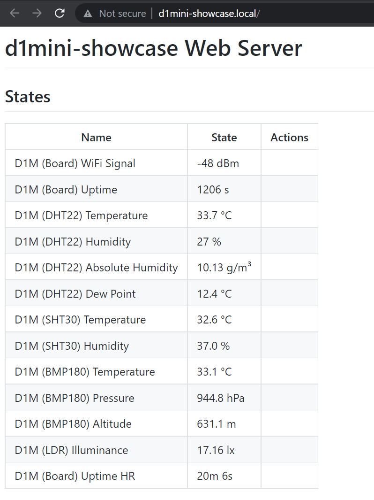
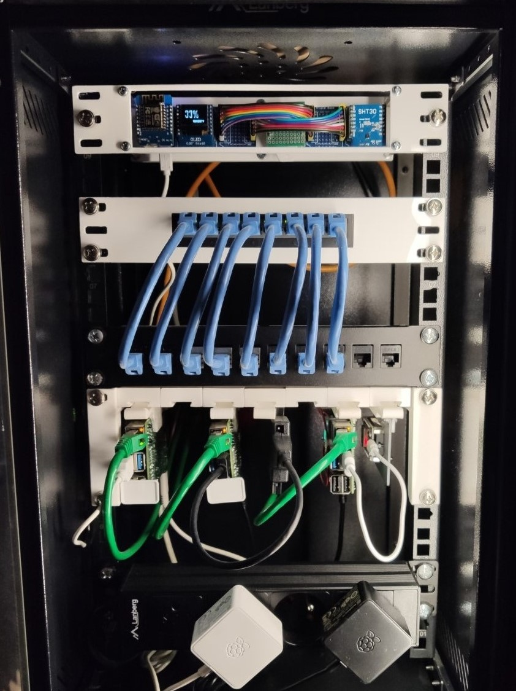
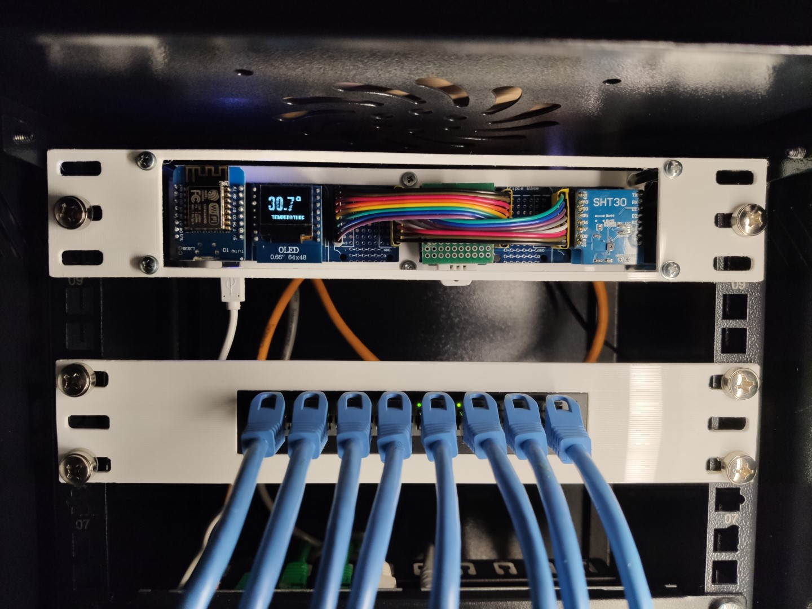
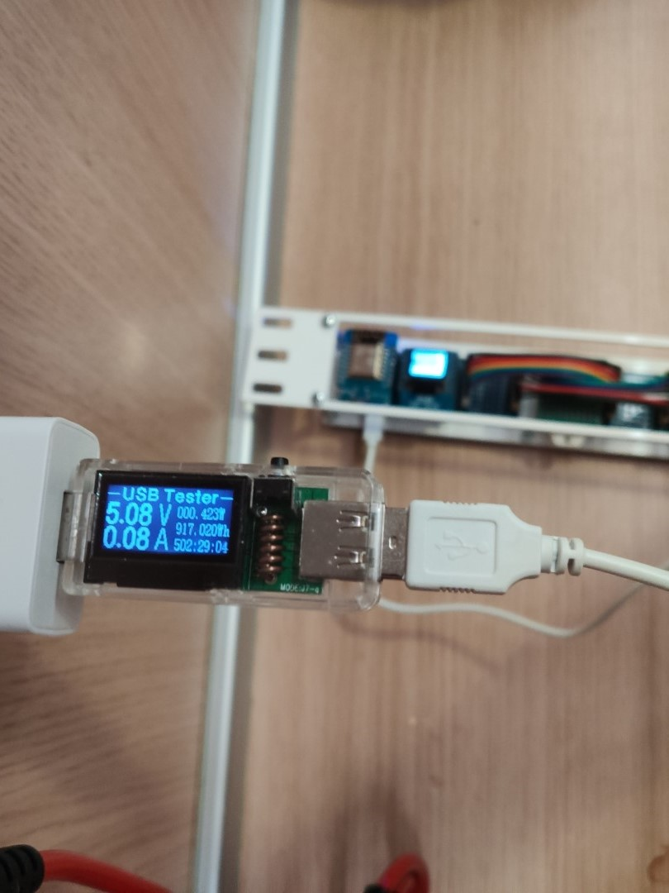

# ESP8266 D1 mini shields

*Modified 2022-02-27*

- [ESP8266 D1 mini shields](#esp8266-d1-mini-shields)
  - [Motivation](#motivation)
  - [BOM](#bom)
  - [ESPHome node configuration](#esphome-node-configuration)
  - [Showcase](#showcase)
  - [References](#references)

## Motivation

I had a lot D1 mini shields that decided to make use of.<br>
The sensor shields I'm using are described in BOM section, anyway the measurements are:

| Measurement name              | Sensor   | Unit |
|:------------------------------|:---------|:-----|
| D1M (Board) WiFi Signal       | Build in | dBm  |
| D1M (Board) Uptime	          | Build in | s    |	
| D1M (Board) Uptime HR	        | Build in | Human readable string |	
| D1M (DHT22) Temperature       | DHT22    | °C   |	
| D1M (DHT22) Humidity          | DHT22    | %	  |
| D1M (DHT22) Absolute Humidity	| DHT22    | g/m³	|
| D1M (DHT22) Dew Point	        | DHT22    | °C	  |
| D1M (SHT30) Temperature       | SHT30    | °C	  |
| D1M (SHT30) Humidity          | SHT30    | %	  |
| D1M (BMP180) Temperature	    | BMP180   | °C	  |
| D1M (BMP180) Pressure	        | BMP180   | hPa	|
| D1M (BMP180) Altitude	        | BMP180   | m	  |
| D1M (LDR) Illuminance	        | LDR      | lx	  |

Using a D1 mini triple base extension board to stack them all and some 3D printed models to mount it into the 10" server rack.

## BOM

| Name | QTY | Price € | Notes |
|:-----|:---:|--------:|:------|
| ESP8266 D1 mini dev board           | 1  |    |  | 
| D1 mini triple base extension board | 2  |    |  |
| DHT22 shield                        | 1  |    |  |
| SHR30 shield                        | 1  |    |  |
| BMP180 shield                       | 1  |    |  |
| OLED Display Shield                 | 1  |    |  |
| LDR shield                          | 1  |    | DIY, light-dependent resistor shield, schematic described at - [bitluni, Solar Weather Station](https://bitluni.net/solar-powered-weather-station) |
| Header wires 2.54mm                 | 16 |    | Male to male   |
| SD Card shield                      |    |    | Optional, WIP  |
| Battery shield                      |    |    | Optional       |

As an additional you may 3D Print a case such as [thing:5265765, D1 Mini showcase panel](https://www.thingiverse.com/thing:5265765) or [thing:5265732, Server rack 10" - D1 Mini mount](https://www.thingiverse.com/thing:5265732).

## ESPHome node configuration

``secrets.yaml``
```yaml
wifi_ssid: ""
wifi_password: ""
ap_password: ""
ota_password: ""
mqtt_broker: ""
mqtt_port: 1883
mqtt_username: ""
mqtt_password: ""
web_server_password: ""
```

``d1mini-showcase.yaml``
```yaml
substitutions:
  device_name: d1mini-showcase
  display_name: D1M
  refresh_interval: 10s

esphome:
  name: $device_name

# Board config
esp8266:
  board: d1_mini

# Enable logging
logger:
  level: DEBUG

# Enable Home Assistant API
#api:

ota:
  password: !secret ota_password

wifi:
  ssid: !secret wifi_ssid
  password: !secret wifi_password
  fast_connect: true

  # Enable fallback hotspot (captive portal) in case wifi connection fails
  ap:
    ssid: Fallback $device_name
    password: !secret ap_password

captive_portal:

# Web server section
web_server:
  port: 80
  auth:
    username: admin
    password: !secret web_server_password

# MQTT configuration
mqtt:
  broker: !secret mqtt_broker
  username: !secret mqtt_username
  password: !secret mqtt_password
  port: !secret mqtt_port
  client_id: $device_name
  # Set to true when finished testing to set MQTT retain flag
  discovery_retain: true

status_led:
  pin: GPIO2

i2c:
  - id: bus_a
    sda: D2
    scl: D1
    scan: true

font:
  - file: 'BebasNeue-Regular.ttf'
    id: font1
    size: 32
  - file: 'BebasNeue-Regular.ttf'
    id: font2
    size: 12

display:
  - platform: ssd1306_i2c
    model: "SSD1306 64x48"
    reset_pin: D0
    address: 0x3C
    id: my_display
    pages:
      - id: page0
        lambda: |-
          it.rectangle(0, 0, 64, 48);
      - id: page1
        lambda: |-
          it.printf(2, 4, id(font1), "%.1f°", id(dht_temperature).state);
          it.print(it.get_width(), 40, id(font2), TextAlign::TOP_RIGHT, "temperature");
      - id: page2
        lambda: |-
          it.printf(2, 4, id(font1), "%.0f%%", id(dht_humidity).state);    
          it.print(it.get_width(), 40, id(font2), TextAlign::TOP_RIGHT, "humidity");
      - id: page3
        lambda: |-
          it.printf(2, 4, id(font1), "%.0f", id(bmp_pressure).state);    
          it.print(it.get_width(), 40, id(font2), TextAlign::TOP_RIGHT, "pressure");    
      - id: page4
        lambda: |-    
          it.filled_rectangle(0, 0, 64, 48);

interval:
  - interval: 5s
    then:
      - display.page.show_next: my_display
      - component.update: my_display

text_sensor:
  - platform: template
    id: uptime_template
    name: ${display_name} (Board) Uptime HR
    state_topic: ${device_name}/board/state/uptime-hr
    # unit_of_measurement: ""
    icon: mdi:clock-start

sensor:

  # Sensor Board: WIFI Signal
  - platform: wifi_signal
    id: wifi_signal_board
    name: ${display_name} (Board) WiFi Signal
    state_topic: ${device_name}/board/state/wifisignal
    # unit_of_measurement: "dBm"
    # icon: mdi:wifi
    update_interval: ${refresh_interval}

  # Sensor Board: Uptime and Uptime HR
  - platform: uptime
    id: uptime_sensor
    name: ${display_name} (Board) Uptime
    on_raw_value:
      then:
        - text_sensor.template.publish:
            id: uptime_template
            state: !lambda |-
              int seconds = round(id(uptime_sensor).raw_state);
              int days = seconds / (24 * 3600);
              seconds = seconds % (24 * 3600);
              int hours = seconds / 3600;
              seconds = seconds % 3600;
              int minutes = seconds /  60;
              seconds = seconds % 60;
              return ( (days ? to_string(days) + "d " : "") + (hours ? to_string(hours) + "h " : "") + (minutes ? to_string(minutes) + "m " : "") + (to_string(seconds) + "s") ).c_str();
    state_topic: ${device_name}/board/state/uptime
    unit_of_measurement: "s"
    icon: mdi:timer-outline
    update_interval: ${refresh_interval}

  # Sensor DHT22: Temperature, Humidity
  - platform: dht
    model: DHT22
    pin: D4
    temperature:
      id: dht_temperature
      name: ${display_name} (DHT22) Temperature
      state_topic: ${device_name}/dht/state/temperature
      # unit_of_measurement: °C
      # icon: 
    humidity:
      id: dht_humidity
      name: ${display_name} (DHT22) Humidity
      state_topic: ${device_name}/dht/state/humidity
      # unit_of_measurement: %
      # icon: 
    update_interval: ${refresh_interval}
  
  # Sensor DHT22: Absolute Humidity (Calculated)
  - platform: template
    # id:
    name: ${display_name} (DHT22) Absolute Humidity
    lambda: |-
      const float mw = 18.01534;                                                  // molar mass of water g/mol
      const float r = 8.31447215;                                                 // Universal gas constant J/mol/K
      return (6.112 * powf(2.718281828, (17.67 * id(dht_temperature).state) /
        (id(dht_temperature).state + 243.5)) * id(dht_humidity).state * mw) /
        ((273.15 + id(dht_temperature).state) * r);                               // in grams/m^3
    accuracy_decimals: 2
    state_topic: ${device_name}/dht/state/absolute-humidity
    unit_of_measurement: g/m³
    icon: mdi:water
    update_interval: ${refresh_interval}

  # Sensor DHT22: Dew Point (Calculated)
  - platform: template
    # id:
    name: ${display_name} (DHT22) Dew Point
    lambda: 
      return (
        243.5 * ( log(id(dht_humidity).state / 100) + ((17.67 * id(dht_temperature).state) / (243.5 + id(dht_temperature).state)) ) / 
        (17.67 - log(id(dht_humidity).state / 100) - ((17.67 * id(dht_temperature).state) / (243.5+id(dht_temperature).state)))
      );
    state_topic: ${device_name}/dht/state/dew-point
    unit_of_measurement: °C
    icon: mdi:thermometer-alert
    update_interval: ${refresh_interval}

  # Sensor SHT30: Temperature, Humidity
  - platform: sht3xd
    address: 0x45
    i2c_id: bus_a
    temperature:
      # id: sht_temperature
      name: ${display_name} (SHT30) Temperature
      state_topic: ${device_name}/sht/state/temperature
      # unit_of_measurement: °C
      # icon: 
    humidity:
      # id: sht_humidity
      name: ${display_name} (SHT30) Humidity
      state_topic: ${device_name}/sht/state/humidity
      # unit_of_measurement: %
      # icon: 
    update_interval: ${refresh_interval}

  # Sensor BMP180: Temperature, Pressure
  - platform: bmp085
    # address: 0x77
    temperature:
      id: bmp_temperature
      name: ${display_name} (BMP180) Temperature
      state_topic: ${device_name}/bmp/state/temperature
      # unit_of_measurement: °C
      # icon: 
    pressure:
      id: bmp_pressure
      name: ${display_name} (BMP180) Pressure
      state_topic: ${device_name}/bmp/state/pressure
      # unit_of_measurement: hPa
      # icon: 
    update_interval: ${refresh_interval}

  # Sensor BMP180: Altitude (Calculated)
  - platform: template
    # id: bmp_altitude
    name: ${display_name} (BMP180) Altitude
    lambda: |-
      const float STANDARD_SEA_LEVEL_PRESSURE = 1013.25;                                                                                        // in hPa, see note
      return ((id(bmp_temperature).state + 273.15) / 0.0065) * (powf((STANDARD_SEA_LEVEL_PRESSURE / id(bmp_pressure).state), 0.190234) - 1);    // in meter
    state_topic: ${device_name}/bmp/state/altitude
    unit_of_measurement: m
    # icon: 
    update_interval: ${refresh_interval}

  # Sensor LDR (light-dependent resistor): Illuminance
  - platform: adc
    # id: ws_illuminance
    name: ${display_name} (LDR) Illuminance
    pin: A0
    device_class: illuminance
    filters:
      - lambda: |-
          return (x / 3300.0) * 2000000.0;
          // return (x / 10000.0) * 2000000.0; // depends on resistor value
    state_topic: ${device_name}/ldr/state/illuminance      
    unit_of_measurement: lx
    # icon: 
    update_interval: ${refresh_interval}
```

## Showcase

|  |  |  |  |
|:------------------------------------------------------------------------------:|:------------------------------------------------------------------------------:|:------------------------------------------------------------------------------:|:------------------------------------------------------------------------------:|


## References

- [ESPHome - Display Component](https://esphome.io/components/display/index.html)
