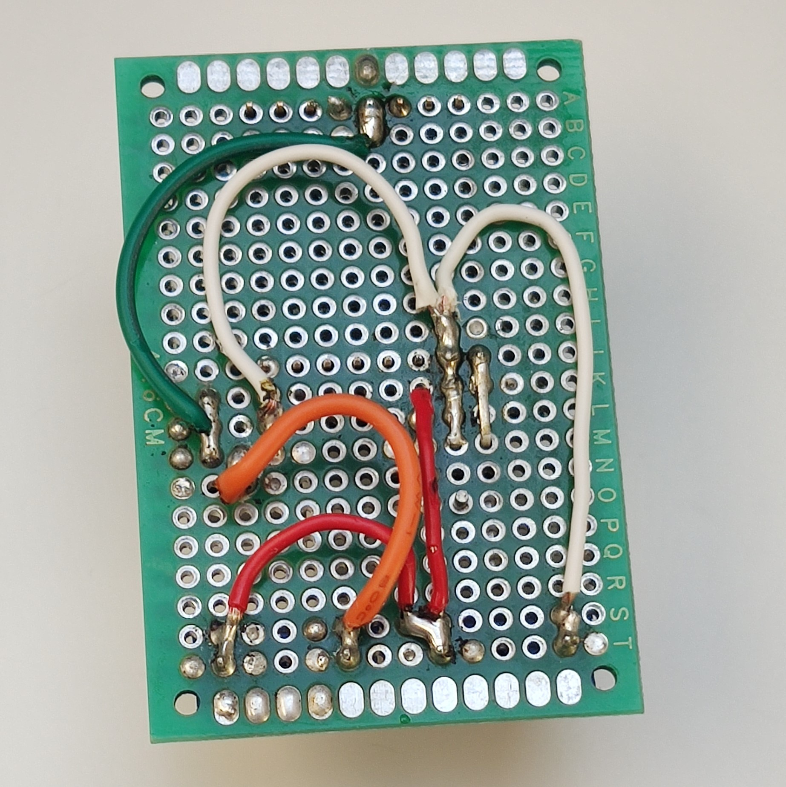

# DiyHue dimmable light strip

*Modified 2022-02-12*

Dimmable 12V LED strip light, using diyHue.

- [DiyHue dimmable light strip](#diyhue-dimmable-light-strip)
  - [BOM](#bom)
  - [Hardware assembly](#hardware-assembly)
  - [Software](#software)
    - [Environment setup (optional)](#environment-setup-optional)
    - [Firmware deploy](#firmware-deploy)

## BOM

| Name                      | QTY | Price € | Notes |
|:--------------------------|:---:|--------:|:------|
| Power supply              | 1   |         | 12Vdc, Wattage depends on LED strip |
| LED strip                 | 1   |         | Generic 12Vdc LED strip, bought [v-tac SKU:2143](https://www.v-tac.eu/products/house-and-garden/led-strip/led-strip-smd5050-60-leds-natural-white-ip20-detail.html), details:<br> - ``DC 12V``, ``SMD 5050``, ``60 Leds/m``, ``10.8W/m``, ``1000lm/m``, ``Day white 4000k``, ``IP20`` |
| ESP8266 NodeMCU / D1 mini | 1   |         | Controlling board, diyHue light sketch - ``Generic_Dimmable_Light.ino`` |
| Voltage regulator         | 1   |         | L7805, to power up the board |
| MOSFET IRLB8721PbF        | 1   |         | IRLB8721PbF transistor, used for the dimming |
| Resistor 1kΩ              | 1   |         |       |
| Misc                      |     |         | Connectors, wires, screws, board, heat sinks, etc.. |
|                           |     |         |       |
| Optionals                 |     |         |       |
| - LED profile             |     |         | Optional |
| - 3D printed parts        |     |         | Optional, you may check [thing:5145793](https://www.thingiverse.com/thing:5145793) |

## Hardware assembly

**Wiring and assembly the hardware**

|  |  |  |
|:----------------------------------------------------------------------------------------:|:----------------------------------------------------------------------------------------:|:----------------------------------------------------------------------------------------:|
| Fig.01 - Fritzing schematic                                                              | Fig.02 - Soldered board, top view                                                        | Fig.03 - Soldered board, bottom view                                                     |

|  |  |  |  | 
|:----------------------------------------------------------------------------------------:|:----------------------------------------------------------------------------------------:|:----------------------------------------------------------------------------------------:|:----------------------------------------------------------------------------------------:|
| Fig.04 - Soldered board, top view                                                        | Fig.05 - Soldered board, bottom view                                                     | Fig.06 - Assembly                                                                        | Fig.07 - Assembly                                                                        | 

**Lamp stand (Optional)**

Check [thing:5145793](https://www.thingiverse.com/thing:5145793) and use the 3D printed models, if not planning to use it as recessed lighting.

## Software

### Environment setup (optional)

You may skip this section if already setup the Arduino environment

<!-- TODO: Using PlatformIO instead of Arduino environment. -->

<!-- 
If you have a backup of Arduino and ArduinoData folders.
These folders must be placed in the root of documents folder.
-->

1. Download the [Arduino IDE](https://www.arduino.cc/en/software)
2. Adding additional boards to the IDE
   Go to ``File/Preferences/Additional boards manager URLs`` and paste the link ``http://arduino.esp8266.com/stable/package_esp8266com_index.json``
   Then ``Tools\Board\Board manager`` search for ``esp8266`` and install the library
   <!--, note that you may have issues with the latest version, so am I, tested with version 2.4.2 -->
3. Install diyHue sketch dependencies 
   If you are using Windows, arduino packages are located in ``Documents/Arduino`` and ``Documents/ArduinoData``
   It was hard for me to get the right packages, required from the sketches, since most of them have the same names and does not appear when search in library, so created the following table for reference.

   | Includes                                 | Notes                                                          | 
   |:-----------------------------------------|:---------------------------------------------------------------|
   | ``#include <FS.h>``                      | Preinstalled with ``esp8266`` board                            |
   | ``#include <ESP8266WiFi.h>``             |                                                                |
   | ``#include <ESP8266mDNS.h>``             |                                                                |
   | ``#include <WiFiUdp.h>``                 |                                                                |
   | ``#include <ESP8266HTTPUpdateServer.h>`` |                                                                |
   | ``#include <ESP8266WebServer.h>``        |                                                                |
   | ``#include <NeoPixelBus.h>``             | [NeoPixelBus GitHub](https://github.com/Makuna/NeoPixelBus)    | 
   | ``#include <WiFiManager.h>``             | [WiFiManager GitHub](https://github.com/tzapu/WiFiManager)     |
   | ``#include <ArduinoJson.h>``             | [ArduinoJson GitHub](https://github.com/bblanchon/ArduinoJson) |

### Firmware deploy

Download the sketch ``Generic_Dimmable_Light.ino`` from [github.com/diyhue/Lights](https://github.com/diyhue/Lights).

Use the board configuration as show in figure below.

You may change source code of the sketch, since number of lights are hard coded and cannot be changed from the UI.

```cpp
//define pins
#define LIGHTS_COUNT 1
uint8_t pins[LIGHTS_COUNT] = {12}; // GPIO 12, d1 mini board label is D6
```

|  |  |  |
|:------------------------------------------------------------------------------------------:|:------------------------------------------------:|:--------------------------------------------------------------------------------------:|
| Fig.08 - Board configuration, IDE                                                          | Fig.09 - ESP8266 D1 Mini GPIOs                   | Fig.10 - Sketch source code changes                                                    |
