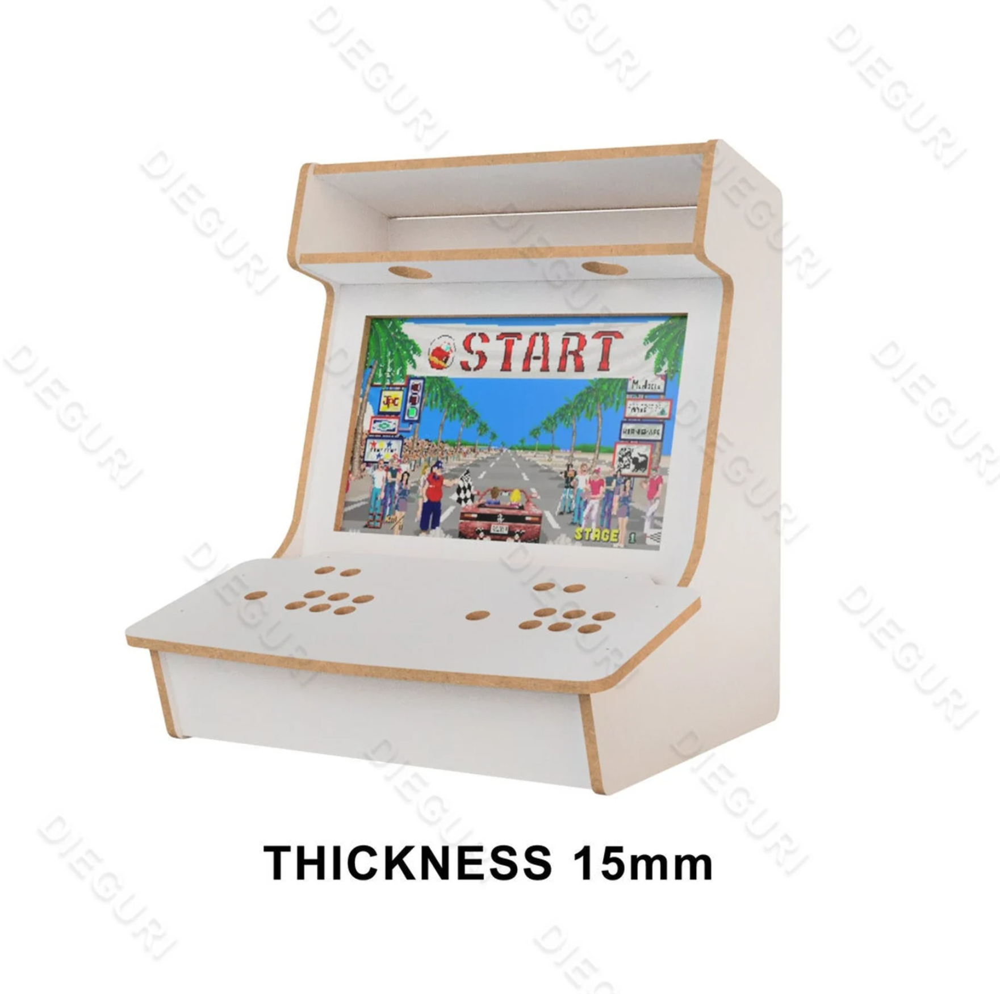
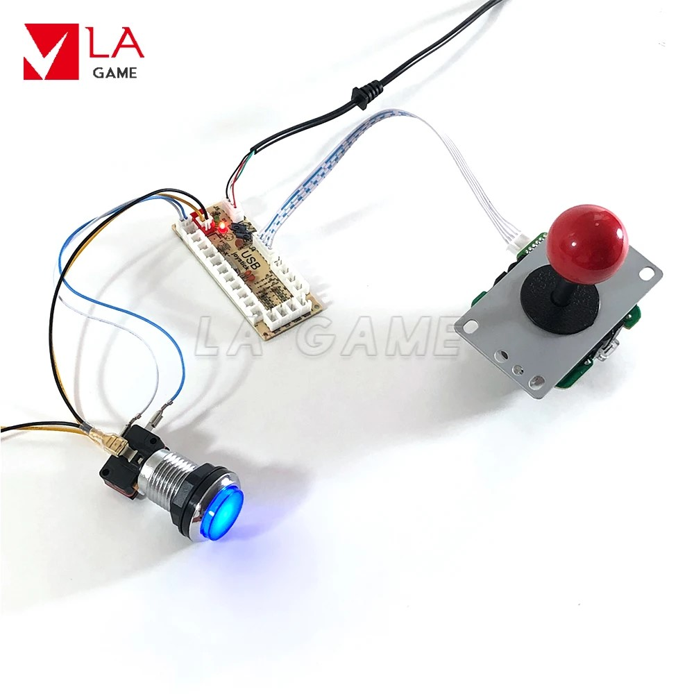

# Arcade Bartop Machine

<!-- *Modified 2024-01-04* -->
*Modified 2024-01-15*

Not a gamer, but I've always wanted to make one of these arcade machines.

|  |  |  |  |
|:---------:|:---------:|:---------:|:---------:|

## TOC

- [Arcade Bartop Machine](#arcade-bartop-machine)
  - [TOC](#toc)
  - [BOM](#bom)
  - [Assembly](#assembly)
  - [Software](#software)
  - [Personalization](#personalization)
    - [Scraper](#scraper)
    - [Splash screens](#splash-screens)
    - [Bezels](#bezels)
    - [Cheats](#cheats)
    - [Marquee](#marquee)
    - [Shaders](#shaders)
    - [Themes](#themes)
  - [Issues](#issues)
  - [Supported Systems](#supported-systems)
  - [Notes](#notes)

## BOM

| Name                       | QTY | Price € | Notes |
|:---------------------------|:---:|--------:|:------|
| [Arcade plans](https://www.etsy.com/listing/677137029/arcade-bartop-machine-evo-cabinet-table) | 1   | 11      | Bough for 12 USD from etsy |
| CNC wood cutting           | 1   | 100     | Acknowledgements to [CNC Services](https://www.facebook.com/cncservicesbg/)
| [Arcade DIY Kit](https://aliexpress.com/item/4001298797758.html) | 1 | 30 | From aliexpress |
| Raspberry Pi 3 Model B+    | 1   |         | I Already had one |
| Monitor                    | 1   |         | Used my very old [VB195T](https://www.asus.com/commercial-monitors/vb195t/) 19" 1280x1024 |
| 500GB HDD                  | 1   | 15      | *optional,  more space for games |
|                            |     |         |                   |
| Screws, Outlet, crimp connectors, wires etc.. |  |    | Used 25 and 15mm long screws|
| Wood oil, sandpaper, paintbrush etc..         |  | 11 |  |
| Old desktop speakers       | 1   | 5       |  |  |
| IEC 60320 C14 Power socket | 1   | 2       | Screw Mount one, with a button | 
| Logitech desktop speakers  | 1   | 10      | Bought used ones               |
|                            |     |         |                   |
| 3D printed models          |     |         | [thing:6435623](https://www.thingiverse.com/thing:6435623), [printables](https://www.printables.com/model/723322-arcade-bartop)|

## Assembly

- **Аssembly**
   - Аssembly all together
   - Drill tiny holes, to avoid damaging the wood when screw the plates together
- **Sand**
   - Using sandpaper
   - Clean all the dust
   - Use wet cloth
   - Dry
- **Painting**
   - Wood oil treathment, using paint brush and roller
   - Wait for some time and 
   - Clean from wood oil
- **Buttons Аssembly**
   - Design button labels, I found some and design the rest
   - Print them different scale in order to fit between button cover and diffuser
   - Disassembly buttons and place the cutted labels
   - Make sure diffuser caps clips tight
   - Assembly rest of the button components
- **Gaming panel**
   - Arrange buttons (nintendo layout used)
   - Joystick positioned to center via 3D printed fixture and attached to the wood via screws
   - USB controller boards, 3D printed a case and attached with screws
   - Wiring, check the assembly photos
- **Monitor placement**
   - Jigsaw tool used to extend the frame in order to fit the monitor
   - The back wood plate attached with VESA and then side screws, drill tiny holes before screws in order to avoid damaging the wood
- **Back plate**
   - Decided to use magnets to attach the backplate
   - 120mm fan mounted
- **Power circuit**
   - Cut hole for power socket
   - Wiring, check photos for more details
- **Sound system**
   - Used old Logitech desktop speakers, arcade cabinet hole is around 60mm
   - 3D print speakers cap
   - Speaker electronics board attached inside
- **RPI**
   - Used original RPI case with 3D printed holder to attach
   - External HDD mount, 3D printed bracket used   
- **WIP!** 🚧 Front panel 🚧
   - To be attached with magnets
   - LEDs

|            |            |                    |            |
|-:-:----------------------------------------------------------------|-:-:----------------------------------------------------------------|-:-:------------------------------------------------------------------------|-:-:----------------------------------------------------------------|
|  |  |          |      |
|          |        |          |  |
|  |  |          |  |
|  |  |  |  |
|  |  |          |  |

## Software

1. Followed the [Official Installation Guide](https://retropie.org.uk/docs/First-Installation/)
2. Downloaded Pre-made [Retropie](https://retropie.org.uk/download/) image for the Raspberry Pi and installed using [Raspberry Pi Imager](https://www.raspberrypi.com/software/)
3. Configure WIFI and Enable SSH
   - ~~Within the RPI imager ``Win + Shift + x`` to access advanced options~~ - It does not work..
   - You may also enable from the GUI later on (keyboard may required)
   - SSH, Check [retropie.org.uk/docs/SSH](https://retropie.org.uk/docs/SSH/) ``ssh pi@retropie.local`` defaut password ``raspberry``
   - WIFI, [retropie.org.uk/docs/Wifi/](https://retropie.org.uk/docs/Wifi/)
4. Configure the inputs
   - Long press to skip
   - ``Start + Select`` for a Hot key (button 0)
5. Update ``sudo apt update`` and ``sudo apt upgrade``
6. Overclock ``sudo nano boot/config.txt``
   ```
   arm_freq=1350
   gpu_freq=525
   core_freq=525
   sdram_freq=500
   over_voltage=6
   v3d_freq=525
   force_turbo=1
   avoid_pwm_pll=1
   disable_splash=1
   ```
   - You may also you use raspi-config defined overclock settings
   - Tempreture check - ``vcgencmd measure_temp``
   - [retropie.org.uk/docs/Overclocking](https://retropie.org.uk/docs/Overclocking/)
   - [reddit, Pi3 Overclock For N64](https://www.reddit.com/r/RetroPie/comments/67h2cv/pi3_overclock_for_n64_finally_eliminated_lag/)
7. External HDD ***Optional**
   - Should be formated as FAT32 or exFAT.
   - HDD formatted as exFAT, use rufus instead of windows built in tool, win formatter cause problems later on
   - [retropie.org.uk/docs/Running-ROMs-from-a-USB-drive](https://retropie.org.uk/docs/Running-ROMs-from-a-USB-drive/)
   - [YouTube - Setup USB drive for roms and emulators](https://www.youtube.com/watch?v=E5MfSlRwYGI)
8. Transferring Roms, BIOS files, etc.. [retropie.org.uk/docs/Transferring-Roms](https://retropie.org.uk/docs/Transferring-Roms/)
   - On Windows, type ``\\RETROPIE.local``
   - On Mac OS X/macOS, open Finder, select "Go" menu and "Connect to Server". Type ``smb://retropie.local`` and hit "Connect"
   - Default credentials - ``pi/raspberry``
   - Note that Roms should be placed in corresponding folders, e.g. nintendo 64 games goes to n64 folder
   - Once files transferred restart the emulator and run the scraping tool from the configuration menu (This will download games meta data such as images, rating, description etc..)
   - Same way for the ``bios`` files, ``Splash screens``, etc..

## Personalization

### Scraper
Scraping is a way to get metadata, boxart and video previews (snapshots) for your games from the internet.  
There are build in ones, but I decided to use a desktop app called [skraper](https://skraper.net/), a reddit post [better scraper for emulationstation?](https://www.reddit.com/r/RetroPie/comments/rnx7p7/better_scraper_for_emulationstation/) turn the wheel for my decision.  
Video tutorial - [How to use Skraper - The best media file Scraper for your Retropie LaunchBox and RecalBox](https://www.youtube.com/watch?v=0WX4HjSduzk)  

### Splash screens
RetroPie lets you customize the splash screen that appears during boot, giving your setup a unique personality.  
The Splash Screen Menu can be accessed from the RetroPie Menu in EmulationStation or through the setup script under option 3 - it is only available on the Raspberry Pi.  
Check [retropie.org.uk/docs/Splashscreen](https://retropie.org.uk/docs/Splashscreen/)

### Bezels 
Bezels in RetroPie are decorative borders that surround your emulated games, mimicking the look of arcade cabinets or consoles. They can add immersion and authenticity to your gameplay.  
[YouTube - Add & Remove Bezels On RetroPie w/ The Bezel Project - RetroPie Guy How To Tutorial](https://www.youtube.com/watch?v=mPcdCj_PQIA)  

### Cheats
More about - [retropie.org.uk/docs/Cheats](https://retropie.org.uk/docs/Cheats/)  

### Marquee
*Second screen required.  
In the context of arcade gaming, a "marquee" refers to a horizontal sign or display panel typically located at the top of an arcade cabinet.  
The marquee displays the title of the game, promotional artwork, or other relevant information to attract players and provide a visual identity for the game.  
[Dual Screen Raspberry Pi4 RetroPie Marquees!](https://www.youtube.com/watch?v=VWFBq7dz41k&t=18s)  
[How to make a digital marquee for your Custom Raspberry Pi Arcade Cabinet! Episode#13 LCD marquee!](https://www.youtube.com/watch?v=Au9O-A2fz74)  

### Shaders 

Enhance the look and feel of classic games.  
Used to apply visual effects to the graphics output of emulated games.  
Shaders can simulate various display technologies or enhance the visual appearance of games, providing a nostalgic or stylized look. RetroPie supports shaders in its emulation software to recreate the look and feel of classic gaming systems.
Check [retropie.org.uk/docs/Shaders-and-Smoothing](https://retropie.org.uk/docs/Shaders-and-Smoothing/)

### Themes

Themes can be installed via ``RetroPie Setup Script >> Configuration / Tools >> esthemes``, then access the ``ui settings`` from the ``start menu`` in emulationstation.  
Docs - [retropie.org.uk/docs/Themes/](https://retropie.org.uk/docs/Themes/)  
Preferred ones - ``Retrorama``, ``Magazine Madness``, ``Flat``, ``Epic Noir - Dark Mode``, ``Flat-Dark``.

## Issues

**Sound**
I had problems with audio (using 3.5mm RPI jack), Tryed to fix it by selecting headphones from all the available configuration options such as raspi-config, retropie GUI menu, retropie audio setup, etc.., but that does not resolve the problem.  
The monitor input is VGA so I went using HDMI to VGA converter with build in AUX out.  

```
#Speakers test
speaker-test -c2 -twav -l7
```

**Emulator does not show game list**  
Need to enable emulation ``Retropie setup > Manage packages > Manage optional packages``  
[Install PSP (PPSSPP) Emulation on Retropie | Super Easy](https://youtu.be/5qrpc38abog?t=72)  

## Supported Systems

Docs - [Supported Systems](https://retropie.org.uk/docs/Supported-Systems/)

| Manufact.                        | Image                                                                                                                                                                   | Thumb. | Rom Foldr           | Num games    | System                                                                                                   | Emulator                                                                                                                                                                                                                                                                                                                                                                                    | Extension                                                             | BIOS                                                                                                                      |
|:--------------------------------:|:-----------------------------------------------------------------------------------------------------------------------------------------------------------------------:|:------:|:-------------------:|:------------:|:--------------------------------------------------------------------------------------------------------:|:--------------------------------------------------------------------------------------------------------------------------------------------------------------------------------------------------------------------------------------------------------------------------------------------------------------------------------------------------------------------------------------------|:---------------------------------------------------------------------:|:-------------------------------------------------------------------------------------------------------------------------:|
| 2006: Nintendo                   |                                                   | -      | ``wii``             | -            | [Wii](https://retropie.org.uk/docs/Wii/)                                                                 | [dolphin](https://github.com/dolphin-emu/dolphin)                                                                                                                                                                                                                                                                                                                                           | .iso                                                                  | -                                                                                                                         |
| 2004: Sony                       |                                                        | Yes    | ``psp``             | 126          | [PSP](https://retropie.org.uk/docs/PSP/)                                                                 | [lr-ppsspp](https://github.com/libretro/libretro-ppsspp), [ppsspp](https://github.com/hrydgard/ppsspp)                                                                                                                                                                                                                                                                                      | .cso .iso .pbp                                                        | -                                                                                                                         |
| 2004: Nintendo                   |                                | -      | ``nds``             | -            | [Nintendo DS](https://retropie.org.uk/docs/Nintendo-DS/)                                                 | [drastic](http://drastic-ds.com/), [lr-desmume](https://github.com/libretro/desmume)                                                                                                                                                                                                                                                                                                        | .bin .nds                                                             | -                                                                                                                         |
| 2001: Nintendo                   |                                                | Yes    | ``gc``              | 17           | [GameCube](https://retropie.org.uk/docs/GameCube/)                                                       | [dolphin](https://github.com/dolphin-emu/dolphin.git)                                                                                                                                                                                                                                                                                                                                       | .iso                                                                  | -                                                                                                                         |
| 2001: Nintendo                   |                    | Yes    | ``gba``             | 920          | [Game Boy Advance](https://retropie.org.uk/docs/Game-Boy-Advance/)                                       | [lr-mgba](https://github.com/libretro/mgba), [lr-vba-next](https://github.com/libretro/vba-next), [lr-gpSP](https://github.com/libretro/gpsp), [gpSP](https://github.com/DPRCZ/gpsp)                                                                                                                                                                                                        | .7z .gba .zip                                                         | gba_bios.bin                                                                                                              |
| 2001: Nintendo                   |                                             | -      | ``pokemini``        | -            | [Pokemon Mini](https://retropie.org.uk/docs/Pokemon-Mini/)                                               | [lr-pokemini](https://github.com/libretro/pokemini)                                                                                                                                                                                                                                                                                                                                         | .min                                                                  | -                                                                                                                         |
| 2001: N/A                        |                                                                                        | 🚧     | ``scummvm``         | 23           | [ScummVM](https://retropie.org.uk/docs/ScummVM/)                                                         | [ScummVM](http://scummvm.org/)                                                                                                                                                                                                                                                                                                                                                              | See Wiki Page                                                         | -                                                                                                                         |
| 2000: Sony                       |                                                | Yes    | ``ps2``             | 6            | [PlayStation 2](https://retropie.org.uk/docs/Playstation-2/)                                             | [pcsx2](http://pcsx2.net/)                                                                                                                                                                                                                                                                                                                                                                  | .iso .img .bin .mdf .z .z2 .bz2 .dump .cso .ima .gz                   | SCPH-XXXXX.BIN, SCPH-XXXXX.EROM, SCPH-XXXXX.ROM1, SCPH-XXXXX.ROM2, SCPH-XXXXX.NVM                                         |
| 2000: N/A                        |                                          | -      | ``fba``             | -            | [FinalBurn Neo](https://retropie.org.uk/docs/FinalBurn-Neo/)   *Obsolete, use fbneo instead              | [lr-fbneo](https://github.com/libretro/fbneo), [lr-fbalpha2012](https://github.com/libretro/fbalpha2012), [PiFBA](https://github.com/RetroPie/pifba)                                                                                                                                                                                                                                        | .7z .zip                                                              | cchip.zip, decocass.zip, isgsm.zip, neogeo.zip, neocdz.zip, midssio.zip, nmk004.zip, pgm.zip, skns.zip, ym2608.zip        |
| 2000: Bandai                     |                    | -      | ``wonderswancolor`` | -            | [WonderSwan Color](https://retropie.org.uk/docs/WonderSwan-Color/)                                       | [lr-mednafen-wswan](https://github.com/libretro/beetle-wswan-libretro), [lr-beetle-wswan](https://github.com/libretro/beetle-wswan-libretro)                                                                                                                                                                                                                                                | .7z .wsc .zip                                                         | -                                                                                                                         |
| 1999: SNK                        |            | Yes    | ``ngpc``            | 119          | [Neo Geo Pocket Color](https://retropie.org.uk/docs/Neo-Geo-Pocket-Color/)                               | [lr-mednafen-ngp](https://github.com/libretro/beetle-ngp-libretro.git), [lr-beetle-ngp](https://github.com/libretro/beetle-ngp-libretro.git)                                                                                                                                                                                                                                                | .7z .ngc .zip                                                         | -                                                                                                                         |
| 1999: Bandai                     |                              | -      | ``wonderswan``      | -            | [WonderSwan](https://retropie.org.uk/docs/WonderSwan/)                                                   | [lr-mednafen-wswan](https://github.com/libretro/beetle-wswan-libretro), [lr-beetle-wswan](https://github.com/libretro/beetle-wswan-libretro)                                                                                                                                                                                                                                                | .7z .ws .zip                                                          | -                                                                                                                         |
| 1998: SNK                        |                    | -      | ``ngp``             | -            | [Neo Geo Pocket](https://retropie.org.uk/docs/Neo-Geo-Pocket/)                                           | [lr-mednafen-ngp](https://github.com/libretro/beetle-ngp-libretro.git), [lr-beetle-ngp](https://github.com/libretro/beetle-ngp-libretro.git)                                                                                                                                                                                                                                                | .7z .ngp .zip                                                         | -                                                                                                                         |
| 1998: Sega                       |                              | Yes    | ``dreamcast``       | 389          | [Dreamcast](https://retropie.org.uk/docs/Dreamcast/)                                                     | [Reicast](https://github.com/reicast/reicast-emulator)                                                                                                                                                                                                                                                                                                                                      | .cdi .gdi                                                             | dc_boot.bin, dc_flash.bin                                                                                                 |
| 1998: Nintendo                   |                    | Yes    | ``gbc``             | 528/5        | [Game Boy Color](https://retropie.org.uk/docs/Game-Boy-Color/)                                           | [lr-gambatte](https://github.com/libretro/gambatte-libretro), [lr-tgbdual](https://github.com/libretro/tgbdual-libretro)                                                                                                                                                                                                                                                                    | .7z .gbc .zip                                                         | -                                                                                                                         |
| 1997: N/A                        |                                                                                  | -      | ``mess``            | -            | [MESS](https://retropie.org.uk/docs/MESS/) *Obsolete                                                     | [lr-mame](https://github.com/libretro/MAME)                                                                                                                                                                                                                                                                                                                                                 | .zip                                                                  | Now a part of MAME                                                                                                        |
| 1996: Nintendo                   |                      | Yes    | ``n64``             | 328          | [Nintendo 64](https://retropie.org.uk/docs/Nintendo-64/)                                                 | [Mupen64plus](https://code.google.com/p/mupen64plus/), [lr-mupen64plus](https://github.com/libretro/mupen64plus-libretro)                                                                                                                                                                                                                                                                   | .n64 .v64 .z64 .zip                                                   | -                                                                                                                         |
| 1995: Nintendo                   |                                          | -      | ``virtualboy``      | -            | [Virtual Boy](https://retropie.org.uk/docs/Virtual-Boy/)                                                 | [lr-beetle-vb](https://github.com/libretro/beetle-vb-libretro)                                                                                                                                                                                                                                                                                                                              | .7z .vb .zip                                                          | -                                                                                                                         |
| 1994: Sony                       |                          | Yes    | ``psx``             | 864          | [PlayStation 1](https://retropie.org.uk/docs/Playstation-1/)                                             | [lr-pcsx-rearmed](https://github.com/libretro/pcsx_rearmed), [pcsx-rearmed](https://github.com/notaz/pcsx_rearmed), [lr-beetle-psx](https://github.com/libretro/beetle-psx-libretro)                                                                                                                                                                                                        | .cbn .cue .img .iso .m3u .mdf .pbp .toc .z .znx                       | SCPH1001.BIN, scph5500.bin, scph5501.bin, scph5502.bin                                                                    |
| 1994: Sega                       |                          | Yes    | ``sega32x``         | 37           | [Sega 32X](https://retropie.org.uk/docs/Sega-32X/)                                                       | [lr-picodrive](https://github.com/libretro/picodrive)                                                                                                                                                                                                                                                                                                                                       | .32x .7z .bin .md .smd .zip                                           | -                                                                                                                         |
| 1994: SEGA                       |            | Yes    | ``saturn``          | 156          | [Saturn](https://retropie.org.uk/docs/Saturn/)                                                           | [lr-Yabause](https://github.com/libretro/yabause), [lr-beetle-saturn](https://github.com/libretro/beetle-saturn-libretro)                                                                                                                                                                                                                                                                   | .bin .cue .iso .mdf                                                   | saturn_bios.bin / sega_101.bin                                                                                            |
| 1993: Panasonic                  |                                  | Yes    | ``3do``             | 34           | [3do](https://retropie.org.uk/docs/3do/)                                                                 | [lr-4do](https://github.com/libretro/4do-libretro)                                                                                                                                                                                                                                                                                                                                          | .iso                                                                  | panafz10.bin                                                                                                              |
| 1993: Atari                      |                        | Yes    | ``atarijaguar``     | 55           | [Atari Jaguar](https://retropie.org.uk/docs/Atari-Jaguar/)                                               | [lr-virtualjaguar](https://github.com/libretro/virtualjaguar-libretro)                                                                                                                                                                                                                                                                                                                      | .j64 .jag                                                             | -                                                                                                                         |
| 1991: Sega                       |                                    | Yes    | ``segacd``          | 15/42?       | [Mega-CD / Sega CD](https://retropie.org.uk/docs/Sega-CD/)                                               | [lr-genesis-plus-gx](https://github.com/libretro/Genesis-Plus-GX), [lr-picodrive](https://github.com/libretro/picodrive)                                                                                                                                                                                                                                                                    | .bin .chd .cue .iso                                                   | bios_CD_U.bin, bios_CD_E.bin, bios_CD_J.bin, us_scd1_9210.bin, eu_mcd1_9210.bin, jp_mcd1_9112.bin                         |
| 1990: SNK                        |                          | Yes    | ``neogeo``          | 268          | [Neo Geo](https://retropie.org.uk/docs/Neo-Geo/)                                                         | [lr-fbneo](https://github.com/libretro/fbneo), [lr-fbalpha2012](https://github.com/libretro/fbalpha2012), [PiFBA](https://github.com/RetroPie/pifba), [GnGeo-Pi](https://github.com/ymartel06/GnGeo-Pi)                                                                                                                                                                                     | .7z .zip                                                              | neogeo.zip                                                                                                                |
| 1990: Sega                       |                                    | Yes    | ``gamegear``        | 258          | [Game Gear](https://retropie.org.uk/docs/Game-Gear/)                                                     | [lr-genesis-plus-gx](https://github.com/libretro/Genesis-Plus-GX), [Osmose](https://github.com/RetroPie/osmose-rpi)                                                                                                                                                                                                                                                                         | .7z .bin .gg .sms .zip                                                | -                                                                                                                         |
| 1990: Nintendo                   |                              | Yes    | ``snes``            | 976          | [Super Nintendo Entertainment System](https://retropie.org.uk/docs/Super-Nintendo-Entertainment-System/) | [lr-snes9x2010](https://github.com/libretro/snes9x2010), [lr-snes9x](https://github.com/libretro/snes9x), [lr-snes9x2005](https://github.com/libretro/snes9x2005), [lr-snes9x2002](https://github.com/libretro/snes9x2002), [PiSNES](https://github.com/RetroPie/pisnes), [lr-armsnes](https://github.com/RetroPie/ARMSNES-libretro), [snes9x-rpi](https://github.com/RetroPie/snes9x-rpi), | .7z .bin .fig .mgd .sfc .smc .swc .zip                                | -                                                                                                                         |
| 1989: Nintendo                   |                                                  | Yes    | ``gb``              | 620          | [Game Boy](https://retropie.org.uk/docs/Game-Boy/)                                                       | [lr-gambatte](https://github.com/libretro/gambatte-libretro), [lr-tgbdual](https://github.com/libretro/tgbdual-libretro)                                                                                                                                                                                                                                                                    | .7z .gb .zip                                                          | -                                                                                                                         |
| 1989: NEC                        |                            | -      | ``supergrafx``      | -            | [PC Engine 2 / SuperGrafx](PC-Engine)                                                                    | [lr-beetle-supergrafx](https://github.com/libretro/beetle-supergrafx-libretro)                                                                                                                                                                                                                                                                                                              | .7z .pce .zip                                                         | syscard3.pce                                                                                                              |
| 1989: MGT                        |                                            | -      | ``samcoupe``        | -            | [SAM Coupé](https://retropie.org.uk/docs/Sam-Coupe/)                                                     | [SimCoupe](http://www.simcoupe.org/)                                                                                                                                                                                                                                                                                                                                                        | .dsk .mgt .sbt .sad                                                   | -                                                                                                                         |
| 1989: Atari                      |                              | Yes    | ``atarilynx``       | 89           | [Atari Lynx](https://retropie.org.uk/docs/Atari-Lynx/)                                                   | [lr-handy](https://github.com/libretro/libretro-handy), [lr-beetle-lynx](https://github.com/libretro/beetle-lynx-libretro)                                                                                                                                                                                                                                                                  | .7z .lnx .zip                                                         | -                                                                                                                         |
| 1988: Sega                       |                        | Yes    | ``megadrive``       | 790/764      | [Mega Drive / Genesis](https://retropie.org.uk/docs/Mega-Drive-Genesis/)                                 | [lr-genesis-plus-gx](https://github.com/libretro/Genesis-Plus-GX), [lr-picodrive](https://github.com/libretro/picodrive), [DGEN](http://dgen.sourceforge.net/)                                                                                                                                                                                                                              | .7z .bin .gen .md .sg .smd .zip                                       | -                                                                                                                         |
| 1987: Sharp                      |                                             | -      | ``x68000``          | -            | [Sharp X68000](https://retropie.org.uk/docs/Sharp-X68000/)                                               | [lr-px68k](https://github.com/libretro/px68k-libretro/)                                                                                                                                                                                                                                                                                                                                     | .dim                                                                  | cgrom.dat, iplrom.dat, iplrom30.dat, iplromco.dat, iplromxv.dat                                                           |
| 1987: NEC                        |                        | Yes    | ``pcengine``        | 116          | [PC Engine / TurboGrafx-16](https://retropie.org.uk/docs/PC-Engine/)                                     | [lr-mednafen-pce-fast](https://github.com/libretro/beetle-pce-fast-libretro.git), [lr-beetle-pce-fast](https://github.com/libretro/beetle-pce-fast-libretro.git)                                                                                                                                                                                                                            | .7z .ccd .chd .cue .pce .zip                                          | syscard3.pce                                                                                                              |
| 1986: Nintendo                   |               | Yes    | ``fds``             | 65           | [Famicom Disk System](https://retropie.org.uk/docs/Famicom-Disk-System/)                                 | [lr-fceumm](https://github.com/libretro/libretro-fceumm), [lr-nestopia](https://github.com/libretro/nestopia)                                                                                                                                                                                                                                                                               | .7z .fds .nes .zip                                                    | disksys.rom                                                                                                               |
| 1986: Atari                      |                            | Yes    | ``atari7800``       | 59           | [Atari 7800](https://retropie.org.uk/docs/Atari-7800/)                                                   | [lr-prosystem](https://github.com/libretro/prosystem-libretro)                                                                                                                                                                                                                                                                                                                              | .7z .a78 .bin .zip                                                    | 7800 BIOS (U).rom                                                                                                         |
| 1985: Sega                       |                            | Yes    | ``mastersystem``    | 529          | [Master System](https://retropie.org.uk/docs/Master-System/)                                             | [lr-Genesis-Plus-GX](https://github.com/libretro/Genesis-Plus-GX), [lr-picodrive](https://github.com/libretro/picodrive), [Osmose](https://github.com/RetroPie/osmose-rpi)                                                                                                                                                                                                                  | .7z .bin .sms .zip                                                    | -                                                                                                                         |
| 1985: Commodore                  |                                          | Yes    | ``amiga``           | 582          | [Amiga](https://retropie.org.uk/docs/Amiga/)                                                             | [UAE4ARM](https://github.com/Chips-fr/uae4arm-rpi/), [UAE4ALL2](https://github.com/RetroPie/uae4all2)                                                                                                                                                                                                                                                                                       | .adf .adz .dms .exe .rp9 .zip                                         | kick13.rom, kick20.rom, kick31.rom                                                                                        |
| 1985: Atari                      |                                              | -      | ``atarist``         | -            | [Atari ST-STE-TT-Falcon](https://retropie.org.uk/docs/Atari-ST-STE-TT-Falcon/)                           | [Hatari](http://hatari.tuxfamily.org/)                                                                                                                                                                                                                                                                                                                                                      | .ctr .img .ipf .raw .rom .st .stx                                     | -                                                                                                                         |
| 1984: Amstrad                    |                                            | -      | ``amstradcpc``      | -            | [Amstrad CPC](https://retropie.org.uk/docs/Amstrad-CPC/)                                                 | [lr-cap32](https://github.com/libretro/libretro-cap32.git), [CapriceRPI](https://github.com/KaosOverride/CapriceRPI)                                                                                                                                                                                                                                                                        | .cpc .dsk                                                             | -                                                                                                                         |
| 1984: Apple                      |                  | -      | ``macintosh``       | -            | [Macintosh](https://retropie.org.uk/docs/Macintosh/)                                                     | [BasiliskII](http://basilisk.cebix.net/)                                                                                                                                                                                                                                                                                                                                                    | .img .rom                                                             | disk.img, mac.rom                                                                                                         |
| 1983: Microsoft                  |                                                    | -      | ``msx``             | -            | [MSX](https://retropie.org.uk/docs/MSX/)                                                                 | [lr-bluemsx](https://github.com/libretro/blueMSX-libretro), [lr-fmsx](https://github.com/libretro/fmsx-libretro), [OpenMSX](http://openmsx.org/)                                                                                                                                                                                                                                            | .col .dsk .mx1 .mx2 .rom                                              | See Wiki Page                                                                                                             |
| 1983: Tangerine Computer Systems |                                                                                    | -      | ``oric``            | -            | [Oric/Atmos](https://retropie.org.uk/docs/Oric/)                                                         | [Oricutron](https://github.com/pete-gordon/oricutron)                                                                                                                                                                                                                                                                                                                                       | .dsk .tap                                                             | -                                                                                                                         |
| 1983: N/A                        |                                          | -      | ``daphne``          | -            | [Daphne](https://retropie.org.uk/docs/Daphne/)                                                           | [Daphne](www.daphne-emu.com/)                                                                                                                                                                                                                                                                                                                                                               | .daphne                                                               | -                                                                                                                         |
| 1983: Sega                       |                        | -      | ``sg-1000``         | -            | [Sega SG-1000](https://retropie.org.uk/docs/SG-1000/)                                                    | [lr-Genesis-Plus-GX](https://github.com/libretro/Genesis-Plus-GX)                                                                                                                                                                                                                                                                                                                           | .7z .bin .sg .zip                                                     | -                                                                                                                         |
| 1983: Nintendo                   |                                          | Yes    | ``nes``             | 1045         | [Nintendo Entertainment System](https://retropie.org.uk/docs/Nintendo-Entertainment-System/)             | [lr-fceumm](https://github.com/libretro/libretro-fceumm), [lr-nestopia](https://github.com/libretro/nestopia), [lr-quicknes](https://github.com/libretro/QuickNES_Core)                                                                                                                                                                                                                     | .7z .fds .fig .mgd .nes .sfc .smc .swc .zip                           | disksys.rom                                                                                                               |
| 1982: Sinclair                   |                                              | Yes*   | ``zxspectrum``      | 8761         | [ZX Spectrum](https://retropie.org.uk/docs/ZX-Spectrum/)                                                 | [lr-fuse](https://github.com/libretro/fuse-libretro), [Fuse](http://fuse-emulator.sourceforge.net/), [FBZX](http://www.rastersoft.com/programas/fbzx.html)                                                                                                                                                                                                                                  | .dsk .gz .img .mgt .scl .sna .szx .tap .trd .tzx .udi .z80            | -                                                                                                                         |
| 1982: Commodore                  |                                                  | 🚧     | ``c64``             | -  🚧       | [Commodore 64/VIC-20/PET](https://retropie.org.uk/docs/Commodore-64-VIC-20-PET/)                         | [Vice](http://vice-emu.sourceforge.net/)                                                                                                                                                                                                                                                                                                                                                    | .crt .d64 .g64 .t64 .tap .x64                                         | -                                                                                                                         |
| 1982: Sharp                      |                                             | -      | ``x1``              | -            | [Sharp X1](https://retropie.org.uk/docs/Sharp-X1/)                                                       | [lr-x1](https://github.com/r-type/xmil-libretro)                                                                                                                                                                                                                                                                                                                                            | .dx1 .zip .2d .2hd .tfd .d88 .88d .hdm .xdf .dup .cmd                 | IPLROM.X1, IPLROM.X1T                                                                                                     |
| 1982: Dragon                     |                                                      | -      | ``dragon32``        | -            | [Dragon 32](https://retropie.org.uk/docs/Dragon/)                                                        | [XRoar](http://www.6809.org.uk/xroar/)                                                                                                                                                                                                                                                                                                                                                      | .asc .bas .cas .ccc .dmk .dsk .jvc .os9 .rom .sna .vdk .wav           | d32.rom                                                                                                                   |
| 1982: Coleco                     |                    | Yes    | ``coleco``          | 214/3        | [Colecovision](https://retropie.org.uk/docs/Colecovision/)                                               | [lr-blueMSX](https://github.com/libretro/blueMSX-libretro), [CoolCV](http://atariage.com/forums/topic/240800-coolcv-emulator-for-mac-os-x-linux-windows-and-raspberry/page-1/)                                                                                                                                                                                                              | .bin .col .rom .zip                                                   | coleco.rom                                                                                                                |
| 1982: Milton Bradley             |                                  | -      | ``vectrex``         | -            | [Vectrex](https://retropie.org.uk/docs/Vectrex/)                                                         | [lr-vecx](https://github.com/libretro/libretro-vecx)                                                                                                                                                                                                                                                                                                                                        | .7z .bin .gam .vec .zip                                               | -                                                                                                                         |
| 1982: Atari                      |          | Yes    | ``atari5200``       | 98           | [Atari 5200](https://retropie.org.uk/docs/Atari-2600/)                                                   | [Atari800](https://atari800.github.io/), [lr-atari800](https://github.com/libretro/libretro-atari800)                                                                                                                                                                                                                                                                                       | .7z .a52 .atr .bas .bin .car .dcm .xex .xfd .zip .atr.gz .xfd.gz      | ATARIXL.ROM, ATARIBAS.ROM, ATARIOSA.ROM, ATARIOSB.ROM, 5200.rom                                                           |
| 1982: NEC                        |                                             | -      | ``pc98``            | -            | [PC-9800](https://retropie.org.uk/docs/PC-9800/)                                                         | [lr-np2kai](http://domisan.sakura.ne.jp/article/np2kai/np2kai.html)                                                                                                                                                                                                                                                                                                                         | .d88 .d98 .88d .98d .fdi .xdf .hdm .dup .2hd .tfd .hdi .thd .nhd .hdd | bios.rom, font.rom, itf.rom, sound.rom, 2608_bd.wav, 2608_sd.wav, 2608_top.wav, 2608_hh.wav, 2608_tom.wav, 2608_rim.wav   |
| 1981: Texas Instruments          |                                                                            | -      | ``ti99``            | -            | [TI-99/4A](https://retropie.org.uk/docs/TI-99/)                                                          | [ti99sim](http://www.mrousseau.org/programs/ti99sim/)                                                                                                                                                                                                                                                                                                                                       | .ctg                                                                  | TI-994A.ctg                                                                                                               |
| 1981: NEC                        |                                             | -      | ``pc88``            | -            | [PC-8800](https://retropie.org.uk/docs/PC-8800/)                                                         | [Quasi88](https://www.eonet.ne.jp/~showtime/quasi88/),  [lr-quasi88](https://github.com/libretro/quasi88-libretro)                                                                                                                                                                                                                                                                          | .88d .cmt .d88 .t88                                                   | N88.ROM, N88SUB.ROM, N88N.ROM, N88EXT0.ROM, N88EXT1.ROM, N88EXT2.ROM, N88EXT3.ROM and optional (N88KNJ1.ROM, N88KNJ2.ROM) |
| 1981: Sinclair                   |                                             | -      | ``zx81``            | -            | [ZX-81](https://retropie.org.uk/docs/ZX81/)                                                              | [lr-81](https://github.com/libretro/81-libretro)                                                                                                                                                                                                                                                                                                                                            | .p .tzx .t81                                                          | -                                                                                                                         |
| 1980: Tandy                      |  | -      | ``coco``            | -            | [CoCo](https://retropie.org.uk/docs/Coco/)                                                               | [XRoar](http://www.6809.org.uk/xroar/)                                                                                                                                                                                                                                                                                                                                                      | .asc .bas .cas .ccc .dmk .dsk .jvc .os9 .rom .sna .vdk .wav           | bas13.rom                                                                                                                 |
| 1978: Magnavox, Philips          |            | -      | ``videopac``        | -            | [Videopac / Odyssey2](https://retropie.org.uk/docs/VideoPac-Odyssey-2/)                                  | [lr-o2em](https://github.com/libretro/libretro-o2em)                                                                                                                                                                                                                                                                                                                                        | .bin                                                                  | o2rom.bin                                                                                                                 |
| 1979: Mattel                     |                      | -      | ``intellivision``   | -            | [Intellivision](https://retropie.org.uk/docs/Intellivision/)                                             | [jzIntv](http://spatula-city.org/~im14u2c/intv/)                                                                                                                                                                                                                                                                                                                                            | .bin .int                                                             | exec.bin, grom.bin                                                                                                        |
| 1980: Nintendo                   |        | -      | ``gameandwatch``    | -            | [Game & Watch](https://retropie.org.uk/docs/Game-%26-Watch/)                                             | [lr-gw](https://github.com/libretro/gw-libretro)                                                                                                                                                                                                                                                                                                                                            | .mgw                                                                  | -                                                                                                                         |
| 1977: Atari                      |                          | Yes    | ``atari2600``       | 608          | [Atari 2600](https://retropie.org.uk/docs/Atari-2600/)                                                   | [lr-stella](https://github.com/libretro/stella-libretro), [Stella](https://stella-emu.github.io/)                                                                                                                                                                                                                                                                                           | .7z .a26 .bin .gz .rom .zip                                           | -                                                                                                                         |
| 1977: Apple                      |                                      | Yes    | ``apple2``          | 2498         | [Apple II](https://retropie.org.uk/docs/Apple-II/)                                                       | [Linapple](https://github.com/linappleii/linapple)                                                                                                                                                                                                                                                                                                                                          | .dsk                                                                  | -                                                                                                                         |
| 1977: Tandy Corporation          |                                                                        | -      | ``trs-80``          | -            | [TRS-80](https://retropie.org.uk/docs/TRS-80/)                                                           | [sdltrs](https://github.com/RetroPie/sdltrs)                                                                                                                                                                                                                                                                                                                                                | .dsk                                                                  | level2.rom, level3.rom, level4.rom, level4p.rom                                                                           |
| 1976: Fairchild Camera and Inst. |                                                                      | -      | ``channelf``        | -            | [Fairchild Channel F](https://retropie.org.uk/docs/Fairchild-ChannelF/)                                  |                                                                                                                                                                                                                                                                                                                                                                                             | .bin .chf .zip .7z                                                    |                                                                                                                           |
|                                  |                                                                                                                                                                         |        |                     |              |                                                                                                          |                                                                                                                                                                                                                                                                                                                                                                                             |                                                                       |                                                                                                                           |
| -                                |                                          | -      | ``fbneo``           | - 🚧🚧🚧   | [FinalBurn Neo](https://retropie.org.uk/docs/FinalBurn-Neo/)                                             |                                                                                                                                                                                                                                                                                                                                                                                             |                                                                       |                                                                                                                           |
| -                                |                                            | Yes    | ``mame-libretro``   | 4777/50      | [MAME](https://retropie.org.uk/docs/MAME/)                                                               |                                                                                                                                                                                                                                                                                                                                                                                             |                                                                       |                                                                                                                           |
| -                                |                                            | Yes    | ``mame-mame4all``   | 2273/1       | [MAME](https://retropie.org.uk/docs/MAME/)                                                               |                                                                                                                                                                                                                                                                                                                                                                                             |                                                                       |                                                                                                                           |

<!-- | ``pc``  delete?   | 337      | [PC](PC)|[DOSBox](http://www.dosbox.com/), [rpix86](http://rpix86.patrickaalto.com/)|.bat .com .exe .sh|-|1981: IBM| | -->
 

## Notes

[racketboy.com - Games that defined retro gaming machines](https://www.racketboy.com/guide/games-that-defined-retro-gaming-machines)  
[retro-sanctuary.com - All Time Top Games Lists](https://retro-sanctuary.com/Top%20Games%20Main.html)  
[racketboy.com - Hidden gems of previous gaming generations](https://www.racketboy.com/guide/hidden-gems)  

<!-- 
🚧
https://retropie.org.uk/docs/Speed-Issues/

ps dir gb
Get-ChildItem -Directory | ForEach-Object { [PSCustomObject]@{ Folder = $_.Name; SizeGB = [math]::Round((Get-ChildItem $_.FullName -Recurse | Measure-Object -Property Length -Sum).Sum / 1GB, 2) } }

log into rpi

df -h

but the hdd does not show
intead rpi recognise it 
blkid
fdisk -l
sudo fdisk -l


sudo mount /dev/sda /media/usb0 (make sure in root dir)

sudo mount -t exfat /dev/sda /media/usb0


/dev/mmcblk0p1: SEC_TYPE="msdos" LABEL_FATBOOT="boot" LABEL="boot" UUID="1FAF-0B10" TYPE="vfat" PARTUUID="bbf0778e-01"
/dev/mmcblk0p2: LABEL="retropie" UUID="a6308ae3-fdfb-4c68-b14f-ba56fb5746f1" TYPE="ext4" PARTUUID="bbf0778e-02"
/dev/mmcblk0p2: LABEL="retropie" UUID="a6308ae3-fdfb-4c68-b14f-ba56fb5746f1" TYPE="ext4" PARTUUID="bbf0778e-02" -->

