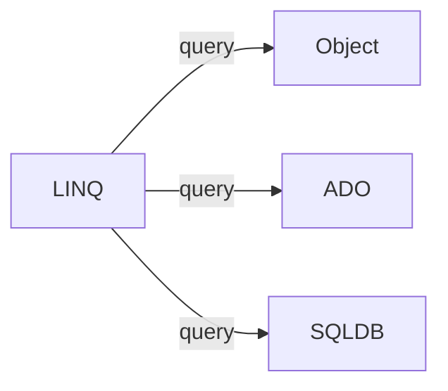

# C# 101

!> Work in process!

basics of c#

class instantiate

```csharp

Animal myanimal = new Animal();

// Animal - type of the variable
// myanimaval - variable
// with new Animal() new instance of the class
```

MVC

- optimizing site performance
- cashing
- async - simultinously executing code parts
- bundling - обединяване, app_start/bundleconfig.cs до 6 файла едновременно, съкращава времето на зареждане на страницата

## LINQ ##

language integrated query

- uniform query syntax
- used to interact numerious data types



- LINQ - query syntax (similar to sql syntax)

```csharp
var result = from s in mylist
            where s.Age > 12 && s.Age < 20
            select s

from s in store
where s ... || s .... && s ...
orderby s.Length, s....
select s
```

```csharp
var result = store.where(s => s...)
                  .orderby(s => s.)
                  .thenby(s => s.)
                  .select(s => s...);
```

- LINQ - method syntax or fluent syntax

```csharp
var result = stringList.where(s => s.contains("a"));
// lamdaaaas
var result2 = s => s.Age > 12 && s.Age < 20;
```

LINQ others

```chasp
where
OrderBy
ThenBy
GroupBt
ToLookup
contains
```

Lambda expression

- operator ```=>```. Read as "gost to"

  ```csharp
  value => value % 2 == 0
  // value - the input
  // % - expression

  n => {...};
  (value, index) => index % 2 == 1;
  ```

- anonymous function, containing expression and statems
- used to create delegates or expression tree types

## Entity framework ##

- ORM (object relactional mapping)
- EDM (Entity data model)

approaches

- code first - creates database from source code
- model first - design model via EF designer
- database first - creates models from database
  
DbContext - api, bridge between db and code

```csharp
public myContext(): DbContext{

    public DbSet<Students> Students{get; set;}

    DbSet<T> T{get; set}

    using(var db = new myContext()){} //fix
}
```

## Anonymous type ##

```csharp
var x = new {....};
object x = new {....};
```

- encapsulate a set of read-only proparties and ther value to a single object
- сравняват се по различен начин : ```csharp  obj.Equals(obj2)```

## Dynamic type ##

- can hold everything (different from object)
- evaluated at runtime
- its like ```var``` in Javascript
- not so good to use it

```csharp
dynamic dyn = 5;
        dyn = "text";
        dyn.name = "name"
        dyn = new Student();
        dyn = new[]{1, 2, 3, 5};
        dyn += "bla";
```

## Structures ##

- A value data type (behaviour like primitive)
- like classes (proparties, methods, etc..)
- mostly used to store data

```csharp
struct Point {
public int x {get; set}
public int y {get; set}
}
```

## Generics ##

Known as:

- parameterized types
- template types

```csharp
List<T> // T can be int, List<int>
List<string>
List<student>

// Generic class
public class GenericList<T> where T: IComparable{
    private T[] elements
}
```

