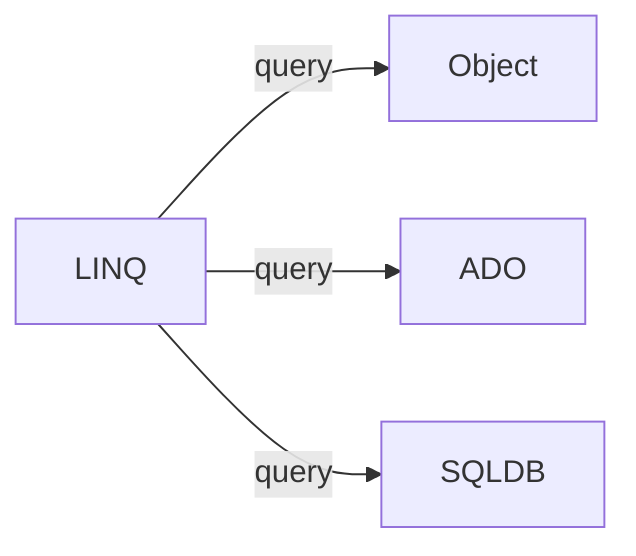

# C# 101

!> Work in process!

- [C# 101](#c-101)
  - [LINQ](#linq)
  - [Entity framework](#entity-framework)
  - [Anonymous type](#anonymous-type)
  - [Dynamic type](#dynamic-type)
  - [Structures](#structures)
  - [Generics](#generics)
  - [C# Assemblies](#c-assemblies)
  - [Virtual (C# Reference)](#virtual-c-reference)
  - [For and foreach](#for-and-foreach)
  - [C# - Overloadable Operators](#c---overloadable-operators)
  - [C# - Extension Methods](#c---extension-methods)
  - [CLR ILDASM and ILASM](#clr-ildasm-and-ilasm)
  - [TypeDef vs TypeRef](#typedef-vs-typeref)

basics of c#

class instantiate

```csharp

Animal myanimal = new Animal();

// Animal - type of the variable
// myanimaval - variable
// with new Animal() new instance of the class
```

MVC

- optimizing site performance
- cashing
- async - simultinously executing code parts
- bundling - обединяване, app_start/bundleconfig.cs до 6 файла едновременно, съкращава времето на зареждане на страницата

## LINQ ##

language integrated query

- uniform query syntax
- used to interact numerious data types



- LINQ - query syntax (similar to sql syntax)

```csharp
var result = from s in mylist
            where s.Age > 12 && s.Age < 20
            select s

from s in store
where s ... || s .... && s ...
orderby s.Length, s....
select s
```

```csharp
var result = store.where(s => s...)
                  .orderby(s => s.)
                  .thenby(s => s.)
                  .select(s => s...);
```

- LINQ - method syntax or fluent syntax

```csharp
var result = stringList.where(s => s.contains("a"));
// lamdaaaas
var result2 = s => s.Age > 12 && s.Age < 20;
```

LINQ others

```chasp
where
OrderBy
ThenBy
GroupBt
ToLookup
contains
```

Lambda expression

- operator ```=>```. Read as "gost to"

  ```csharp
  value => value % 2 == 0
  // value - the input
  // % - expression

  n => {...};
  (value, index) => index % 2 == 1;
  ```

- anonymous function, containing expression and statems
- used to create delegates or expression tree types

## Entity framework ##

- ORM (object relactional mapping)
- EDM (Entity data model)

approaches

- code first - creates database from source code
- model first - design model via EF designer
- database first - creates models from database
  
DbContext - api, bridge between db and code

```csharp
public myContext(): DbContext{

    public DbSet<Students> Students{get; set;}

    DbSet<T> T{get; set}

    using(var db = new myContext()){} //fix
}
```

## Anonymous type ##

```csharp
var x = new {....};
object x = new {....};
```

- encapsulate a set of read-only proparties and ther value to a single object
- сравняват се по различен начин : ```csharp  obj.Equals(obj2)```

## Dynamic type ##

- can hold everything (different from object)
- evaluated at runtime
- its like ```var``` in Javascript
- not so good to use it

```csharp
dynamic dyn = 5;
        dyn = "text";
        dyn.name = "name"
        dyn = new Student();
        dyn = new[]{1, 2, 3, 5};
        dyn += "bla";
```

## Structures ##

- A value data type (behaviour like primitive)
- like classes (proparties, methods, etc..)
- mostly used to store data

```csharp
struct Point {
public int x {get; set}
public int y {get; set}
}
```

## Generics ##

Known as:

- parameterized types
- template types

```csharp
List<T> // T can be int, List<int>
List<string>
List<student>

// Generic class
public class GenericList<T> where T: IComparable{
    private T[] elements
}
```

## C# Assemblies

<!-- https://www.youtube.com/watch?v=axTcf8r2kh8&list=PLRwVmtr-pp06rfSgNYu_oBg40DkwXiRHt -->
[](https://www.youtube.com/watch?v=axTcf8r2kh8 "Assemblies")


## Virtual (C# Reference)

The virtual keyword is used to modify a method, property, indexer, or event declaration and allow for it to be overridden in a derived class. For example, this method can be overridden by any class that inherits it:

```csharp
public virtual double Area()   
{  
    return x * y;  
}  
```

[Virtual (C# Reference)](https://docs.microsoft.com/en-us/dotnet/csharp/language-reference/keywords/virtual)

## For and foreach

``foreach`` syntax is quick and easy. 

``for`` syntax is a little more complex, but is also more flexible.

``foreach`` is useful when iterating all of the items in a collection. 

``for`` is useful when iterating overall or a subset of items.

The ``foreach`` iteration variable which provides each collection item, is **READ-ONLY**, so we can't modify the items as they are iterated. Using the ``for`` syntax, we can modify the items as needed.

Bottom line- use ``foreach`` to quickly iterate all of the items in a collection.

Use ``for`` to iterate a subset of the items of the collection or to modify the items as they are iterated.


## C# - Overloadable Operators

[Overloadable operators](https://docs.microsoft.com/en-us/dotnet/csharp/language-reference/operators/operator-overloading#overloadable-operators)

```csharp
public static Complex operator +(Complex c1, Complex c2)
    => new Complex(c1.real + c2.real, c1.imaginary + c2.imaginary);

// Override ToString() to display a complex number in the traditional format:
public override string ToString() => $"{this.real} + {this.imaginary}";
```

## C# - Extension Methods

[Extension methods](https://docs.microsoft.com/en-us/dotnet/csharp/programming-guide/classes-and-structs/extension-methods)

```csharp
using ExtensionMethods;  

string s = "Hello Extension Methods";  
int i = s.WordCount(); //extension method
```

The most common extension methods are the LINQ standard query operators.

Extension methods are defined as **static** methods but are **called by using instance method syntax**. Their first parameter specifies which type the method operates on, and the parameter is preceded by the this modifier.

Therefore, the principle of **encapsulation** is not really being violated. In fact, **extension methods cannot access private variables in the type they are extending**.

If you do implement extension methods for a given type, remember the following points:

- An extension method will **never be called if it has the same signature as a method defined** in the type.
- Extension methods are brought into **scope at the namespace level**. For example, if you have multiple static classes that contain extension methods in a single **namespace named Extensions**, they will all be brought into scope by the **using Extensions; directive**.

Guide to define and call the extension method

1. Define a static class to contain the extension method. The class must be visible to client code. For more information see Access Modifiers.
2. Implement the extension method as a static method with at least the same visibility as the containing class.
3. The first parameter of the method specifies the type that the method operates on; it must be preceded with the this modifier.
4. In the calling code, add a using directive to specify the namespace that contains the extension method class.
5. Call the methods as if they were instance methods on the type.

Example:

```csharp
using System;
using System.Collections.Generic;
using System.Text;
using System.Linq;

namespace EnumExtension
{
    // Define an extension method in a non-nested static class.
    public static class Extensions
    {        
        public static Grades minPassing = Grades.D;
        public static bool Passing(this Grades grade)
        {
            return grade >= minPassing;
        }
    }

    public enum Grades { F = 0, D=1, C=2, B=3, A=4 };
    class Program
    {       
        static void Main(string[] args)
        {
            Grades g1 = Grades.D;
            Grades g2 = Grades.F;
            Console.WriteLine("First {0} a passing grade.", g1.Passing() ? "is" : "is not");
            Console.WriteLine("Second {0} a passing grade.", g2.Passing() ? "is" : "is not");

            Extensions.minPassing = Grades.C;
            Console.WriteLine("\r\nRaising the bar!\r\n");
            Console.WriteLine("First {0} a passing grade.", g1.Passing() ? "is" : "is not");
            Console.WriteLine("Second {0} a passing grade.", g2.Passing() ? "is" : "is not");
        }
    }
  }

/* Output:
    First is a passing grade.
    Second is not a passing grade.

    Raising the bar!

    First is not a passing grade.
    Second is not a passing grade.
 */

```

## CLR ILDASM and ILASM

<!-- https://www.youtube.com/watch?v=D_1Op4TBM-Y -->

[](https://www.youtube.com/watch?v=D_1Op4TBM-Y "ILDASM and ILASM")

## TypeDef vs TypeRef

[TypeDef vs. TypeRef](https://docs.microsoft.com/en-us/archive/blogs/jmstall/typedef-vs-typeref)