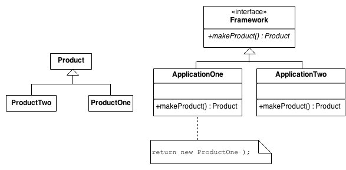

# Design Patterns

## Content

- [ ] Behavioral Patterns
  - [ ] **Chain of Resp.**	A way of passing a request between a chain of objects
  - [ ] **Command**	        Encapsulate a command request as an object
  - [ ] **Interpreter**	    A way to include language elements in a program
  - [ ] **Iterator**	    Sequentially access the elements of a collection
  - [ ] **Mediator**	    Defines simplified communication between classes
  - [ ] **Memento**	        Capture and restore an object's internal state
  - [x] **Observer**	    A way of notifying change to a number of classes
  - [ ] **State	Alter**     an object's behavior when its state changes
  - [x] **Strategy**	    Encapsulates an algorithm inside a class
  - [ ] **Template Method**	Defer the exact steps of an algorithm to a subclass
  - [ ] **Visitor**	        Defines a new operation to a class without change
  
- [ ] Creational Patterns
  - [ ] **Abstract Factory**	Creates an instance of several families of classes
  - [ ] **Builder**	            Separates object construction from its representation
  - [x] **Factory**             Method	Creates an instance of several derived classes
  - [ ] **Prototype**	        A fully initialized instance to be copied or cloned
  - [x] **Singleton**	        A class of which only a single instance can exist

- [ ] Structural Patterns
  - [ ] **Adapter**	        Match interfaces of different classes
  - [ ] **Bridge**	        Separates an object’s interface from its implementation
  - [ ] **Composite**	    A tree structure of simple and composite objects
  - [x] **Decorator**	    Add responsibilities to objects dynamically
  - [ ] **Facade**	        A single class that represents an entire subsystem
  - [ ] **Flyweight**	    A fine-grained instance used for efficient sharing
  - [ ] **Proxy**	        An object representing another object

----
## PatternName

template

### Definition

### UML class diagram

### Bullet points

### References

---

## Strategy

### Definition

Define a **family of algorithms**, **encapsulate each one**, and make them **interchangeable**. Strategy lets the algorithm vary independently from clients that use it.

This pattern allows a client to choose an algorithm from a family of algorithms at run-time and gives it a simple way to access it.

- Family of Algorithms: This means this pattern provides a set of algorithms using one of which at run time you can achieve the desired output.
- Encapsulate each one of the: This pattern allows you to place your algorithms in different classes (encapsulate them).
- Makes the algorithm interchangeable: The beauty with strategy pattern is that we can select at run time which algorithm we want to apply to our object and can also replace them with one another.
These are the three main points of Strategy pattern.

Strategy Design Pattern involves the removal of an algorithm from its host class and putting it in a separate class. As you know, there may be multiple strategies which are applicable for a given problem. So, if the algorithms will exist in the host class, then it will result in a messy code with lots of conditional statements.

### UML class diagram

The classes and objects participating in this pattern are:

- Strategy  (SortStrategy)
  - declares an interface common to all supported algorithms. Context uses this interface to call the algorithm defined by a ConcreteStrategy
- ConcreteStrategy  (QuickSort, ShellSort, MergeSort)
  - implements the algorithm using the Strategy interface
- Context  (SortedList)
  - is configured with a ConcreteStrategy object
  - maintains a reference to a Strategy object
  - may define an interface that lets Strategy access its data.

### Bullet points

- This pattern defines a set of related algorithm and encapsulate them in separated classes, and allows client to choose any algorithm at run time.
- It allows to add new algorithm without modifying existing algorithms or context class, which uses algorithm or strategies
- Strategy is a behavioral pattern in Gang of Four Design pattern list.
- Strategy pattern is based upon Open Closed design principle of SOLID principals.
- Combination of Collections.sort() and Comparator interface is an solid example of Strategy pattern.

### References

- Book [Head First Design Patterns](https://www.google.com/search?q=head+first+design+patterns&pws=0&gl=us&gws_rd=cr)
- YouTube [Strategy Pattern – Design Patterns (ep 1)](https://www.youtube.com/watch?v=v9ejT8FO-7I)
- Web article [strategy - dofactory](https://www.dofactory.com/net/strategy-design-pattern)
- Web article [strategy - sourcemaking](https://sourcemaking.com/design_patterns/strategy)
- Web article [strategy - refactoring](https://refactoring.guru/design-patterns/strategy)
- Web article [strategy - c-sharpcorner](https://www.c-sharpcorner.com/article/strategy-design-pattern-using-c-sharp/)
- Web article [strategy - dotnettricks](https://www.dotnettricks.com/learn/designpatterns/strategy-design-pattern-c-sharp)
- Web article [strategy - tutorialspoint](https://www.tutorialspoint.com/design_pattern/strategy_pattern.htm)

---

## Observer

### Definition

Define a one-to-many dependency between objects so that when one object changes state, all its dependents are notified and updated automatically.

The observer pattern (a subset of the publish/subscribe pattern) is a software design pattern in which an object, called the subject, maintains a list of its dependents, called observers, and notifies them automatically of any state changes, usually by calling one of their methods. It is mainly used to implement distributed event handling systems.

An Observer (sometimes known as publish-subscribe pattern) is best used on GUI interfaces to update states of change on GUI objects such as all other objects can update itself (e.g. resizing a window, then all gui objects such as buttons can re-align itself based on window's size). This is usually done by introducing EventListeners (which is an Observer pattern).

Subjects, or as we also know them, Observables, update Observers using a common interface.
Observers are loosely coupled in that the Observable knows nothing about them, other than that they implement the Observer interface.
You can **push** or **pull** data from the Observable when using the pattern (pull is considered more “correct”).

### UML class diagram

The classes and objects participating in this pattern are:

- Subject  (Stock)
  - knows its observers. Any number of Observer objects may observe a subject
  - provides an interface for attaching and detaching Observer objects.
- ConcreteSubject  (IBM)
  - stores state of interest to ConcreteObserver
  - sends a notification to its observers when its state changes
- Observer  (IInvestor)
  - defines an updating interface for objects that should be notified of changes in a subject.
- ConcreteObserver  (Investor)
  - maintains a reference to a ConcreteSubject object
  - stores state that should stay consistent with the subject's
  - implements the Observer updating interface to keep its state consistent with the subject's

### Bullet points

- The Observer Pattern defines a one-to-many relationship between objects.
- Subjects, or as we also know them, Observables, update Observers using a common interface.
- Observers are loosely coupled in that the Observable knows nothing about them,
- other than that they implement the Observer interface.
- You can push or pull data from the Observable when using the pattern (pull is
- considered more “correct”).
- Don’t depend on a specific order of notification for your Observers.
- Java has several implementations of the Observer Pattern, including the general
- purpose java.util.Observable.
- Watch out for issues with the java.util.Observable implementation.
- Don’t be afraid to create your own Observable implementation if needed.
- Swing makes heavy use of the Observer Pattern, as do many GUI frameworks.
- You’ll also find the pattern in many other places, including JavaBeans and RMI.

### References

- Book [Head First Design Patterns](https://www.google.com/search?q=head+first+design+patterns&pws=0&gl=us&gws_rd=cr)
- YouTube [Observer Pattern – Design Patterns (ep 2)](https://www.youtube.com/watch?v=_BpmfnqjgzQ)
- Web article [observer - dofactory](https://www.dofactory.com/net/observer-design-pattern)
- Web article [observer - sourcemaking](https://sourcemaking.com/design_patterns/observer)
- Web article [observer - refactoring](https://refactoring.guru/design-patterns/observer)
- Web article [observer - c-sharpcorner](https://www.c-sharpcorner.com/UploadFile/40e97e/observer-design-pattern-in-C-Sharp/)
- Web article [observer - dotnettricks](https://www.dotnettricks.com/learn/designpatterns/observer-design-pattern-c-sharp)
- Web article [observer - MSDN - Implementing Observer in .NET](http://msdn.microsoft.com/en-us/library/ms998543.aspx)

--- 

## Decorator

### Definition

Attach additional responsibilities to an object dynamically. Decorators provide a flexible alternative to subclassing for extending functionality.
Decorator is a structural design pattern that lets you attach new behaviors to objects by placing these objects inside special wrapper objects that contain the behaviors.

### UML class diagram

The classes and objects participating in this pattern are:

- Component   (LibraryItem)
  - defines the interface for objects that can have responsibilities added to them dynamically.
  - This is an interface containing members that will be implemented by ConcreteClass and Decorator.
- ConcreteComponent   (Book, Video)
  - defines an object to which additional responsibilities can be attached.
  - This is a class which implements the Component interface.
- Decorator   (Decorator)
  - maintains a reference to a Component object and defines an interface that conforms to Component's - interface.
  - This is an abstract class which implements the Component interface and contains the reference to a Component instance. This class also acts as base class for all decorators for components.
- ConcreteDecorator   (Borrowable)
  - adds responsibilities to the component.
  - This is a class which inherits from Decorator class and provides a decorator for components.

**Example**:

The classes, interfaces, and objects in the above class diagram can be identified as follows:

- Vehicle - Component Interface.
- HondaCity- ConcreteComponent class.
- VehicleDecorator- Decorator Class.
- Special Offer- ConcreteDecorator class.

**Example (Head First Design Patterns)**:

### Bullet points

- Inheritance is one form of extension, but not necessarily the best way to achieve flexibility in - our designs.
- In our designs we should allow behavior to be extended without the need to modify existing code.
- Composition and delegation can often be used to add new behaviors at runtime.
- The Decorator Pattern provides an alternative to subclassing for extending behavior.
- The Decorator Pattern involves a set of decorator classes that are used to wrap concrete - components.
- Decorator classes mirror the type of the components they decorate. (In fact, they are the same - type as the components they decorate, either through inheritance or
- interface implementation.)
- Decorators change the behavior of their components by adding new functionality before and/or - after (or even in place of) method calls to the component.
- You can wrap a component with any number of decorators.
- Decorators are typically transparent to the client of the component; that is, unless the client - is relying on the component’s concrete type.
- Decorators can result in many small objects in our design, and overuse can be complex.

### References

- Book [Head First Design Patterns](https://www.google.com/search?q=head+first+design+patterns&pws=0&gl=us&gws_rd=cr)
- YouTube [Decorator Pattern – Design Patterns (ep 3)](https://www.youtube.com/watch?v=GCraGHx6gso)
- YouTube [Design Patterns: Decorator](https://www.youtube.com/watch?v=6PPMR0GWrZQ)
- Web article [Decorator - dofactory](https://www.dofactory.com/net/decorator-design-pattern)
- Web article [Decorator - sourcemaking](https://sourcemaking.com/design_patterns/decorator)
- Web article [Decorator - refactoring](https://refactoring.guru/design-patterns/decorator)
- Web article [Decorator - c-sharpcorner](https://www.c-sharpcorner.com/UploadFile/pranayamr/decorator-design-pattern/)
- Web article [Decorator - dotnettricks](https://www.dotnettricks.com/learn/designpatterns/decorator-design-pattern-dotnet)
- Web article [Decorator - tutorialspoint](https://www.tutorialspoint.com/design_pattern/decorator_pattern.htm)

---

## Factory Method Pattern

### Definition

Define an interface for creating an object, but let subclasses decide which class to instantiate. Factory Method lets a class defer instantiation to subclasses.
Defining a "virtual" constructor.
The new operator considered harmful.

### UML class diagram

The classes and objects participating in this pattern are:

- Product  (Page)
  - defines the interface of objects the factory method creates
- ConcreteProduct  (SkillsPage, EducationPage, ExperiencePage)
  - implements the Product interface
- Creator  (Document)
  - declares the factory method, which returns an object of type Product. Creator may also define a default implementation of the factory method that returns a default ConcreteProduct object.
  - may call the factory method to create a Product object.
- ConcreteCreator  (Report, Resume)
  - overrides the factory method to return an instance of a ConcreteProduct.

**Example:**

### References

- Book [Head First Design Patterns](https://www.google.com/search?q=head+first+design+patterns&pws=0&gl=us&gws_rd=cr)
- YouTube [Factory Method Pattern – Design Patterns (ep 4)](https://www.youtube.com/watch?v=EcFVTgRHJLM)
- Web article [Factory method - dofactory](https://www.dofactory.com/net/factory-method-design-pattern)
- Web article [Factory method - sourcemaking](https://sourcemaking.com/design_patterns/factory_method)
- Web article [Factory method - refactoring](https://refactoring.guru/design-patterns/factory-method)
- Web article [Factory method - c-sharpcorner](https://www.c-sharpcorner.com/article/factory-method-design-pattern-in-c-sharp/)
- Web article [Factory method - dotnettricks](https://www.dotnettricks.com/learn/designpatterns/factory-method-design-pattern-dotnet)
- Web article [Factory method - tutorialspoint](https://www.tutorialspoint.com/design_pattern/factory_pattern.htm)

---

## Singleton Pattern

### Definition

Ensure a class has only one instance and provide a global point of access to it.
Encapsulated "just-in-time initialization" or "initialization on first use".
Application needs one, and only one, instance of an object. Additionally, lazy initialization and global access are necessary.
This is a class which is responsible for creating and maintaining its own unique instance. For example db connection strings

### UML class diagram

The classes and objects participating in this pattern are:

- Singleton   (LoadBalancer)
  - defines an Instance operation that lets clients access its unique instance. Instance is a class operation.
  - responsible for creating and maintaining its own unique instance.

The Singleton class declares the static method getInstance that returns the same instance of its own class.

The Singleton’s constructor should be hidden from the client code. Calling the getInstance method should be the only way of getting the Singleton object.

### Bullet points

- The Singleton Pattern ensures you have at most one instance of a class in your application.
- The Singleton Pattern also provides a global access point to that instance.
- Java’s implementation of the Singleton Pattern makes use of a private constructor, a static method combined with a static variable.
- Examine your performance and resource constraints and carefully choose an appropriate Singleton implementation for multithreaded applications (and we should consider all applications multithreaded!).
- Beware of the double-checked locking implementation; it is not thread-safe in versions before Java 2, version 5.
- Be careful if you are using multiple class loaders; this could defeat the Singleton implementation and result in multiple instances.
- If you are using a JVM earlier than 1.2, you’ll need to create a registry of Singletons to defeat the garbage collector.

### References

- Book [Head First Design Patterns](https://www.google.com/search?q=head+first+design+patterns&pws=0&gl=us&gws_rd=cr)
- YouTube [Singleton Pattern – Design Patterns (ep 6)](https://www.youtube.com/watch?v=hUE_j6q0LTQ)
- Web article [Singleton - dofactory](https://www.dofactory.com/net/singleton-design-pattern)
- Web article [Singleton - sourcemaking](https://sourcemaking.com/design_patterns/singleton)
- Web article [Singleton - refactoring](https://refactoring.guru/design-patterns/singleton)
- Web article [Singleton - c-sharpcorner](https://www.c-sharpcorner.com/article/singleton-design-pattern-in-c-sharp/)
- Web article [Singleton - dotnettricks](https://www.dotnettricks.com/learn/designpatterns/singleton-design-pattern-dotnet)
- Web article [Singleton - tutorialspoint](https://www.tutorialspoint.com/design_pattern/singleton_pattern.htm)

---