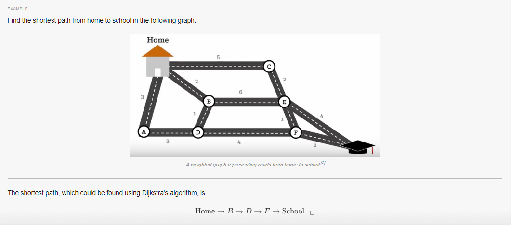

# Dijkstra's Algorithm

!> Work in process!

Helpful links:
https://en.wikipedia.org/wiki/Dijkstra%27s_algorithm

Dijkstras Algorithm for Single-Source Shortest Path
https://www.youtube.com/watch?v=U9Raj6rAqqs&feature=youtu.be

Dijkstras Algorithm Directed Graph Example
https://www.youtube.com/watch?v=k1kLCB7AZbM&feature=youtu.be

https://github.com/TelerikAcademy/Data-Structures-and-Algorithms/blob/master/Topics/09.%20Graph-Algorithms/README.md

https://rawgit.com/TelerikAcademy/Data-Structures-and-Algorithms/master/Topics/09.%20Graph-Algorithms/index.html

https://brilliant.org/wiki/dijkstras-short-path-finder/

Dijkstra's algorithm is an algorithm for finding the shortest paths between nodes in a graph, which may represent, for example, road networks

Find the shortest path from vertex A to all other vertices
The path is a directed path between them such that no other path has a lower weight.
Assumptions
Edges can be directed or not
Weight does not have to be distance
Weights are positive or zero
Shortest path is not necessary unique
Not all edges need to be reachable

In non-weighted graphs or edges with same weight finding shortest path can be done with BFS

Array implementation, Queue, Priority Queue

