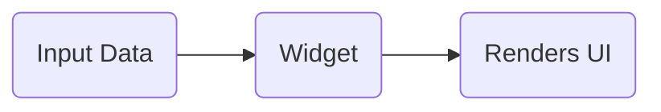
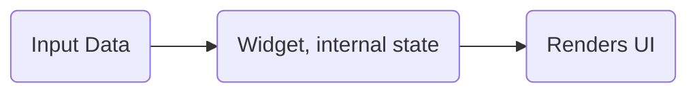
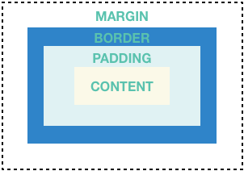

# Flutter notes

Notes related to the course

- [Flutter notes](#flutter-notes)
  - [Creating a project](#creating-a-project)
  - [Analyzing the default boilerplate app](#analyzing-the-default-boilerplate-app)
  - [Dart - Introduction](#dart---introduction)
  - [Dart - Class constructors and named arguments](#dart---class-constructors-and-named-arguments)
  - [Building an app from scratch](#building-an-app-from-scratch)
  - [Execution of the application](#execution-of-the-application)
  - [Types of Widgets](#types-of-widgets)
  - [Adding widgets and functionalities](#adding-widgets-and-functionalities)
  - [Functions](#functions)
  - [Anonymous Functions](#anonymous-functions)
  - [Stateless and Stateful Widget](#stateless-and-stateful-widget)
    - [Stateless](#stateless)
    - [Stateful](#stateful)
  - [Updating Widget Data](#updating-widget-data)
  - [Private properties](#private-properties)
  - [Reusable custom Widgets](#reusable-custom-widgets)
  - [Styling and Layouting](#styling-and-layouting)
  - [Dart Enums and multiple Constructors](#dart-enums-and-multiple-constructors)
  - [Callback Functions](#callback-functions)
  - [Dart - introducing to Maps](#dart---introducing-to-maps)
  - [Dart - final and const](#dart---final-and-const)
  - [References](#references)

<!-- 019 -->
## Creating a project

The starting point..

```bash
flutter create name_of_the_project
```

This will create a boilerplate project.

Overview of the generated boilerplate.

&#128193; ``.idea`` Hold configurations for android studio, doesn't need to change anything there.<br>
&#128193; ``.vscode`` Exist only if using vs code as IDE, code editor configurations.<br>
&#128193; ``android`` Hold complete android project as you could also create it without flutter, when flutter code gets compiled to native code, it will injected in to this android <br>project. This is the project when later will be build to native android app.<br>
&#128193; ``build`` Hold the output of the flutter application, folder is generated and manage by the flutter SDK, should change anything in there.<br>
&#128193; ``ios`` Same as above folders (build and android), does not exist on windows, because iOS cannot be build from windows machine.<br>
&#128193; ``lib`` Important folder, the folder that the most of the work is done. Code of the project goes there.<br>
&#128193; ``test`` It allows us to write test for the app, automated tests, etc..<br>
&#128221; ``.gitignore`` Git related.<br>
&#128221; ``.metadata`` File managed by the flutter, build instructions etc..<br>
&#128221; ``.packages`` Same as above, generated automatically, manages some internal dependencies, packages. Fully managed automatically.<br>
&#128221; ``pubspec.yaml`` This file allows us mostly mange dependencies of the project, configuration of third party packages that may project use. Also configuration other things such as Fonts and images may be used in the project.<br>
&#128221; ``pubspec.lock`` Generated automatically based on ``pubspec.yaml``, provides more details based on defined in ``pubspec.yaml``.<br>

<!--021 Analyzing the Default App -->
## Analyzing the default boilerplate app

``main.dart`` file, under the ``lib`` folder is the entry point of the app.

<!-- 022 Dart Basics -->
## Dart - Introduction

Flutter use Dart as programing language.

Dart is similar to ``C#`` and ``Java``.

Everything is a ``object`` like in ``JavaScript``

Dart is a typed language.

Use camel case code styles.

Check [dartpad.dev](https://dartpad.dev/) web-based playground for ``Dart``.

Examples:

```dart
void main() {
  for (int i = 0; i < 5; i++) {
    print('hello ${i + 1}');
  }
}
```

```dart
addNumbers(int num1, int num2) {
  print(num1 + num2);
}

void main(){
  addNumbers(1, 2);
}
```

<!-- 023 -->
```dart
class Person {
  String name;
  int age;

  // Constructor
  // Note that if the arguments of the ctor are the same names as the props, will assign them directly
  Person(String inpName, int inpAge) {
    this.name = inpName; // The keyword this is not mandatory
    age = inpAge;
  }

  Person(String name, int age, String gender) {}
}

void main() {
  var p1 = new Person('A', 22); // new keyword is not required,  object
  print(p1); // prints - Instance of 'Person'
}
```

<!-- 027 Class Constructors & Named Arguments.mp4 -->
## Dart - Class constructors and named arguments

There are also **Named arguments** [Check more](https://dart.dev/guides/language/language-tour)

```dart
class Person {
  String name;
  int age;
  String gender;

  // Constructor with Named arguments, args wrapped in {}
  // There are also available for functions
  // Named arguments are great for ctor/functions that takes a lot of arguments
  // The gender parameter has default value
  // inpName is required, available only within Flutter
  Person({String inpName, int age, String gender = 'Male'}) {
    name = inpName;
    this.age = age;
    this.gender = gender;
  }
}

void main() {
  var p1 = new Person(
      inpName: 'A', age: 22); // Using ctor with named/optional arguments
  print(p1);
  var p2 = new Person(inpName: 'P2');
  print(p2);
  print(p2.gender);
}
```

```dart
class Person {
  String name;
  int age;
  String gender;

  // Short syntax constructor
  Person({this.name, this.age, this.gender = 'Male'});
}

void main() {
  var p1 = new Person(name: 'Person 1', age: 22); // Using ctor with named/optional arguments
  print(p1);
  print(p1.name);

  var p2 = new Person(name: 'Person 2');
  print(p2);
  print(p2.gender);
}

```

<!-- 024 -->
<!-- 025 Building an App From Scratch.mp4 -->
<!-- 026 Running the App on an Emulator.mp4 -->
<!-- 028 First Summary & Additional Syntax -->
## Building an app from scratch

Delete everything from ``lib/main.dart``.

Flutter app is tree of widgets, everything is a widget.

One widget per file.

The code for the ``main.dart``

```dart
import 'package:flutter/material.dart';

void main(){
  // The function that run the app runApp()
  runApp(MyApp());
}

// Shorten main:
//void main() => runApp(MyApp());

// In order to see something we should inherit from the widget.
// Extends only from one class.
class MyApp extends StatelessWidget {

  // @override is a decorator provided by Dart
  @override // Flutter calls this method whatever need to draw something on the screen.
  Widget build(BuildContext context) {
    // MaterialApp provided from the imported package.
    // All the arguments are optional, but home acts a core widget, that Flutter will bring to the screen.
    return MaterialApp(home: Text('Hello!'),); // Used named argument "home"
  }
}
```

## Execution of the application

1. ``lib/main.dart`` is the entry point of the app that Flutter looks for.
2. ``void main()`` is automatically executed when the app launches.
3. Within method another function is called ``runApp(MyApp())``.
The ``runApp()`` is provided by the imported material package.
This functions does all the heavy lifting behind the scenes to take a widget we created ``MyApp()`` and draw it to the screen.
4. ``MyApp()`` extends a widget and calls the overridden build method.
Flutter takes care of always calling the build method in order to draw something to the screen
5. The ``BuildContext`` that is passed to the ``build(BuildContext context)`` contains some metadata about the widget (position on the tree, overall of the application, etc..)

<!-- 029 Building a Widget Tree -->
<!-- 030 Visible (Input _ Output) & Invisible (Layout _ Control) Widgets -->
## Types of Widgets

Visible, related to user input and output data, like  ``RaisedButton()``, ``Text()``, ``Card``, etc..

Invisible, Layout and control how tree behaves ``Row()``, ``Column()``, ``ListVew()``, etc..
Those widgets help us structuring the content, control how visible widgets are drawn onto the screen.

THere are widgets like ``Container()`` that belongs for both categories.

<!-- 031 Adding Layout Widgets -->
<!-- 032 Connecting Functions & Buttons -->
## Adding widgets and functionalities

```dart
import 'package:flutter/material.dart';

void main() => runApp(MyApp());

class MyApp extends StatelessWidget {
  @override
  Widget build(BuildContext context) {

    var words = [
      'Color',
      'Anima',
    ];

    void myButtonFunction(){
       print('Btn pressed, function called');
    }

    return MaterialApp(
      home: Scaffold(
        appBar: AppBar(
          title: Text('My First App'),
        ), // AppBar
        body: Column(
          children: <Widget>[ // Array of widgets

            Text('text'),

            RaisedButton(
              child: Text('btn1'),
              onPressed: myButtonFunction, // Without (), in this way -> pointer to the function
                                           // Passing a name of the function instead of result
            ), //RaisedButton

            RaisedButton(
              child: Text('btn2'),
              onPressed: () => print('Anonymous Functions btn2'), // Anonymous Function
            ), //RaisedButton

            RaisedButton(
              child: Text('btn3'),
              onPressed: () {
                print('Anonymous Functions btn3'); // Anonymous Function
              },
            ), //RaisedButton

          ], // <Widget>[]
        ), // Column
      ), // Scaffold
    ); // MaterialApp
  }
}

```

## Functions

Note the ``RaisedButton()`` widget, it has ``onPressed`` which takes a function.
Good practice is to declare the function that will be used within the class.
Classes should work stand alone, everything that belongs to the widget should be at the same class.
Should be a stand alone unit.

<!-- 033 Anonymous Functions -->
## Anonymous Functions

Has no name :)
Make use of it if its short and does not going to be use anywhere, but only in one place.

```dart
onPressed: () => print('Anonymous Function btn2') // Anonymous Function
```

```dart
onPressed: () {
  print('Anonymous Function btn3'); // Anonymous Functions
}
```

In Flutter this does going to be executed immediately, but if we add ``()`` after the function, it will be called at widget initialization.

```dart
onPressed: () {
  print('Anonymous Function btn3');
}() // Note the () at the ending
```

<!-- 036 Updating Correctly with Stateful Widgets -->
## Stateless and Stateful Widget

In general State is Data/Information used by the application.
App State - Authenticated Users, Loaded Jobs, etc..
Widget State - Current User Input, Is a Loading Spinner being shown?, etc..

### Stateless

For the stateless widget we can receive data only from outside the class.



``Input Data`` - Data can change (externally).
``Renders UI`` - Gets rendered when ``Input Data`` changes.

### Stateful

Unlike the ``stateless widget`` we can modify the state from inside the class and re-render the widget.



``Renders UI`` - Gets rendered when ``Input Data`` or ``local State`` changes.

<!-- 034 Updating Widget Data (Or_ Using StatelessWidget Incorrectly) -->
## Updating Widget Data

Updating the text based on button press, there are list of words that will change, We should keep a ``state``.
The class ``MyApp`` extends ``StatelessWidget`` that's preventing us from updating the widget so called ``Text()``.
Not all the widgets need be change, that's why there is a ``StatelessWidget``'s, for example a ``Text()`` just gets the text that should be rendered and that's all.

In order to manage the state:

- We should separate the widget tree in two parts
  - ``class MyApp extends StatefulWidget`` Here we derive from ``StatefulWidget``
  - ``class MyAppState extends State<MyApp>`` State is a generic type ``<>`` of ``MyApp``, in this way we tell Flutter that the MyAppState belongs to MyApp
- ``class MyApp extends StatefulWidget`` Should override the ``State<StatefulWidget> createState()`` and ``return MyAppState();``
- With this changes the ``Widget build(BuildContext context)`` method is within the state class, because the state holds the data to build the widget and render it.
- Tell the Flutter we are about to change the state. ``State<T>`` provides method ``setState()`` (its a function that takes a function as argument), We should move the code that change within that function. Flutter re-render the UI bases on this method.

```dart
import 'package:flutter/material.dart';

void main() => runApp(MyApp());

class MyApp extends StatefulWidget {
  @override
  State<StatefulWidget> createState() {
    return MyAppState(); // Here is where the magic happens
  }
}

// Note the class name, the naming conventions is to end with State
class MyAppState extends State<MyApp> { // State is a generic type <>, in this way we tell Flutter that the MyAppState belongs to MyApp

  var wordIndex = 0;

  void changeText() {
    setState(() { // This function update the state, provided by State<T>
      wordIndex = wordIndex + 1;
    });
    print('Btn pressed, function called');
    print(wordIndex);
  }

  var words = [
    'Color',
    'Animal',
    'Escaping symbol\'s',
  ];

  @override
  Widget build(BuildContext context) {
    return MaterialApp(
      home: Scaffold(
        appBar: AppBar(
          title: Text('My First App'),
        ),
        body: Column(
          children: <Widget>[
            Text(
              words[wordIndex],
            ),
            RaisedButton(
              child: Text('Change the text'),
              onPressed: changeText,
            ),
            RaisedButton(
              child: Text('btn2'),
              onPressed: () => print('Anonymous Functions btn2'),
            ),
          ],
        ),
      ),
    );
  }
}

```

<!-- 037 A Brief Look Under The Hood -->
The ``setState(() { });`` invokes build method of the widget ``Widget build(BuildContext context)``.
In the example you may thing its waste of resources to re-render all that widget tree, but Flutter have many mechanisms and optimizations to not just re-render everything from the widget tree, but only the ``Text()`` widget.

<!-- 038 Using Private Properties -->
## Private properties

In Dart you can have variables on classes, so called properties.
Other files and classes can be use from another by the help with the ``import``.
To turn the class into a ``private`` we simple add ``_`` prefix to the class name, like ``_MyAppState()`` in this way the class can only be used within the same file.
It is also possible to use underscore (private) modifier for all the properties and methods in the class.

<!-- 039 Creating a New, Custom Widget -->
## Reusable custom Widgets

Good practice and convention is to have a one widget per file.
If using a VS Code as IDE we can type ``st`` in the newly created file ``word.dart`` and by the help of the intelli sense use code snipped to create widget easily.
Splitting the widgets/code in small parts can help the performance and decrease time cost for maintaining the project, also we keep OOP principles.

``word.dart``

```dart
import 'package:flutter/material.dart';

class Word extends StatelessWidget {
  final String wordText; // Class property, final mean tha the value will never change

  Word(this.wordText); // Class constructor

  @override
  Widget build(BuildContext context) {
    return Text(wordText);
  }
}
```

In main ``main.dart`` replace ``Text(words[wordIndex])`` widget with ``Word(words[wordIndex])``

<!-- 040 First Styling & Layouting Steps.mp4 -->

## Styling and Layouting

Adding styles to the custom widget ``Word``

```dart
import 'package:flutter/material.dart';

class Word extends StatelessWidget {
  // Class property, final mean tha the value will never change
  final String wordText;

  Word(this.wordText); // Class constructor

  @override
  Widget build(BuildContext context) {
    return Container(
      width: double.infinity, // The full width of the device
      margin: EdgeInsets.all(10), // Spacing around the container
      child: Text(
        wordText,
        style: TextStyle(fontSize: 28),
        textAlign: TextAlign.center, // Enum, static fields
      ),
    );
  }
}
```

By default the ``Text()`` widget only allocates as much space as the text needs.
That's why the text is wrapped by ``Container()`` widget, part of the so called "invisible widgets".



<!-- 041 Enums & Multiple Constructors -->
## Dart Enums and multiple Constructors

Note the ``EdgeInsets.all(10)``, if navigate to the implementation by holding ``CTRL`` and ``Click`` we may notice that there are serval constructors, like ```const EdgeInsets.fromLTRB(this.left, this.top, this.right, this.bottom);`` and ``const EdgeInsets.all(double value)``

```dart
class Person {
  String name;
  int age;
  String gender;

  // Short syntax constructor
  Person({this.name, this.age, this.gender = 'Female'});

  // Special/Extra constructor
  Person.male(this.name) {
    gender = 'Male';
  }
}

void main() {
  var p1 = new Person(name: 'Person 1', age: 22); // Using constructor with named/optional arguments
  print(p1.name);

  var p2 = new Person.male('Person 2'); // Using the special constructor
  print(p2.name);
  print(p2.gender);
}
```

<!-- 042 Official Docs & The Widget Catalog -->
<!-- 043 Passing Callback Functions Around -->
## Callback Functions

>Lifting the state up, you manage the state on the shared, on the common denominator of the different widgets that need this state
>The function (address) that is passing around is also known as a **callback** - because the receiving widget calls it the future

``myBtn.dart``

```dart
import 'package:flutter/material.dart';

class MyBtn extends StatelessWidget {
  // Property with type Function, holding pointer to a function
  final Function selectHandler;

  // Constructor for accepting/storing the function
  MyBtn(this.selectHandler);

  @override
  Widget build(BuildContext context) {
    return Container(
      width: double.infinity,
      child: RaisedButton(
        onPressed: selectHandler, // No (), we do not want to execute this immediately, but when we press the button
        child: Text('btn text'),
        color: Colors.blue,
      ),
    );
  }
}
```

``main.dart``

```dart
import 'package:flutter/material.dart';
import './word.dart';
import './myBtn.dart';

void main() => runApp(MyApp());

class MyApp extends StatefulWidget {
  @override
  State<StatefulWidget> createState() {
    return _MyAppState();
  }
}

class _MyAppState extends State<MyApp> {
  var _wordIndex = 0;

  void _changeText() {
    setState(() {
      _wordIndex = _wordIndex + 1;
    });
    print(_wordIndex);
  }

  var words = [
    'Color',
    'Animal',
    'Escaping symbol\'s',
  ];

  @override
  Widget build(BuildContext context) {
    return MaterialApp(
      home: Scaffold(
        appBar: AppBar(
          title: Text('My First App'),
        ),
        body: Column(
          children: <Widget>[
            Word(words[_wordIndex]),
            MyBtn(_changeText), // Passing the pointer to the function
          ],
        ),
      ),
    );
  }
}
```

<!-- 044 Introducing Maps -->
<!-- 045 Mapping Lists to Widgets -->
## Dart - introducing to Maps

Like a dictionary, key value pair collection

The difference between a ``List ([])`` and a ``Map ({})`` in Dart / Flutter - lists give you an ordered list of single values, identified by an index. Maps use key-value pairs where you identify values by their key.

``answer.dart``

```dart
import 'package:flutter/material.dart';

class Answer extends StatelessWidget {
  // Property with type Function, holding pointer to a function
  final Function selectHandler;
  final String answerText;

  // Constructor for accepting/storing the function
  Answer(this.selectHandler, this.answerText);

  @override
  Widget build(BuildContext context) {
    return Container(
      width: double.infinity,
      child: RaisedButton(
        onPressed: selectHandler, // No (), we do not want to execute this immediately, but when we press the button
        child: Text(answerText),
        color: Colors.blue,
        textColor: Colors.white,
      ),
    );
  }
}
```

``main.dart``

```dart
import 'package:flutter/material.dart';
import 'question.dart';
import 'answer.dart';

void main() => runApp(MyApp());

class MyApp extends StatefulWidget {
  @override
  State<StatefulWidget> createState() {
    return _MyAppState();
  }
}

class _MyAppState extends State<MyApp> {
  var _qIndex = 0;

  void _answerQuestion() {
    setState(() {
      _qIndex = _qIndex + 1;
    });
    print(_qIndex);
  }

// The Map
  var questions = [
    {
      'questionText': 'What\'s your favorite color?',
      'answers': ['Black', 'Red', 'Green', 'White']
    },
    {
      'questionText': 'What\'s your favorite animal?',
      'answers': ['Dog', 'Cat', 'Rat']
    }
  ];

  @override
  Widget build(BuildContext context) {
    return MaterialApp(
      home: Scaffold(
        appBar: AppBar(
          title: Text('My First App'),
        ),
        body: Column(
          children: <Widget>[
            // Accessing from the Map array (by index, then the key)
            Question(questions[_qIndex]['questionText']),

            ...(questions[_qIndex]['answers'] as List<String>).map((answer) {
              // Anonymous function, executes for each element in the list
              // We also cast it as List<Strings> to enable the iterations, because flutter does not know that is a list
              // The three dots '...' are spread operator,
              // this take a list and pull all the values in the list out of it and add them to the surrounding list as individual values
              // so we don't add list to a list, but the values of a list to a list, having only one list without a nested list
              return Answer(_answerQuestion, answer);
            })
            .toList(),
          ],
        ),
      ),
    );
  }
}
```

[Spread Collections](https://github.com/dart-lang/language/blob/master/accepted/2.3/spread-collections/feature-specification.md)

<!-- 046 final vs const -->
## Dart - final and const

``final`` - run time constant value, like readonly in C#.
``const`` - compile time constant value.

There are two types of declaring the constant value

```dart
const myConst = 1; // The variable is constant
var myConst = const 1; // The value is constant
const myConst = const 1; // Both constants

// Examples
var list = const ['Hello'];
list.add('Friend'); // Does not work if "list" is a const
```

Use ``final`` if the object wont change after it's initialize

<!-- 047 [quiz] Advanced Flutter & Dart Basics -->
<!-- 047 Introducing if Statements -->
<!-- 048 [DART DEEP DIVE] More on if Statements -->
<!-- 049 [DART DEEP DIVE] The null Value -->
<!-- 050 Outputting Widgets Conditionally -->
<!-- 051 Splitting the App Into Widgets -->
<!-- 052 Calculating a Total Score -->
<!-- 053 Getters & else-if -->
<!-- 054 Resetting the Quiz -->
<!-- 055 [assignment_video] Time to Practice Flutter Basics -->


---

## References

[UDP Socket Programming with Dart (Unicast and Multicast)](http://jamesslocum.com/post/77759061182)
[Communicating Flutter with NodeMCU using MQTT protocol](https://medium.com/@ricardoogliari/communicating-flutter-with-nodemcu-using-mqtt-protocol-a44e93ba14e3)
[How to communicate through BLE using Flutter](https://blog.kuzzle.io/communicate-through-ble-using-flutter)
[flutterstudio.app](https://flutterstudio.app/)
[fluttercrashcourse.com](https://fluttercrashcourse.com/)
[How to Learn Flutter in 2020](https://www.freecodecamp.org/news/how-to-learn-flutter-in-2020/)
[generation.com - android emulators](https://www.genymotion.com/)
[App that will communicate between devices connected on the same local network Wi-Fi](https://stackoverflow.com/questions/53493067/app-that-will-communicate-between-devices-connected-on-the-same-local-network-wi)
[How to Build Flutter Apps for iOS and Android](https://www.youtube.com/playlist?list=PLSzsOkUDsvdtl3Pw48-R8lcK2oYkk40cm)

[A tour of the Dart language](https://dart.dev/guides/language/language-tour)
[flutter.dev - widgets catalogue](https://flutter.dev/docs/development/ui/widgets)