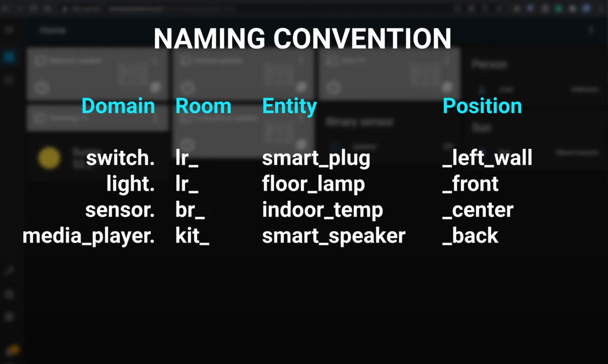

# Home Assistant

*Modified 2021-11-05*

- [Home Assistant](#home-assistant)
  - [Getting started](#getting-started)
  - [Addons](#addons)
  - [ESPhome](#esphome)
  - [Resources](#resources)
  - [Research](#research)
  - [Home Assistant up and running](#home-assistant-up-and-running)
  - [Others](#others)
  - [Naming conventions](#naming-conventions)

## Getting started

My main motivation to try Home Assistant was to use that nice looking 3D floor plan as well as ESPHome.

The initial idea was to use HA inside of a docker container, but figurate out that is not a great option, so dedicated a whole Raspberry Pi for it.

To prepare a SD Card with the OS just follow the [Installation](https://www.home-assistant.io/installation/raspberrypi) guide.

## Addons

Installed the following Addons

- VS CODE
- samba share
- ESPHome

## ESPhome

installation guide - [This is SO Much Better! Getting Started with ESPHome 2021](https://www.youtube.com/watch?v=iufph4dF3YU&t=277s)

create a new device

hit install download the bin file

download tesmotizer and flash it

## Resources

YouTube
- [Getting started with Home Assistant - 2021](https://www.youtube.com/watch?v=F57zx3qQXuY)
  Good content, also nice to have naming conventions guideline.

Articles

## Research

[Home Assistant vs OpenHAB - Which one is better?](https://www.youtube.com/watch?v=A4jrE_MtRWc)

Home Assistant choosen, uses python, has more integrations and stars in github.

## Home Assistant up and running

sample dashboard - https://demo.home-assistant.io/#/lovelace/0

[Running Home Assistant with Docker (docker-compose)](https://chrisschuld.com/2019/09/running-home-assistant-with-docker/)

- [NEW! ESP Web Tools. Program ESP boards from your browser with ESPHome Add-on in Home Assistant.](https://www.youtube.com/watch?v=mj-24SZLQKk)
  uses xiaomi ble temp sensors

[3 Things No One Will Tell You About Home Assistant](https://www.youtube.com/watch?v=WGiFUpiYjEE)
[5 Home Assistant Beginner MISTAKES to Avoid!](https://www.youtube.com/watch?v=i1083cCR2CI)

[Introduction to Home Assistant floorplan and Honeycomb menu module](https://www.youtube.com/watch?v=oJ9Yr2dSqUk)
[Home Assistant Floorplan Starting With Sweet Home 3D](https://www.youtube.com/watch?v=FBcbXH62fBQ)
[Home Assistant: Ultra Cheap 4$ multi-room Temperature Sensors (Xiaomi Mijia BLE ESP32)](https://www.youtube.com/watch?v=K-HG7qs9hK0)

[Getting Started with Home Assistant 2021 - All you need is a Raspberry Pi](https://www.youtube.com/watch?v=u_aKcf_F1MM)

[My Favourite Home Automation Project + Future of Smart Home?](https://www.youtube.com/watch?v=ry8T67AgbUM)

## Others

Theme to use
https://ui-lovelace-minimalist.netlify.app/

ESP Home
[This is SO Much Better! Getting Started with ESPHome 2021](https://www.youtube.com/watch?v=iufph4dF3YU)

[Tasmota vs ESPhome: Who wins? (DIY Sensors, ESP32, Deep-Sleep, etc.)](https://www.youtube.com/watch?v=nHaFM0tKOvY)

[Floorplan UI with Color synced lights - Share your Projects! / Lovelace & Frontend - Home Assistant Community](https://community.home-assistant.io/t/floorplan-ui-with-color-synced-lights/169417)

[Hass.io Floorplan UI with Color synced lights - YouTube](https://www.youtube.com/watch?v=KcfZc1MXP_A)

[home assistant with diyhue - YouTube](https://www.youtube.com/results?search_query=home+assistant+with+diyhue)

[Home Assistant and Lovelace UI - YouTube](https://www.youtube.com/watch?v=_dtbwpY8u-E)

[Introduction to Home Assistant floorplan and Honeycomb menu module - YouTube](https://www.youtube.com/watch?v=oJ9Yr2dSqUk)

[Philips Hue App Walkthrough - Setup, Tips & Tricks - YouTube](https://www.youtube.com/watch?v=XyJGGSudqYE)

[SWAKES Home Assistant Blog](https://hmas.swakes.co.uk/?fbclid=IwAR0IQpJU5Rxy9-tmm52O_ikyqCvYasmccJMHtjzNwV0NoQaBt4v5Jw07fzw)

[.NET Rocks! | Podcast on Spotify](https://open.spotify.com/show/5tz9eGgXtNHmq3WVD3EwYx?si=0EuqEoNHSN-NpRO51cSBYw&nd=1)

[nicehash](https://www.nicehash.com/my/mining/rigs/0-FCNfj018EEa57pnS0d38Jg)

[smeagolworms4/mqtt-explorer - Docker Image | Docker Hub](https://hub.docker.com/r/smeagolworms4/mqtt-explorer)

[\[Question\] Could you provide docker images? · Issue #172 · thomasnordquist/MQTT-Explorer](https://github.com/thomasnordquist/MQTT-Explorer/issues/172)

[HOME | dronamics](https://www.dronamics.com/)

[Avoiding Ads Everywhere With Wireguard VPN and Pi-Hole | Sean Z Writes](https://seanzwrites.com/posts/avoiding-ads-everywhere/)

[Personal area](https://www.giftcards.eu/en/profile/getCardDetails)

[Search for kallax | 3D Warehouse](https://3dwarehouse.sketchup.com/search/?q=kallax&searchTab=model)

[Defining home automation devices in YAML with ESPHome and Home Assistant, no programming required! – Just another Linux geek](https://blog.christophersmart.com/2020/03/31/defining-home-automation-devices-in-yaml-with-esphome-and-home-assistant-no-programming-required/)

[Influx Query Language (InfluxQL) reference | InfluxDB OSS 1.8 Documentation](https://docs.influxdata.com/influxdb/v1.8/query_language/spec/#durations)

[Home - Grafana](http://bms.local:3000/?orgId=1)

[MQTT Button plugin - Grafana Plugin Development - Grafana Labs Community Forums](https://community.grafana.com/t/mqtt-button-plugin/771)

[ryantxu (Ryan McKinley)](https://github.com/ryantxu)

[IRL1404ZPBF | INFINEON | Транзистори полеви - MOSFET | Електронен магазин - Комет Електроникс](https://store.comet.bg/Catalogue/Product/18632/#e30%3D)

[Atanas Yanev - atanas\_yanew | HackerRank](https://www.hackerrank.com/atanas_yanew)

[Adjusting the X-Axis on the Ender 3 - My Stoopid Stuff](http://www.mystoopidstuff.com/blog/adjusting-the-x-axis-on-the-ender-3)

[Real-time web applications with ASP.NET Core SignalR | On .NET | Channel 9](https://channel9.msdn.com/Shows/On-NET/Real-time-web-applications-with-ASPNET-Core-SignalR)

[How to Set Up This Next-Level Personal Home Dashboard in Your Kitchen | Grafana Labs](https://grafana.com/blog/2019/10/29/how-to-set-up-this-next-level-personal-home-dashboard-in-your-kitchen/)

## Naming conventions

|  |
|:------------------------------------------------------:|
