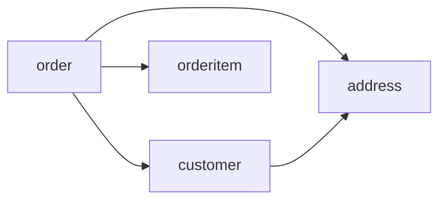

# Object oriented programming 101

!> Work in process!

encapsulation
private - modifier
we can not acces private variables, we use methods (getter and setters) to acces

inheritance
class Pig: Animal

polymorphism
ако имаме клас, който наслядава друг клас, можем да презаписваме методите (overloading)

main class method we mark with virtual
chield class methord - override

namespaces - used for organize out source code

**object:**

- own identity
- characteristics
- proparties (vars)
- states
- behavior (functions)

**class**
Describes what and object will be but it isnt the object itself

- blueprint
- we can create object based on class
- object (instance), each object is instance of class
- process of creating object of the class is **instantiation**

THE four fundametal ideas/pilars of OOP
APIE

- abstaction
- polymorphism
- inheritance
- encapsulation

abstaction

- focus on the essential
- ignore the irrelevant
- ignore the uninportant

encapsulation (black box)

- bundle all together
- hide information (obj)
- control access (obj)
- safety change the way object works
- reducing dependencies between different parts of code

inheritance

- one class inherit from another
- add only the new feature
- relations between the classes
- 1st class is the superclass
- second class is the subclass/child class
- reuse code

polymorphism

- let us automaticaly do the correct behavior
- different behavior for method
- inheritance base polymorphism - base class have same method that derive class override
example

```

int a + int b = add
string A + string B = concat
```
- allow us to overriding the method of the superclass
- let us do the correct behavior
- so if call a function it will do correct things for the specified class it was instantiated from

OOP design process
1. Gather requirements
2. Describe the app
3. Identify the main object
4. Describe the interactions
5. Create a class diagram

UML (inified modeling langiage)
- giagrams
- graphical representation of a class
  
use cases
tittle - what is the goal
actor - who describes
scenarion - how is it accomplish

user story
As a user ... (type of user)
I want ... (goal)
So that ... (reason)

Instantiation
```csharp
Customer fred = new Customer();
```

constructor 
- construct the object
- constructors make sure any variables belong to that object are set to the object
- constructors are methods in the class with the same name with the class
- there is no return in constructor methods
- we can have multiple constructors

for example:

```csharp
public class SpaceShip{

    public SpaceShip();
    public SpaceShip(string var1, string var2)

    //when we create/instantiate object it will choose the right constructor depend of that what arguments we pass in
}
```

Destructors/finalizers
- called when object is being delete
- releasing memory

static/shared member
- shared variable for all objects
- its 1 copy for all objects
- like const in procedurall
- we can also create static methods
- static methods can only acces static variables


inheritance
- we can describe it whit "is a"
    - a car is a vechicle
- in c# we use ":" for inheritance
- calling method in the super/base class
    - base.doSomthing();
- abstract class (base class) must inherit from it before instantining an object


interfaces
- is like an abstact base class
- list of method signatures


SOLID principles of OOP
- S: single responsability principle. One reason to exist
    - Cohesion
    How strongly related and focused are the various elements of a module (class, function, namespace).
    Добър кофежън е когато нещото (класа) има една единствена цел и да прави едно единствено нещо.
    пример: printer, HDD...
    лош пример: 
    ```csharp 
    bla.makepizza();
    bla.withdrowMoney();
    bla.openDbConnection();
    ```
- O: open/close principe. Open for extension, but close to modifie. Should be open to extend, while not changing the inners of existing classes or funcs
- L: liskov substitution. Derive class must be substitutable for the thier base class. Наследяващия клас трябва да бъде заменим с неговия базов клас, "is a"
- I: interface segregation. Multy specific interfaces are bether than one general purpose interface. Ясни интерфейси, спецефички за клиента
- D: Dependancy invertion. Depend on abstraction, not on concretions

Coupling. Показва колко тясна е връзката между свързаните класове
- must be kept loose
- all classes must have small, direct, visible and flexible relationships to other classes
- one module must be easily used by other modules


GRAPS principle of OOP
general responsability assignment software patterns


signature
method signiture - we can have manny functions sharing the same name, as long the parameters (arguments we pass in) are different

overloading - like signature, provide variaty of functions with same name

interfaces - contracts between class and object

constructor - method that execute every time that instance is created, share the same name with the class

static constructor - used for static class field,

we can have many ctors and also inherite one from another

collaboration ("uses a") - collaboration exist whatever an object from one class uses an one or more instances of another class

composition ("has a") - exist whatever an object from one class is composed from one or more object from another class



overriding - every class inherit from global object

example:

```csharp
override ToString string ToString(){
    return base.ToString();
}
```

C# Classes
- abstract class
    - can not be instantiated (can't use new to create instance)
    - its use for a base class and never use at his own
- concrete class
    - can be instantiated (we can use ```new``` to create instance)
    - is nothing but normal class, we can use as a base class or may not.Not compulsory, it can't contain abstract methods.we can create object and work with this class. A concrete class is used to define a useful object that can be instantiated as an automatic variable on the program stack.
- sealed class
    - can't be extended
    - can't be inheretance
    - no override them

class methods and proparties
- public
    - any class have access this props
- private
    - only base class have access
- protected
    - base class and all derived classes has access

base classes
- in base or abstact classes methods that we want to override have to be marked with virtual or abstact keyword

example:

```csharp
public abstract validate(){}
```

Reusable components

public static class - dont need to create an instance (new...) of the class to use a method
- can not be instantiated
- accsessing members of the class using the class name
- members of the class, also need to be static

extenstion methods
- only in static members
- extend the class (static class)
- class must be static
- both classes must be static
- use ```this``` keyword before its first arg to specify the class to be extended

example:
```csharp
public static MyStaticExtensionClass(){
    public static string mystaticmethod(this string s)
}

//so we can acces it like...
//also appear in intelysence

MyStaticExtensionClass.mystaticmethod(s);
```

Implicit class interface
- the set of public methods and proparties of the class

Explicit interface
- ```public interface ILoggable```
- ```string Log();```
- can be reused in any class
- interfaces in .NET starts with I, examples: IEquatable, IComparable... (naming convension)


Generics
- allow defining parameterized classes that process data of unknown (generic) type
- also known as "template types"
example:

```csharp
public class GenericList<T>(){
    public void Add(T element){}
}
```

### override
different behavior for chield class

### overload
method overload - same name different behavior

### delegates
- special .Net types that hold method refrance
- describe signature of given method
- collection of methods
- delegates are refrance types
- thier values are methods
- used to performe callback invocations
- used for events
- predicates
- multicast delegates
  
examples:

```csharp
delegate void PrintStuff(string stuff)

static void printHello(string s){}
static void printWorld(string s){}

PrintStuff print = printHello;

print("bla")

// multicast delegates
someDelegate d = bla;
d += bla2;
d += bla3;

d("hello world");

//db query example
using (var db = new ApplicationDbContext())
{
Expression<Func<Class, bool>> predicate = x => 
        professorId == null || x.ProfessorId == professorId;

    var classIds = db.Classes
            .Where(predicate)
            .Select(c => c.Id)
            .ToList();

    return classIds;
}
```


