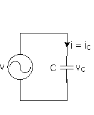

## Sine waves in elements

!> Work in process!

### син ток в R ...

### Inductance with a Sinusoidal Supply

### син ток в C ...

### etc..

## Комплексни съпротивления

Generally, AC circuits may contain Resistors, Inductors and (or) Capacitors. Impedance, represented by the letter "Z" and measured in Ohms, is the total opposition that a circuit offers to the flow of AC Current, it is a combination of Resistance R and Reactance X, Z = R + jX  **Figure 1**.

$$ Z_R = R $$

$$ Z_L = jX_L = j \omega L $$

$$ Z_C = -jX_C = -j \omega {1 \over \omega \ C} $$

### R

| fig amplitude                                        | fig complex                                                                                                      |
| ---------------------------------------------------- | ---------------------------------------------------------------------------------------------------------------- |
|           |                                                                       |
| $$ i(t) = i_m sin \omega t $$                        | $$ \dot{I} = { i_m \over \sqrt{2} } \ e^{j0^\circ} $$                                                            |
| $$ u(t) = R \cdot i(t) = r \cdot i_m sin \omega t $$ | $$ \dot{U}_R = {R \cdot i_m \over \sqrt{2} } \ e^{j0^\circ} = R \cdot \dot{I}$$ $$ \dot{U} = Z_R \cdot \dot{I}$$ |

### L

TODO: fig
$$ i(t) = i_m sin \omega t $$

$$ u_L(t) = \omega L \cdot i_m sin(\omega t + 90^\circ) $$

$$ \dot{I} = {i_m \over \sqrt{2} } \cdot e^{j0^\circ} $$

$$ \dot{U}_L = {\omega L \ i_m\over \sqrt{2} } \cdot e^{j90^\circ} = \omega L \ \dot{I} \ j$$

$$ \dot{U}_L = j \omega \ L \dot{I} = j X_L \cdot \dot{I} $$

$$ Z_L = j \omega L = jX_L$$

### C

TODO: fig
$$ i(t) = i_m sin \omega t $$

$$ u_C(t) = i_m {1 \over \omega \cdot{C} }sin{-90^\circ} $$

$$ \dot{U}_C = { i_m \over \sqrt{2} } \cdot {1 \over \omega \cdot{C} } \ e^{-90^\circ} = -j {1 \over \omega \cdot C} \cdot \dot{I} $$

$$ \dot{U}_C = - j {1 \over \omega \cdot C} \cdot \dot{I} = -j X_C \cdot I $$

$$ Z_C = -  j {1 \over \omega \cdot C} = - jX_C$$
<!--  -->
