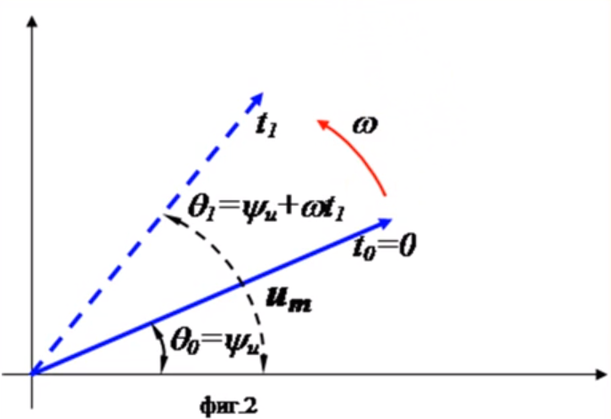
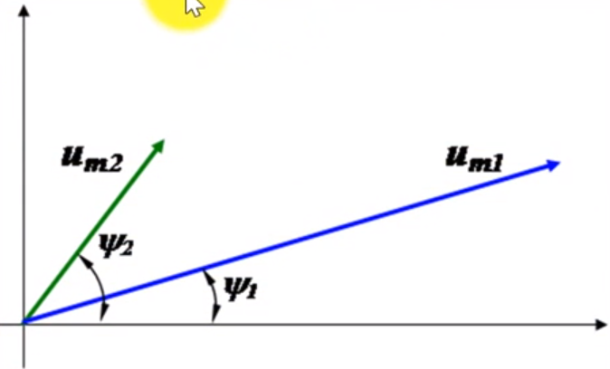
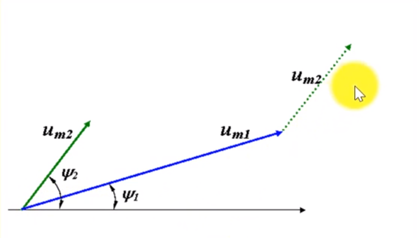
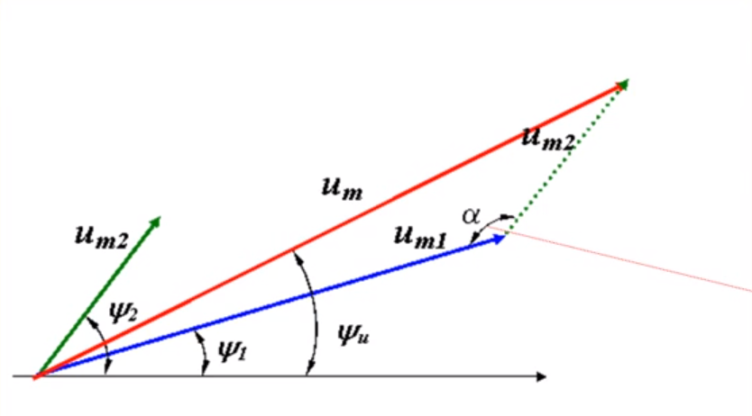

# Sinusoidal modes in linear circuits

!> Work in process!

Sinusoidal Waveforms

## Sinosoidal waveform

Sinusoidal current/voltage is a current/voltage that varies in time by a sinusoidal law
$$ A(t) = A_{m}\ sin(\omega t+ \psi_A) $$

where:

$ A_{m} $, amplitude [^1]

$ T \ [s] $,  one full cycle or period

$ f \ [Hz] $, frequency $ f = {1 \over T} $

$ \omega = {2\pi \over T} = 2\ \pi f \ [rad/s] $, Angular frequency [^2]

$ \theta = \omega t+ \psi \ [rad] $, phase

$ \psi \ [rad] $, start phase. For $t=0,\ \psi=0$

[^1]: [Amplitude](https://en.wikipedia.org/wiki/Amplitude)

[^2]: [Angular frequency](https://en.wikipedia.org/wiki/Angular_frequency)

<!-- Като извод можем да кажем, че синусоидално изменящите се ток и напрежение се характеризират от три величини: амплитуда $a_m$, ъглова скорост $ \omega $ и фаза $ \theta $ -->

So, we can say that the sinusoidal changing current and voltage are describe by three parameters: **amplitude** $ a_m $, **angular velocity** $ \omega $ and **phase** $ \theta $

For the voltage and current:

$$ u(t) = u_{m}\ sin(\omega t+ \psi_u) $$

$$ i(t) = i_{m}\ sin(\omega t+ \psi_i) $$

<!-- Ако две синусоидални величини се изменят с една и съща честота се наричат **изохронни** ( честотата $ \omega $ e еднаква за тока и напрежението ) -->
If two sine-wavelengths are changed at the same frequency they are called **isochronic** (the frequency $ \omega $ is equal for both current and voltage)

<!-- Разликата във фазите на двете величини се означава с $ \varphi $ -->
Phase Difference or Phase Shift is denoted by $ \varphi $

Аsuming the lines above:

$$ \varphi = \theta_u - \theta_i = \psi_u - \psi_i $$

$ \varphi > 0 $ voltage leads the phase current
$ \varphi < 0 $ current leads the phase voltage
$ \varphi = 0 $ resonance, voltage and currant are in phase

### Average value of sine wave

<!-- средната стойност на една sin функция е **нула** (през първия полупериод величината има положинателна стойност, а през втория отрицателна т.е. има симетрия). Поради това, под средна стойност се разбира средното за полупериода -->
Average value over one (or more) cycles is clearly **zero** (during the first half period magnitude has positive value and the second negative ie there is symmetry).
However, it is often useful to know the average magnitude of the waveform independent of its polarity.

Therefore, the average value is the average for the half-period

$$ I_{avg} = {1 \over {T \over 2} } \int_0^{T \over 2} i_m sin(\omega t) \cdot dt $$

$$ = {2 i_m \over T \omega}(- cos (\omega t)) \Big|_0^\pi = $$

$$ = {2 i_m \cdot 2 \over T \cdot 2 \pi f} = $$

$$ = {4 i_m T \over 2 \pi T} = {2 i_m \over \pi} = 0.637 \ i_m $$

### Root mean square amplitude (RMS) [^3]

[^3]: [Root mean square (RMS)](https://en.wikipedia.org/wiki/Root_mean_square)

<!-- Ефективната стойност на една синусоидална функция е средно - квадратичната стойност на функцията. -->
The "effective value" or RMS of a sinusoidal function is the average - quadratic value of the function.

<!-- Ефективната стойност на синусоидален ток $ i(t) $ е числено равна на стойносста на постоянен ток $ I $, който за време равно на периода $ T $, отделя същото количество топлина, колкото е синусоидалния ток $ i(t) $. -->

<!-- Измервателните уреди, като амперметър и волтметър измерват точно тази стойност -->
Measuring instruments, such as an ammeter and a voltmeter, accurately measure this value.

<!-- Ефективните стойности на променливите ток, напрежение и ЕДН се получават, като техните амплитуди се разделят с : $ \sqrt{2}$ -->

The RMS value of sinusoidal voltage and current are obtained by dividing their amplitudes by: $ \sqrt{2} $.

<!-- Връзката между ефективна и максимална стойност: -->
The relationship between RMS and amplitude value are shown in following equations:

$$ I = \sqrt{{1 \over T} \int_0^T i(t)dt} $$

$$ i(t)^2 = i_m^2 sin^2(\omega t + \psi_i) $$

$$ I^2 = {1 \over T} \int_0^T i_m^2 sin^2(\omega t +\psi_i) dt $$

$$ I^2 = {i_m^2\over T} \int_0^T sin^2(\omega t +\psi_i) dt $$

From trigonometric identities [^4] $sin^2(\alpha)$:
$$ sin^2(\alpha) = {1 \over 2} (1-cos2\alpha) $$
[^4]: [Trigonometric Identities](http://www.purplemath.com/modules/idents.htm)

$$ I^2 = {i_m^2\over T} \left[ {1 \over 2} \int_0^T dt - {1 \over 2} \int_0^T cos2(\omega t +\psi_i) dt \right] $$

$$, sin = 0 $$

$$ I^2 = {i_m^2 \over 2T} \left[ t\Big|_0^T \right] => I^2 = {i_m^2 \over T} (T-0)= I^2 = {i_m^2 \cancel{T} \over 2 \cancel{T}}$$

$$ I = {i_m \over \sqrt{2} }$$

<!-- По аналогичен начин се получава: -->
Analogously, there is obtained:

$$ U = {u_m \over \sqrt{2} } $$

$$ E = {e_m \over \sqrt{2} } $$

$$ i_m = \sqrt{2} \cdot I $$

$$ u_m = \sqrt{2} \cdot U $$

$$ e_m = \sqrt{2} \cdot E $$

### Изобразяване на синусоидални величини с вектори

Синусоидалната величина може да се представи посредством **вектор**
- с големина равна на **амплитудата**
- който се **върти** по посока обратна на чавониковата стрелка със скорост $ \omega $.

$$ u(t) = u_m sin(\omega + \psi_u) $$

- В момента $ t_0 = 0 $, векторът сключва с абцисната ос ъгъл, равен на началната фаза $ \psi_u $
- В момента $ t_1 = 0 $, векторът се е завъртял по посока обратна на часовниковата стрелка и сключва с абцисната ос ъгъл, равен на фазата $ \theta_1= \psi_u + \omega t_1$

#### Vector diagram

Съвкупност от векторните изображения на таковете и напреженията в една и съща електрическа верига.

Ако имаме няколко синусоидални величини с **еднакви честоти** можем да получим резултантната синусоидална величина чрез действия с вектори като ги разглеждаме за момента $ t_0 = 0 $

Пример:
Да се определи напрежението:

$ u(t) = u_m sin( \omega t + \psi_u ) $

**if** $ u(t) = u_{1}(t) + u_{2}(t) $

**where**
$ u_1(t) = u_{m1} sin( \omega t + \psi_{u1} )$
$ u_2(t) = u_{m2} sin( \omega t + \psi_{u2} )$

$$ \alpha = 180 - (\psi_2 - \psi_1 ) $$

$$ cos(180 - \alpha) = -cos(\alpha) $$

$$ u_m = \sqrt{ u_{m1}^2 + u_{m2}^2 - 2u_{m1} u_{m2} \ cos(\alpha) } $$

$$ = \sqrt{ u_{m1}^2 + u_{m2}^2 - 2u_{m1} u_{m2} \ cos(180 - (\psi_2 - \psi_1 )) } $$

$$ = \sqrt{ u_{m1}^2 + u_{m2}^2 - 2u_{m1} u_{m2} \ cos( \psi_2 - \psi_1 ) } $$

### Комплексни стойности

**notes:**
add fig Re, Im
more explanations

$$ D = a + jb $$

$$ D = c * e^{j \varphi} $$

$$ c = \sqrt{a^2 + b^2} $$

$$ \varphi = arctg \left( {b \over a} \right) $$

$$ a = c \ cos \varphi $$

$$ b = c \ sin \varphi $$

$$ i(t) = i_m sin(\omega t + \psi_i) \ \therefore \ i(t) = i_m e^{j(\omega t + \psi_i)} $$

$$ i(t) = i_m e^{j(\omega t + \psi_i)} $$ 

$$ = \sqrt{2} \ I \ e^{j \omega t} \ e^{j \psi_i} $$ 

$$ = \sqrt{2} \ e^{j \omega t} I \ e^{j \psi_i} $$

$$ = \sqrt{2} \ e^{j \omega t} \dot{I} $$

$$ \dot{I} = I \cdot e^{j \psi_i} $$

$ \dot{I} = I \cdot e^{j \psi_i} $ - комплексна ефективна стойност на синусоидална величина

#### Example

Нека разгледаме синусоидално изменящ се ток за да онагледим написаното до тук.

TODO: add fig 

example:

$ i(t) = 20 sin(\omega t + 45^\circ) $

$ \dot{I} = I \cdot e^{j \psi_i}, \ \psi_i = 45^\circ $

$ I = {i_m \over \sqrt{2}} = {20 \over \sqrt{2} } $

$ \dot{I} = { {20 \over \sqrt{2}} \cdot e^{j45} } $

$ = { 10 \sqrt{2} \ e^{j45} } $

$ = { 10 \sqrt{2} \cdot {cos(45^\circ) + jsin(45^\circ)} } $

$ = { 10 \sqrt{2} \left( {\sqrt{2} \over 2} + j {\sqrt{2} \over 2} \right) } $

$ = 10 + j10, A$

$\color{red} TODO: vector diagram $

$ \dot{I} = 10 \sqrt{2} \ e^{j45^\circ} = (10 + j10), A $

- обратно преобразуване

$ \dot{I} = a + jb $

$  = \sqrt{a^2 + b^2} \cdot e^{\ j \ arctg \left( { b \over a} \right)} $

$ = I \cdot e^{j \psi_i}$

ефективната стойност е: $ I = {\sqrt{a^2 + b^2}} $

началната фаза: $ \psi_i = \ arctg \left( { b \over a} \right) $

$ i(t) = \sqrt{2} \ I \ sin(\omega t + \psi_i ) = i_m sin(\omega t + \psi_i)$

## Reading

[Degrees, radians, angular velocity and phase angle](https://thecuriousastronomer.wordpress.com/2013/06/02/degrees-and-radians/)

<!-- https://www.chegg.com/homework-help/definitions/instantaneous-average-and-rms-values-4
 
http://macao.communications.museum/eng/exhibition/secondfloor/MoreInfo/2_4_4_PhaseShift.html

https://en.wikipedia.org/wiki/Amplitude

https://prezi.com/qxqbb87pft7k/presentation/

https://www.uni-ruse.bg/disciplines/TE/DocLib3/05.%20%D0%A1%D0%B8%D0%BD%D1%83%D1%81%D0%BE%D0%B8%D0%B4%D0%B0%D0%BB%D0%BD%D0%B8%20%D0%B5%D0%BB%D0%B5%D0%BA%D1%82%D1%80%D0%B8%D1%87%D0%B5%D1%81%D0%BA%D0%B8%20%D0%B2%D0%B5%D1%80%D0%B8%D0%B3%D0%B8.pdf

-->

<!-- #helpfulls
https://thecuriousastronomer.wordpress.com/2013/06/02/degrees-and-radians/

https://www.physicsoverflow.org/15329/mathjax-basic-tutorial-and-quick-reference 
https://math.meta.stackexchange.om/questions/5020/mathjax-basic-tutorial-and-quick-reference
http://www.onemathematicalcat.org/MathJaxDocumentation/TeXSyntax.htm 

-->