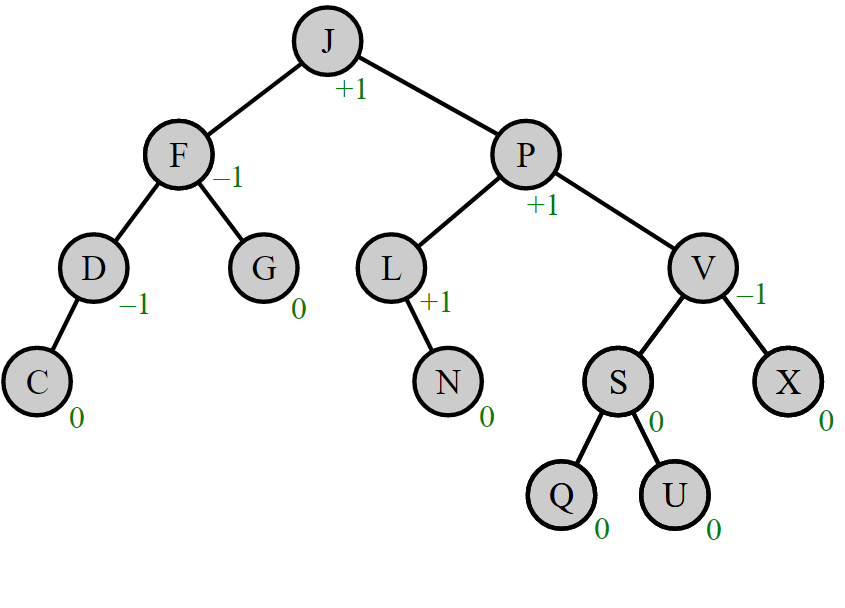
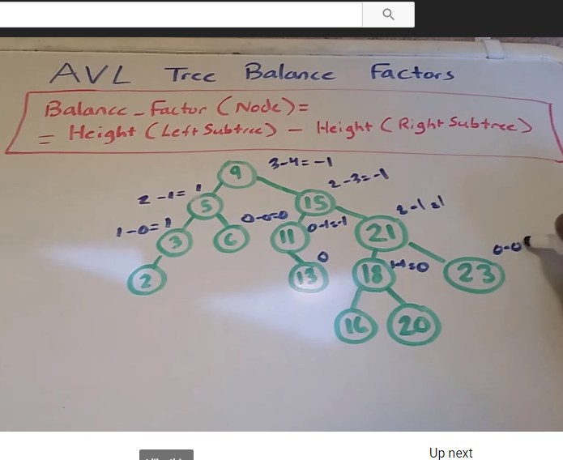
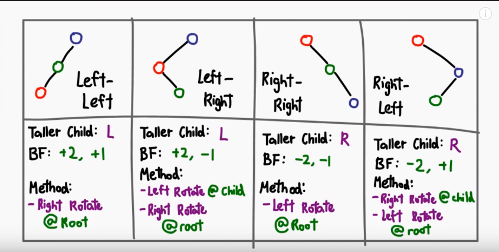

# Data​ ​Structures - Trees

!> Work in process!

Helpful links:
https://www.tutorialspoint.com/discrete_mathematics/introduction_to_trees.htm

http://www.geeksforgeeks.org/binary-tree-set-1-introduction/

http://www.geeksforgeeks.org/binary-tree-set-2-properties/

http://www.geeksforgeeks.org/binary-tree-set-3-types-of-binary-tree/

https://github.com/TelerikAcademy/Data-Structures-and-Algorithms/tree/master/Topics/07.%20Trees-and-Traversals

https://rawgit.com/TelerikAcademy/Data-Structures-and-Algorithms/master/Topics/07.%20Trees-and-Traversals/index.html#/2/1

https://appliedgo.net/balancedtree/ 

https://www.cs.usfca.edu/~galles/visualization/AVLtree.html

Binary heap
Min - min value to be root value

Balanced tree (AVL tree)
https://appliedgo.net/balancedtree/

AVL Tree
Height of the left and right child of every node to differ by most +-1

Balancing

