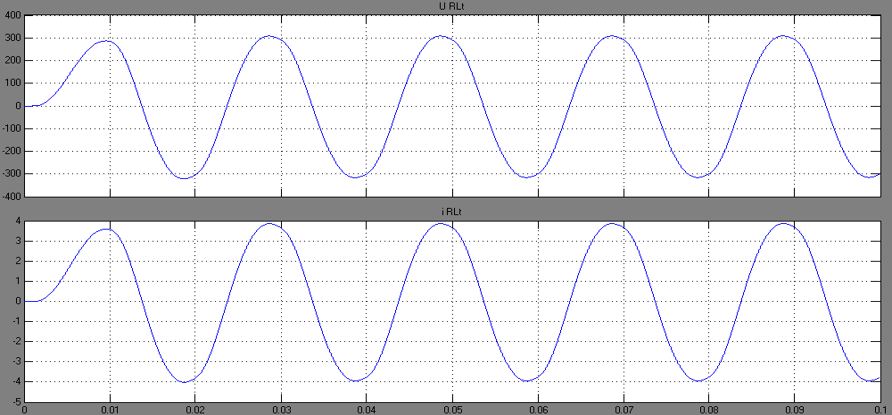
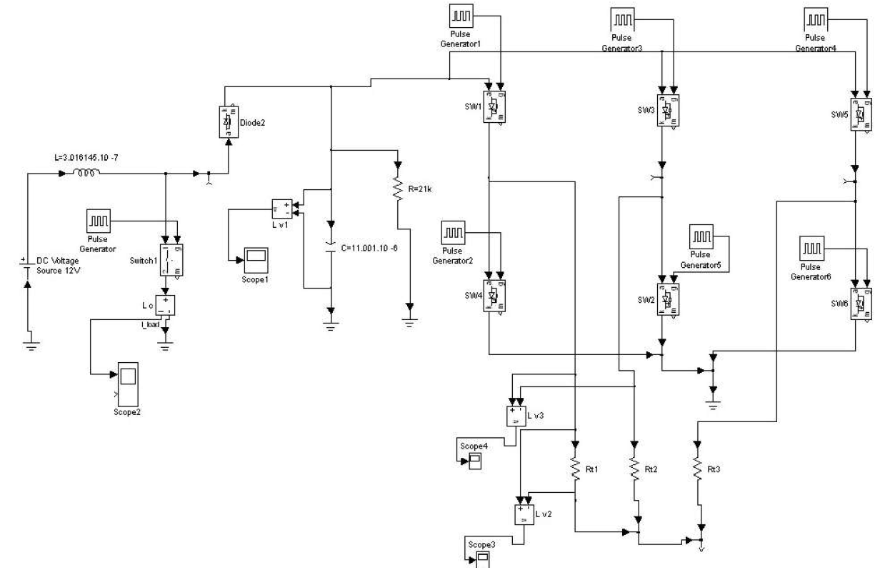

# PhD Proof of work

Phd activities over the study period

## Table of Contents

- [PhD Proof of work](#phd-proof-of-work)
  - [Table of Contents](#table-of-contents)
  - [Overview](#overview)
  - [Timeline](#timeline)
    - [2016-2017](#2016-2017)
    - [2017-2018](#2017-2018)
    - [2018-2019](#2018-2019)
      - [Summary](#summary)
  - [Publications](#publications)
    - [Simulation of sinusoidal voltage inverter using reducing switching losses PWM strategy](#simulation-of-sinusoidal-voltage-inverter-using-reducing-switching-losses-pwm-strategy)
      - [Abstract](#abstract)
      - [Conclusion](#conclusion)
    - [Simulation of three-phase invertor for quasi-sinusoidal voltage](#simulation-of-three-phase-invertor-for-quasi-sinusoidal-voltage)
      - [Abstract](#abstract-1)
      - [Conclusion](#conclusion-1)
    - [Modelling and analysis of hybrid power station](#modelling-and-analysis-of-hybrid-power-station)
      - [Abstract](#abstract-2)
      - [Conclusion](#conclusion-2)
    - [Numerical modeling of the magnetic field distribution in single-phase single-core transformer](#numerical-modeling-of-the-magnetic-field-distribution-in-single-phase-single-core-transformer)
      - [Abstract](#abstract-3)
      - [Conclusion](#conclusion-3)
    - [Interactive education web-based platform for theoretical electrical engineering related topics](#interactive-education-web-based-platform-for-theoretical-electrical-engineering-related-topics)
      - [Abstract](#abstract-4)
      - [Conclusion](#conclusion-4)
    - [Performance analysis and modelling of grid-connected small photovoltaic system](#performance-analysis-and-modelling-of-grid-connected-small-photovoltaic-system)
      - [Abstract](#abstract-5)
      - [Conclusion](#conclusion-5)
  - [Upcoming](#upcoming)

## Overview

**Start of the doctorate:** 01.07.2016

**Dissertation topic:** Modeling and analysis of electromagnetic radiation of electrotechnics objects

**Scientific advisers:** Assoc. Prof. Dr. Atanas Chervenkov

**Department:** Theoretical Electrical Engineering

**Faculty:** Faculty of Automatics

**Doctoral Program:** Theoretical Electrical Engineering

**Profession field:** 5.2 Electrical Engineering Electronics and Automation

## Timeline

### 2016-2017

2016.11 Exams

- PhD exam Theoretical Electrical Engineering, 18.11.2016, grade 5.25
- PhD second language exam - English, 21.11.2016, grade passed

2016.09 XI Summer school Theoretical electrical engineering '2016

- Date: 15.09.2016 - 16.09.2016
- Paper title: Simulation of sinusoidal voltage inverter using reducing switching losses PWM strategy
- Publisher: Advanced Aspects of Theoretical Electrical Engineering Sofia '2016
- Location: Sofia, Bulgaria
- Authors: Atanas Chervenkov, Todorka Chervenkova, Atanas Yanev

2017.01 – 2017.06 Erasmus+ student exchange program

- Jönköping University, Sweden
- Server-side Web Development (TPWK16)
- Client-side Programming (TKPK17)
- Web Development with JavaScript and DOM (TWJK14)

2017.06 International Conference Automatics '2017

- Date: 02.06.2017 – 04.06.2017
- Paper title: Simulation of three-phase invertor for quasi-sinusoidal voltage
- Publisher: Proceedings of the TU-Sofia, Volume 67, Issue 2, 2017, ISSN 1311-0829
- Location: Sozopol, Bulgaria
- Authors: Atanas Chervenkov, Todorka Chervenkova, Atanas Yanev

2017.07 Attestation

- Date: 03.07.2017
- Result: Passed

### 2017-2018

2017.11 Exam

- Modeling of electro technical systems, grade 5.75

2017.12 Exam

- Simulation of electro technical systems, grade 5.50

2018.03 – 2018.05 Teaching

- Laboratory exercises – Total of 24 students, separated in 2 groups. Each group consist of 4 subgroups with 3 students each, doing one exercise per laboratory occupation
- Information about students – Faculty of Transport, Aviation equipment and technologies (ATT), Course 2, Thread 11, Group 57

2018.06 International Conference Automatics '2018

- Date: 01.06.2018 – 03.06.2018
- Paper title: Modelling and analysis of hybrid power station
- Publisher Proceedings of the Technical University of Sofia, Volume 68, Issue 2, 2018, ISSN 1311-0829
- Location: Sozopol, Bulgaria
- Authors: Atanas Chervenkov, Todorka Chervenkova, Atanas Yanev

2017.06 Attestation

- Date: 07.06.2018
- Result: Passed

<!-- Others

- Contract NIS (20180928 scientific report first stage)
- Dissertation thesis work done - Извършване на литературно проучване и систематизиране на източниците. -->

### 2018-2019

2018.09 XII Summer school Theoretical electrical engineering '2018

- Date: 13.09.2018 – 14.09.2018
- Paper title: Numerical modeling of the magnetic field distribution in single-phase single-core transformer
- Publisher: Advanced Aspects of Theoretical Electrical Engineering Sofia '2018, ISSN: 1313-9487
- Location: Sofia, Bulgaria
- Authors: Atanas Yanev, Atanas Chervenkov

2019.05 PhD extending doctoral studies

- Date: 23.05.2019
- Reason: 6 months abroad, Erasmus+
- Extend period: 6 months

2019.06 International Conference Automatics '2019

- Date: 01.06.2019 – 03.06.2019
- Paper title: Interactive education web-based platform for theoretical electrical engineering related topics
- Publisher: Proceedings of the Technical University of Sofia, Volume 69, Issue 2, 2019
- Location: Sozopol, Bulgaria
- Authors: Atanas Chervenkov, Atanas Yanev

2019.06 16-th International Conference ELMA '2019

- Date: 06.06.2019 – 08.06.2019
- Paper title: Performance analysis and modelling of grid-connected small photovoltaic system
- Publisher: XVI-th International Conference on Electrical Machines, Drives and Power Systems ELMA '2019, IEEE
- Location: Sozopol, Bulgaria
- Authors: Atanas Chervenkov, Atanas Yanev, Todorka Chervenkova

2019.07 Member of an appointed committee

- Date: 18.07.2019
- Committee of developing a methodology for determining the amount of additional scholarships PhD students, Faculty of Automatics
- Direction: N38/16.07.2019, Dean of the FA of TU-SOFIA

2019.06 Attestation

- Date: 04.06.2019
- Result: Passed

<!-- Others

- Contract NIS (second stage)
- Dissertation thesis work done - Има доста писано в атестацията. Предстои оформянето на дисертационната работа. -->

#### Summary

Examinations – Passed

Scientific papers – Author/co-author of 7 published (for now)

Student mobility – Took part in Jonkoping University, Sweden within Erasmus+ program

Teaching – Responsible for conducting laboratory exercise in electrical engineering field of study

## Publications

### Simulation of sinusoidal voltage inverter using reducing switching losses PWM strategy

|                | Description |
|---------------:|:------------|
| Date           | 15.09.16 – 16.09.2016, Sofia, Bulgaria |
| Event          | XI Summer school Theoretical electrical engineering '2016 |
| Publisher      | Advanced Aspects of Theoretical Electrical Engineering Sofia '2016 |
| Location       | Sofia, Bulgaria |
| Authors        | Atanas Chervenkov, Todorka Chervenkova, Atanas Yanev |
| Keywords       | simulation, converter, PWM, power losses, model, SIMULINK |
| Short abstract | The article examines the work of a converter that synthesizes sinusoidal voltage supply to the active-inductive load through method of controlled high-frequency pulses with sinusoidal pulse-width modulation. |

#### Abstract

The article examines the work of a converter that synthesizes sinusoidal voltage supply to the active-inductive load through method of controlled high-frequency pulses with sinusoidal pulse-width modulation.
High frequency semiconductor key elements of the converter switched at zero current, i.e. with reduced switching losses, each high-frequency pulse transmitted to the load range specified quantity / dose / energy.
The linear dependence on active power in load to the first harmonic amplitude of load voltage and regulation angle respectively is achieved.
Simulations on the operation of the converter to achieve a sinusoidal voltage in the converter output are carried out.
Simulink model of the investigated converter is composed.

| Fig.1 Circuit model of the studied invertor |
|:---:|
|  |

#### Conclusion

The simulation model of the sinusoidal voltage invertor is created.

| Fig.6 Sinusoidal voltage trough active-inductive load and output current in divided transformer |
|:---:|
|  |

As a result of the analysis and simulations, obtained through the program package MATLAB 7.1 is proven the capabilities of the inverter for the synthesis of sinusoidal output voltage.
Obtaining of an ideal sinusoidal voltage leads to a significant reduction of harmonics in the load of the converter. This ensures low level of electromagnetic interference and improves electromagnetic compatibility.
Switching semiconductor elements of high-frequency inverter is performed at zero current, by using high-frequency current impulses, controlled by SPWM signal.
The energy supplied from the high-frequency inverter in the process of synthesizing of the sinusoidal output voltage is dosed. By this dosing, the power losses in the power controllers, divided transformer and filtering inductance are minimal.
The analysis and simulations allows determining the parameters of the sinusoidal mode in blocks of control and filter-load.

### Simulation of three-phase invertor for quasi-sinusoidal voltage

|                | Description |
|---------------:|:------------|
| Date           | 02.06.2017 - 04.06.2017 |
| Event          | International Conference Automatics '2017 |
| Publisher      | Proceedings of the Technical University of Sofia, Volume 67, Issue 2, 2017, ISSN 1311-0829 |
| Location       | Sozopol, Bulgaria |
| Authors        | Atanas Chervenkov, Todorka Chervenkova, Atanas Yanev |
| Keywords       | simulation, three-phase inverter, PWM, SIMULINK model, reduced distortion, electromagnetic compatibility|
| Short abstract | An inverter that synthesizes three-phase quasi-sinusoidal voltage supply to the active load through method of controlled pulses with pulse-width modulation is investigated. |

#### Abstract

An inverter that synthesizes three-phase quasi-sinusoidal voltage supply to the active load through method of controlled pulses with pulse-width modulation is investigated.
The linear dependence of active power in load and regulation angle, the first harmonic amplitude of load voltage and regulation angle, respectively is achieved.
Simulations of the converter to achieve a quasi-sinusoidal voltage in the converter output are carried out. SIMULINK model of the three-phase converter for industrial purpose with reduced distortion is composed.
The obtained quasi-sinusoidal voltage is not ideal one, but leads to a significant reduction of harmonics in the load of the converter.
This ensures lower level of electromagnetic interference and improves electromagnetic compatibility.

| Fig. 1 Simulink model of the three-phase invertor |
|:---:|
|  |

#### Conclusion

The simulation model of the three-phase invertor is created.
As a result of the analysis and simulations, obtained through SIMULINK of the program package MATLAB, the capabilities of the inverter for the synthesis of output voltage like a sinusoidal wave is proved.

| Fig. 8 Amplitude spectrum of quasi-sinusoidal output voltage |
|:---:|
|  |

The obtained quasi-sinusoidal voltage is not ideal one, but leads to a significant reduction of harmonics in the converter load. This ensures lower level of electromagnetic interference and improves electromagnetic compatibility.

### Modelling and analysis of hybrid power station

|                | Description |
|---------------:|:------------|
| Date           | 01.06.2018 - 03.06.2018 |
| Event          | International Conference Automatics '2018 |
| Publisher      | Proceedings of the Technical University of Sofia, Volume 68, Issue 2, 2018, ISSN 1311-0829 |
| Location       | Sozopol, Bulgaria |
| Authors        | Atanas Chervenkov, Todorka Chervenkova, Atanas Yanev |
| Keywords       | analysis, modelling, hybrid power station, photovoltaic plant, wind-generator, MATLAB, harmonics. |
| Short abstract | Simulation model of hybrid power station containing Photovoltaic and wind generator sources as well as energy storage. |

#### Abstract

The power station with renewable generating sources is considered.
It consist of Photovoltaic plant and Wind-generator.
A model of hybrid power station in MATLAB is created.
Simulations of the power station operation have been carried out in different modes.
The performance of hybrid power station is analysed.
The harmonic composition of the generated AC voltage with an industrial frequency is investigated.

| Fig. 1 Circuit model of the studied invertor | Fig. 6 Block diagram of the simulated Hybrid Power Station |
|:---:|:---:|
|  |  |

#### Conclusion

The power hybrid station with renewable generating sources - Photovoltaic plant and Wind-generator is considered.
They are highly safe for the environment as it does not produce any emission and harmful waste product like conventional energy resources.
A model of hybrid power station in MATLAB is created.

| Fig. 7 Voltages in the three phases | Fig. 10 Harmonics analysis with two sources |
|:---:|:---:|
|  |  |

Simulations of the power station operation have been carried out in different modes.
The performance of hybrid power station is analysed.
The harmonic composition of the generated AC voltage with an industrial frequency is investigated.
The hybrid power station is good and effective solution for power generation than conventional energy resources.

### Numerical modeling of the magnetic field distribution in single-phase single-core transformer

|                | Description |
|---------------:|:------------|
| Date           | 13.09.2018 – 14.09.2018 |
| Event          | XII Summer school Theoretical electrical engineering '2018 |
| Publisher      | Advanced Aspects of Theoretical Electrical Engineering Sofia '2018, ISSN: 1313-9487 |
| Location       | Sofia, Bulgaria |
| Authors        | Atanas Yanev, Atanas Chervenkov |
| Keywords       | electromagnetic interference, numerical modelling, magnetic induction, transformer |
| Short abstract | An electromagnetic model of single-phase single-core transformer is made and a numerical simulation of the electromagnetic field is performed. |

#### Abstract

An electromagnetic model of single-phase single-core transformer is made and a numerical simulation of the electromagnetic field is performed.
The distribution of the magnetic induction in the transformer's core and in the surrounding space is obtained.
A comparative analysis of the obtained electromagnetic values with the computed parameters by a chain model is carried out.
The investigation enables the determination of the magnetic flux dissipated in the surrounding space outside the transformer that generates the electromagnetic interference.

Investigated transformer:

- Low power transformer P = 250VA
- Transformer's magnet made of 0.35 mm thick silicon steel sheets
- Circular copper conductors for primary and secondary winding
- Primary winding - voltage 220V, d=1mm, 289 turns
- Secondary winding - voltage 72, d=1.62mm, 104 turns

#### Conclusion

An electromagnetic model of single-phase single-core transformer is made and a numerical simulation of the electromagnetic field is performed. The distribution of the magnetic induction in the transformer's core and in the surrounding space is obtained.

| Fig. 2 Distribution on magnetic induction in magnetic core | Fig. 3 Distribution magnetic flux lines in magnetic core |
|:---:|:---:|
|  |  |
| **Fig. 7 Distribution on magnetic induction vectors by short circuit mode** | **Fig. 5 Distribution of magnetic vector-potential by idle mode** |
|  |  |

The investigation enables the determination of the magnetic flux dissipated in the surrounding space outside the transformer that generates the electromagnetic interference.

### Interactive education web-based platform for theoretical electrical engineering related topics

|                | Description |
|---------------:|:------------|
| Date           | 01.06.2019 – 03.06.2019 |
| Event          | International Conference Automatics '2019 |
| Publisher      | Proceedings of the Technical University of Sofia, Volume 69, Issue 2, 2019, ISSN 1311-0829 |
| Location       | Sozopol, Bulgaria |
| Authors        | Atanas Chervenkov, Atanas Yanev |
| Keywords       | Education platform, Learning platform, Interactive platform, Electrical engineering platform, web-based education |
| Short abstract | Web-based educational platform, which delivers resources and theoretical electrical engineering related topics. |

#### Abstract

The paper represents web-based educational platform, which delivers resources and theoretical electrical engineering related topics.
The platform allows easily access by everyone because of its web-based nature.
The system is based on top of the free open source software which makes its development efficient and time reduced significantly.
The purpose of this interactive educational web-based platform is to provide a variety of significant, quality, and understandable content.
Architecture of the platform is scalable and extendable.
The article describes theoretical underpinnings, features, architecture, implementation of particular platform, and the application results.

| Fig. 4 Home page of the application | Fig. 9 Responsive mobile design |
|:---:|:---:|
|  |  |

#### Conclusion

The Interactive education web-based platform for theoretical electrical engineering related topics and resources is created.
The platform provides easily use by the end clients and the contributors (authors) of the content.
The required recourses for deploying, hosting and keeping live the system are free.
The system is responsive and accessible by most used devices on the following URL [https://tee.ayanev.eu](https://tee.ayanev.eu)

### Performance analysis and modelling of grid-connected small photovoltaic system

|                | Description |
|---------------:|:------------|
| Date           | 06.06.2019 – 08.06.2019 |
| Event          | 16-th International Conference ELMA '2019 |
| Publisher      | XVI-th International Conference on Electrical Machines, Drives and Power Systems ELMA '2019, IEEE |
| Location       | Sozopol, Bulgaria |
| Authors        | Atanas Chervenkov, Atanas Yanev, Todorka Chervenkova |
| Keywords       | electromagnetic compatibility, modelling, performance, photovoltaic system |
| Short abstract | A grid-connected 30 kW small PV system, located in Southeast Bulgaria has been studied. Performance analysis of the investigated PV system as well as MATLAB model and simulations of the PV system. |

#### Abstract

A grid-connected 30 kW small PV system, located in Southeast Bulgaria has been studied.
Performance analysis of the PV system is done.
The PV system is balanced according reactive power.
The total harmonic distortion THD of the object is very low and satisfies the requirements of the standards.
A model of PV system is created in MATLAB.
Simulations of the operation in different modes have been carried out.
The electromagnetic compatibility of analyzed small PV power system is satisfied.

Power station details

- PV modules Polycrystalline silicon TRITEC TRI-MAX EU 250Wp.
- The modules are placed on a support rail with spacing to ensure free flow on air under the modules.
- A string by combination of series connecting modules (6 strings of 20 modules) is formed.
- PV system uses one HUAWEI SUN2000-33KTL - 30 KW.
- The inverter outputs at 400 V, 50 Hz.

Performance analysis

- The performance analysis with apparatus Metrel MI 2392F was conducted. (instruments for power quality analysis)
- For gathering the necessary information, the device is connected to the inverter via L1/2/3 Clamps (clamps 3x300A, range 100%, U range: 240-1000V, L-N, Connection 4W)
- Several measurements are made over a certain time interval, each of 200ms duration and a density of 1024 points

| Fig. 3 Waveforms of voltages and current in normal mode | Fig. 5 Closer view for THD |
|:---:|:---:|
|  |  |

Measurement results

- The shape of the voltage and current are close to the sinusoidal curve.
- The power system is balanced according reactive power.
- Total harmonic distortion is minimal according to IEEE 519

PV System Model

- A model of power system in MATLAB is created.
- A control technique is using to accomplish maximum generating power from the solar plant.
- The results of the simulation prove the stability and reliable operation of the investigated system.
- The investigated PV system using SIMULINK is simulated.
- A 30-kW PV system is considered.

| Fig. 6 Block diagram of the simulated PV system |
|:---:|
|  |

| Fig.8 Simulation result of the voltages in normal mode |
|:---:|
|  |

#### Conclusion

The analyzed photovoltaic system has a significant advantage - it reduces the cost of transmission and distribution of electrical energy, because the power is produced with low voltage at the end point of use.
The PV system is balanced according reactive power in normal mode.
This does not obstruct the low voltage distribution grid with the transfer of reactive power.
The total harmonic distortion of the object is very low and satisfies the requirements of the standards.
The electromagnetic compatibility of analyzed small PV power system is satisfied.

---

## Upcoming

Тhe status is valid to date January 2020

**Scientific papers**  
Work in progress on two papers, while the one of them will hopefully took place at International Conference Automatics ‘2020 later this summer

**Dissertation**
Most of the work is done/committed, upcoming dissertation layout and formatting, assembling all the pieces together
