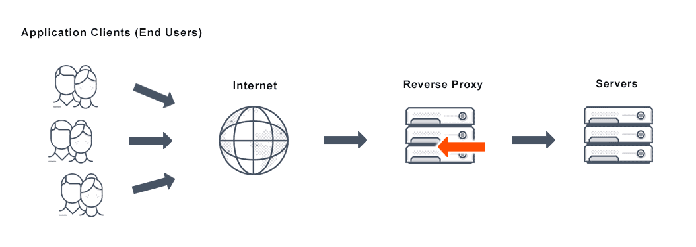
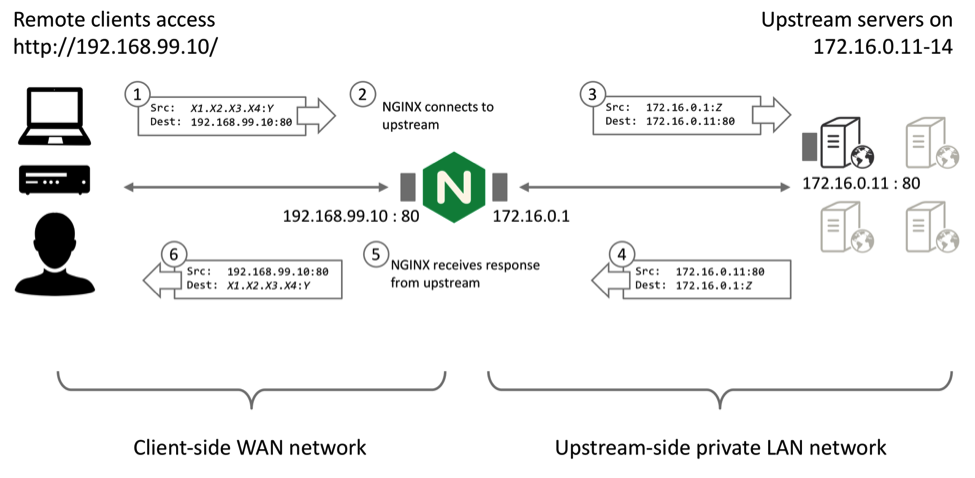

# NGINX proxy manager

*Modified 2021-12-28*

Reverse proxy allowing the management of incoming connections/requests to be redirected to the correct device and service, 
adds a layer of security for devices that are hosted as it does not directly expose the device to the internet.<br>
Without reverse proxy in order to access a service we have to expose a port for each service, Imagine if we have many services how much ports we have to expose and the security vulnerability will increase.<br>
With proxy manager we can expose one port only for the nginx and thats all, based on configuration it will route/redirect the traffic to the desired service
There are many benefits of using reverse proxy, not mentioned here, since the content will be too long.
    
|  |  |
|:------------------------------------------------------------------------:|:----------------------------------------------------------------------:|

``docker-compose.yml``
```yaml
version: '3'
services:
  nginx:
    image: jc21/nginx-proxy-manager:latest
    container_name: nginx
    env_file:
      - ./services/nginx/nginx.env    
    ports:
      - 8080:80
      - 81:81
      - 4433:443
    volumes:
      - ./volumes/nginx/data:/data
      - ./volumes/nginx/letsencrypt:/etc/letsencrypt
    restart: unless-stopped
```

``nginx.env``
```env
TZ=Europe/Sofia
```

The WEB UI available at port ``:81``
Default credentials for the login are ``admin@example.com``/``changeme``, you will be prompt to edit the admin user.
Click on proxy hosts to add a new entry.

A serval configurations on the router are required.
From within router settings find a section called ``Virtual servers``, then open a ports for HTTP and HTTPS routed to the nginx service.

| Service Type/Name | External Port | Internal IP | Internal Port | Protocol |
|:------------------|:-------------:|:------------|:-------------:|:--------:|
|  NGINX HTTP       | 80            | The IP where nginx is hosted | 8080 | TCP |
|  NGINX HTTPS      | 443           |                              | 4433 | TCP |

**Resources**

- [NGINX PROXY MANAGER TUTORIAL RASPBERRY PI 4 INSTALLATION - EPISODE 6](https://www.youtube.com/watch?v=UoABJxIeq3A&list=PL9z5ElY5ntAZvTLNM99a2L98YMxMIqC_O&index=9&t=1s)<br>
  YouTube, a very good explanation how reverse proxy works and what would it be is not used.
- [How to Install Nginx Proxy Manager on a Raspberry Pi!](https://www.youtube.com/watch?v=jp7zqjNhTAs)<br>
  Youtube, another good tutorial about Nginx Proxy Manager.
- [nginx proxy manager](https://nginxproxymanager.com/)<br>
  Project website, official docs.
