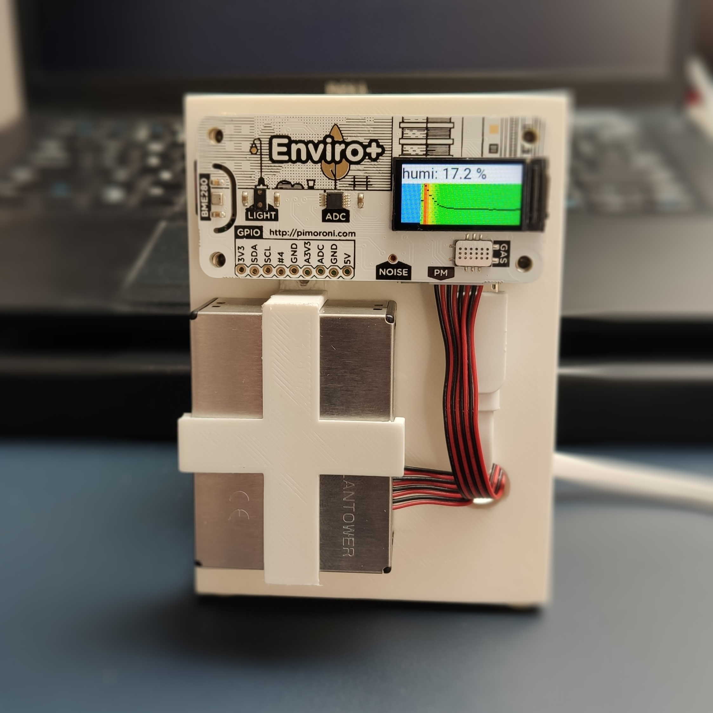
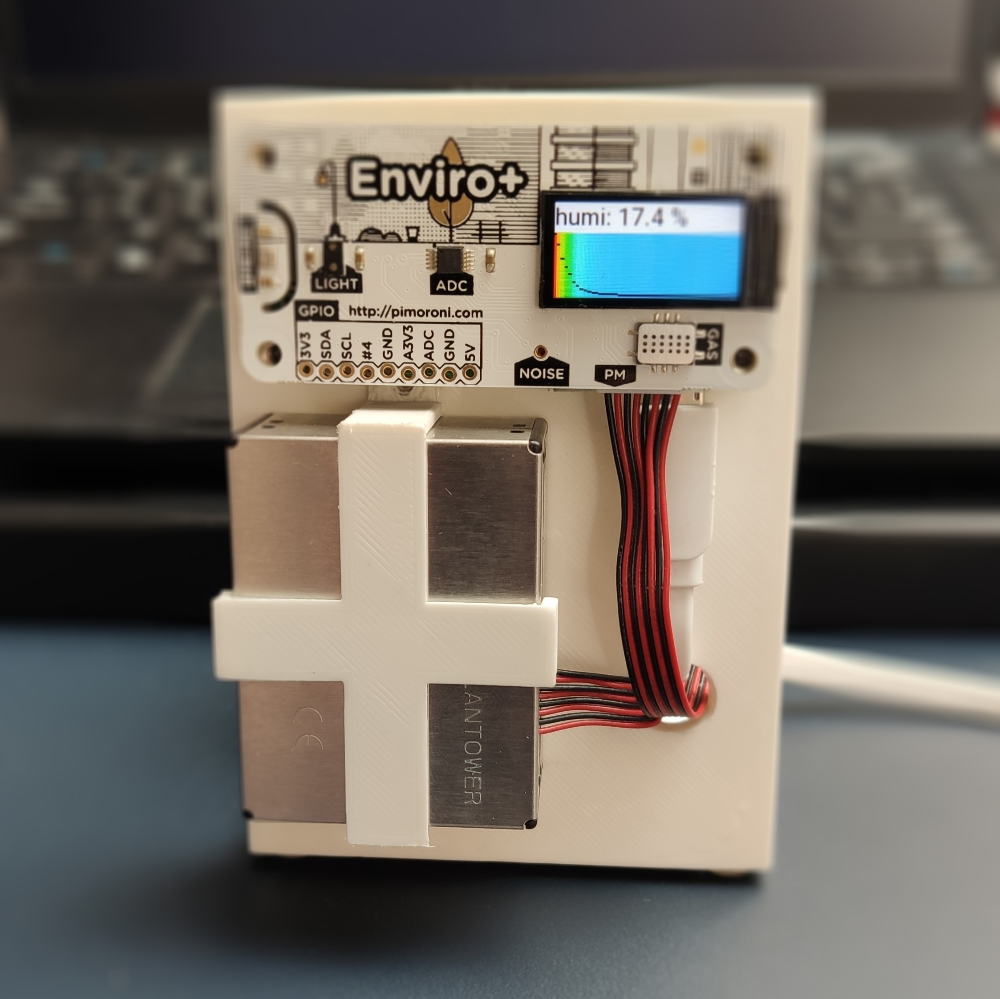
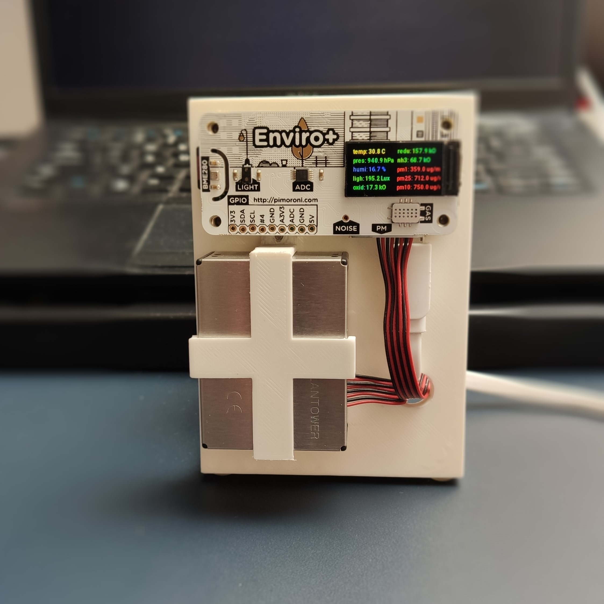
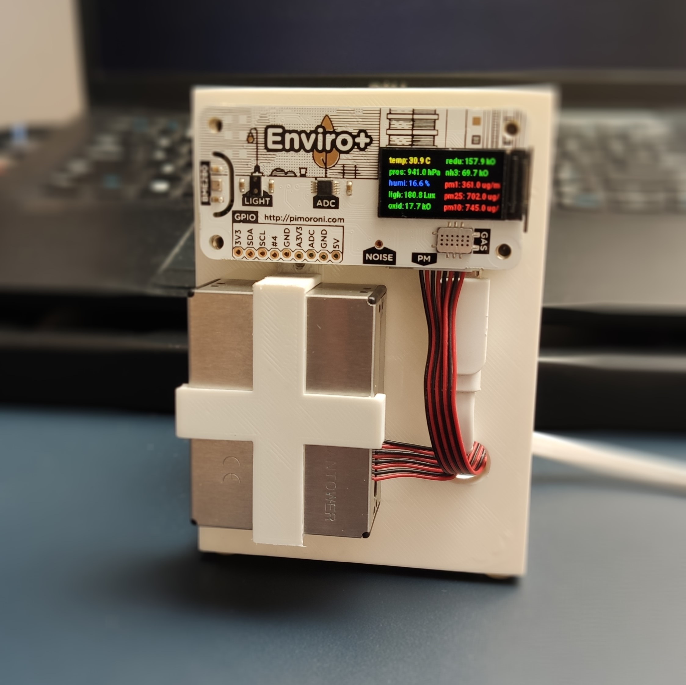

# Raspberry Pi Enviro+ indoor monitoring station

- [Raspberry Pi Enviro+ indoor monitoring station](#raspberry-pi-enviro-indoor-monitoring-station)
  - [Description](#description)
  - [Show case](#show-case)
  - [References](#references)
  - [TODOs](#todos)

## Description

Using Raspberry Pi Zero W and Pimoron's Enviro+ hat for indoor monitoring station.

The station push data to the ``MQTT broker`` where is consumed by the ``Node-Red`` which take care for writing the data to the ``InfluxDb``.
Metrics are visualized with the help of the ``Grafana`` dashboards.

Files and parts:

- STL files for the station - [thing:3818372](https://www.thingiverse.com/thing:3818372)
- [Enviro+ hat for Raspberry Pi – Enviro + Air Quality](https://shop.pimoroni.com/products/enviro?variant=31155658457171)
- Raspberry Pi Zero W with microSD card

## Show case

|||
|:-:|:-:|
|||
|||

## References

- [Getting Started with Enviro+](https://learn.pimoroni.com/tutorial/sandyj/getting-started-with-enviro-plus)
- [Grafana Pimoroni Enviroplus Dashboard](https://grafana.com/grafana/dashboards/11605)

## TODOs

- source code of the station
- JSON model of the data
- Node-red flow for consume from the mqtt and write to the influxDB
