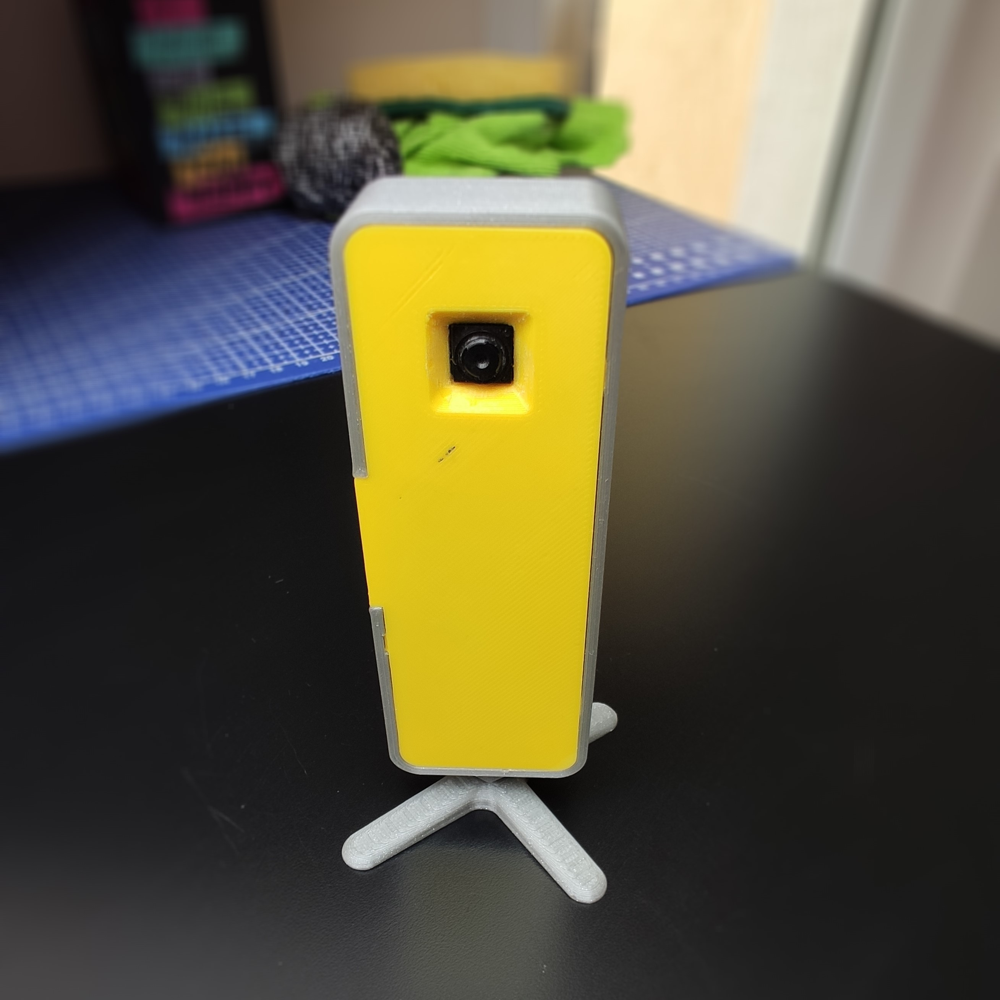
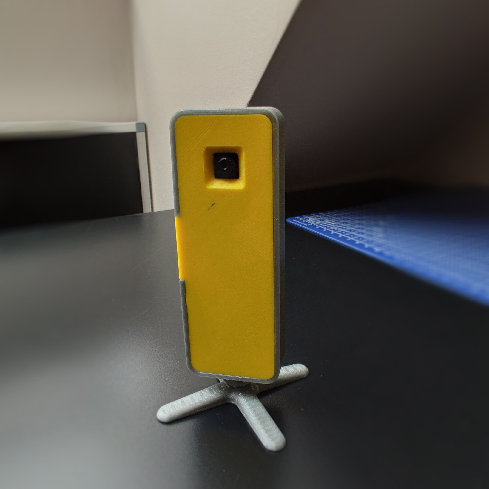
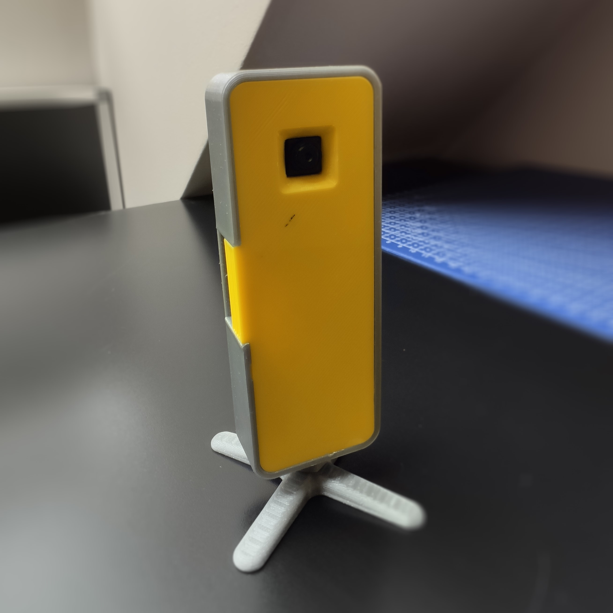
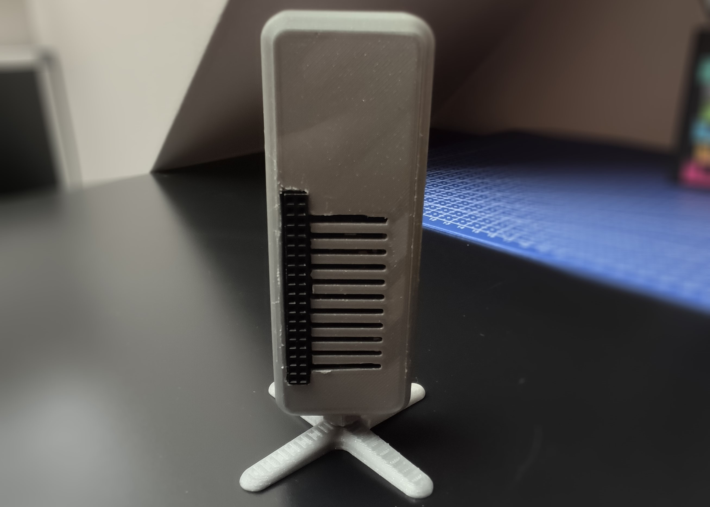
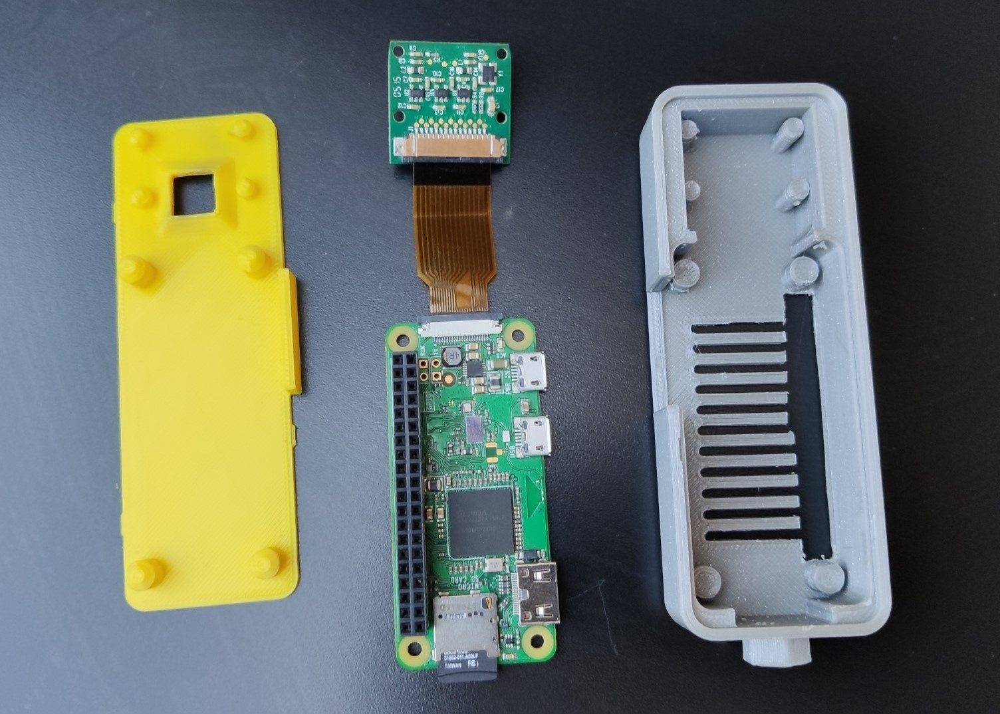
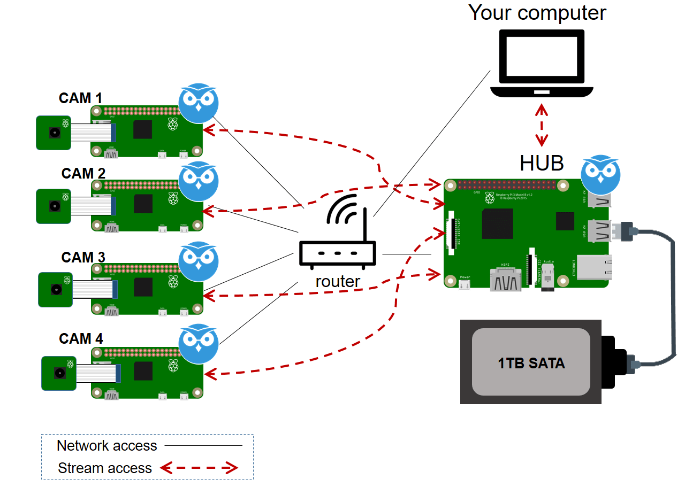

# Raspberry Pi surveillance system

*Modified 2020-07-31*

- [Raspberry Pi surveillance system](#raspberry-pi-surveillance-system)
  - [Description](#description)
  - [Showcase](#showcase)
  - [References](#references)

## Description

Surveillance camera using Raspberry Pi Zero W with camera module v1.3.

The enclosure used - [thing:3587354](https://www.thingiverse.com/thing:3587354)

Software - [MotionEyeOS](https://github.com/ccrisan/motioneyeos/wiki)

## Showcase

||||
|:-:|:-:|:-:|
||||

## References

- [Docs - Installation](https://github.com/ccrisan/motioneyeos/wiki/Installation)
- [Install MotionEyeOS on Raspberry Pi – Surveillance Camera System](https://randomnerdtutorials.com/install-motioneyeos-on-raspberry-pi-surveillance-camera-system/)
- [CCTV Raspberry Pi Based System with Storage using MotionEyeOS](https://randomnerdtutorials.com/cctv-raspberry-pi-based-system-storage-motioneyeos/)
- [YouTube, Nest Cams are a BIG RIPOFF - DIY WiFi Security Camera Guide](https://www.youtube.com/watch?v=H7p5YEOrlSc)
